# Stakeholder Perspectives — Realtime Pulse 2026-05-05

**Author**: James Pether Sörling  
**Date**: 2026-05-05  

---

## 6-Lens Stakeholder Matrix

| Stakeholder | Position | Primary Interest | Key Documents | Tension Points |
|-------------|----------|-----------------|---------------|----------------|
| **Ulf Kristersson (M, PM)** | Coalition manager | Maintain Tidö majority through election | All Tidö legislation | C defection (HD024146), gang crime overcommitment |
| **Jimmie Åkesson (SD)** | Junior partner power | Harder law enforcement + agency deregulation | HD10458, HD10459, HD024143, HD024145 | Not enough deregulation on forestry; agency governance not fully controlled |
| **Annie Lööf / Ebba Busch proxy** | C/KD pivots | Differentiation within coalition | HD024146, KU39 | C on CRC; KD on constitutional reform |
| **Magdalena Andersson (S)** | Lead opposition challenger | Hold government accountable, position as alternative PM | HD10458, HD10463, all interpellations | Cannot be too specific on crime policy; must balance urban/rural |
| **Nooshi Dadgostar (V)** | Hard opposition | Welfare state defence, rights-based legislation | HD024142, HD024146, HD024148 | CRC argument strongest in HD024148 (has legal purchase) |
| **Gustav Fridolin / Emma Nohrén (MP)** | Environmental differentiation | Forestry EU compliance + youth rights | HD024141, HD024147, HD024148 | EU infringement argument requires patience (T+12-24m) |
| **Riksbanken / FI (Jakob Forssmed)** | Technical regulator | HD03255 macro-prudential mandate | HD03255 [A1] | Lagrådet timing uncertainty |
| **Statskontoret** | Independent evaluation | FiU49 debt management evaluation quality | HD01FiU49 [A1] | Evaluation recommendations not yet public |
| **Lagrådet** | Constitutional watchdog | Youth crime age 13 constitutional compatibility | HD03246, HD024146 [A1] | ~2026-06-01 opinion deadline |
| **European Commission DG ENV** | EU compliance | Habitats Directive Article 6 compliance | HD024141–HD024147 [A1] | Swedish domestic politics invisible to Commission; formal track operates independently |

---

## Named Actor Intelligence: Key Ministerial Interpellees

### Justice Minister Gunnar Strömmer (M)
**Accountability vector HD10458**: Must answer for the April 20 Aftonbladet "gang crime eliminated in four years" statement. No KPI framework exists. Strategic options:
1. Reframe as aspirational direction, not measurable KPI
2. Cite legislative progress (HD03246, REVA taskforce) as proxy measures
3. Refuse to engage on specific timeline — risk: S/V amplify as evasion

**Assessment**: Option 1 + 3 most likely; creates elongated opposition attack surface.

### Infrastructure Minister Andreas Carlson (KD)
**Accountability vector HD10463**: Ostlänken rerouting is an irreversible technical/political decision. Credible answer requires capacity analysis Carlson does not have publicly committed. Regional mobilisation from S/MP Östergötland candidates is already active.

### Research/Higher Ed Minister Mats Persson (L)
**Accountability vector HD10461**: Sweden drops to ESA rank #17 despite substantial space sector. Research ministry cannot increase ESA contribution without budget amendment authority. Answer will likely defer to "government's research bill commitments."

### Civil Protection Minister Carl-Oskar Bohman (M)
**Accountability vector HD10462**: MSB preparedness questions during elevated EU security environment. Government has launched several preparedness measures (Totalförsvarsbeslutet 2021); answer can cite concrete progress.

---

## Coalition Stakeholder Mapping

```mermaid
%%{init: {'theme': 'dark', 'themeVariables': {"'primaryColor': '#00d9ff', 'primaryTextColor': '#e0e0e0', 'primaryBorderColor': '#ff006e', 'lineColor': '#ffbe0b', 'secondaryColor': '#1a1e3d', 'tertiaryColor': '#0a0e27'"}}}%%
graph LR
    M["🔵 M (68)\nKristersson"] -->|"Tidö core"| TID["TIDÖ GOVERNMENT\n176 seats"]
    SD["🔵 SD (73)\nÅkesson"] -->|"Tidö core"| TID
    KD["🔵 KD (19)\nBusch"] -->|"Tidö core"| TID
    L["🔵 L (16)\nSvantesson"] -->|"HD024146 ⚠️"| TID
    C["🟡 C (24)\nCarlson"] -->|"Tidö support\n(conditional)"| TID
    TID -->|"Majority votes\nall bills"| GOV["GOVERNMENT MAJORITY\n176 vs 173"]
    S["🔴 S (107)\nAndersson"] -->|"Opposition"| OPP["OPPOSITION\n173 seats"]
    V["🔴 V (24)\nDadgostar"] -->|"Opposition"| OPP
    MP["🔴 MP (18)\nNohrén"] --> OPP
    C2["🟡 C (CRC cluster)\nHD024146"] --> OPP
    style TID fill:#1a1e3d,stroke:#00d9ff
    style GOV fill:#00d9ff,stroke:#00d9ff
    style OPP fill:#ff006e,stroke:#ff006e
    style C fill:#ffbe0b,stroke:#ffbe0b
    style C2 fill:#ffbe0b,stroke:#ffbe0b
```

---

## Improvement Pass — New Stakeholder Perspectives

### Sida (institutional target — HD10464)
**Position**: Defensive — must demonstrate accountability for aid disbursement  
**Interests**: Institutional survival, mission continuity, donor partner confidence  
**SD claim exposure**: Hamas-linked 55 MSEK payment [A2 unverified] — if confirmed, internal governance failure; if denied, reputational vindication

### UD Civil Servants (HD10466)
**Position**: Collectively targeted; professional rights and constitutional protections at stake  
**Interests**: RF Chapter 12 compliance confirmation; protection from political career consequences  
**Alliance**: ST (Statstjänstemännens) union, constitutional scholars, opposition parties

### Centerpartiet (HD01JuU30 intersection)
**Position**: JuU30 provides additional CRC/ECHR legal ballast for existing HD024146 defection  
**Interests**: Differentiation from government on rights-based grounds while maintaining coalition-adjacent status
