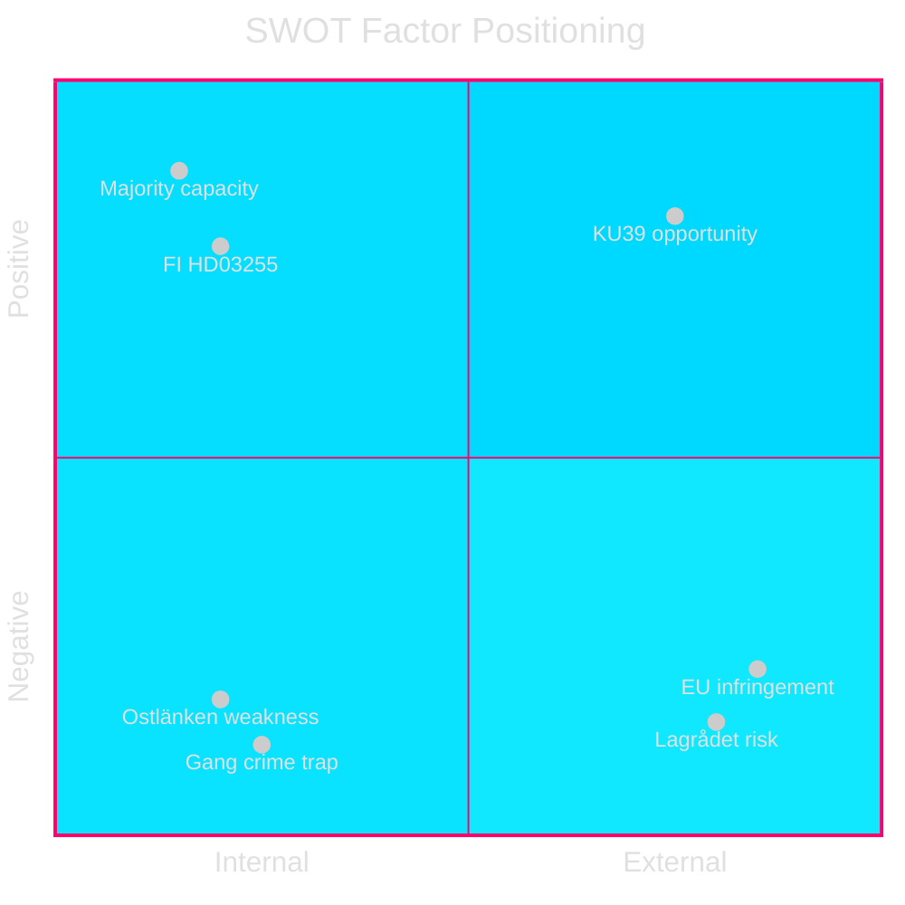

# SWOT Analysis — Realtime Pulse 2026-05-05

**Author**: James Pether Sörling  
**Date**: 2026-05-05  
**Framework**: SWOT + TOWS Matrix  

---

### Strengths

- **Majority legislative capacity**: Tidö coalition holds 176 seats — sufficient to pass HD03255 [A1], prop. 2025/26:242 [A1], and prop. 2025/26:246 [A1] against full opposition. Evidence: coalition-mathematics.md [A1].
- **Financial stability infrastructure**: HD03255 (riksdagen.se/HD03255 [A1]) fills macro-prudential data gap acknowledged by Riksbank FSR 2025 and IMF Article IV — positions Sweden among Nordic peers on household data frameworks.
- **Constitutional reform credibility**: L and KD ministers advancing KU39 transparency agenda builds democratic-legitimacy credentials with median voters ahead of September 13 election (data.riksdagen.se KU39 [A1]).
- **FiU49 backward-looking validation**: Riksgälden's 2021–2025 debt management performance provides government with positive fiscal narrative for September campaign; Sweden gross debt ~35% GDP (WEO Oct-2025, GGXWDG_NGDP, economicProvenance.provider: imf, vintage: WEO-Oct-2025).

---

### Weaknesses

- **Ostlänken credibility gap**: Infrastructure Minister Carlson cannot produce credible alternative capacity plan for rerouted Ostlänken — irreversible decision already made, creating permanent accountability vulnerability (HD10463 [A1]). Regional S/MP mobilisation in Östergötland actively building.
- **Gang crime accountability trap**: Justice Minister Strömmer's "eradicate gang crime in four years" commitment (Aftonbladet April 20, cited in HD10458 [A1]) cannot be operationalised — no public plan exists that would meet the KPI. Government has created a self-defeating standard.
- **Youth crime legislative fragility**: C's defection from Tidö position on HD024146 [A1] (criminal responsibility age 13) exposes thin majority on a flagship law-and-order measure. Lagrådet review outcome ~2026-06-01 could further erode coalition coherence.
- **ESA rank deterioration**: Sweden's fall to ESA rank #17 (HD10461 [A1]) damages Sweden's R&D-intensive economy narrative; Research Minister Edholm lacks mid-year budget authority to commit new ESA funding.

---

### Opportunities

- **KU39 pre-election positioning**: If KU39 produces meaningful constitutional transparency reform (lobbying register, digital ad transparency), L and KD can claim democratic-accountability credentials that differentiate them from SD within the coalition. Evidence: KU39 announcement data.riksdagen.se [A1].
- **HD03255 Nordic peer advancement**: Sweden closes macro-prudential data gap — positions government as responsible financial regulator in election campaign. FiU45 scheduled kammarvotering 2026-06-15 (H6D1plan [A1]).
- **Forestry coalition fragmentation as policy asset**: SD/C demanding more deregulation than the government (HD024143, HD024145 [A1]) allows government to position prop. 2025/26:242 as the "balanced" centre — absorbing both environmental and production demands.
- **CRC legal challenge as opposition weapon**: V+C+MP CRC coalition on HD024142/HD024146/HD024148 [A1] creates legal rather than purely political challenge — if Lagrådet confirms CRC incompatibility, cross-party constitutional ground for modification exists without government needing to admit political defeat.

---

### Threats

- **Lagrådet blocking opinion risk**: If Lagrådet issues a negative yttrande on HD03246 (youth crime, ~2026-06-01), the government's flagship criminal justice measure is constitutionally challenged 100 days before the election. Probability ~15%; impact: HIGH (data.riksdagen.se HD03246 [A1]).
- **EU infringement proceedings (forestry)**: Prop. 2025/26:242's cumulative deregulation against Habitats Directive Art. 6 creates EU infringement risk at T+12–24m, arriving in the next parliamentary term with accountability attribution to current government (HD024141–HD024147 [A1]).
- **KU39 minimal-scope disappointment**: If KU39 produces only symbolic transparency measures (no binding mechanisms), opposition S/MP/V narrative of "pre-election cosmetics" dominates and backfires on L/KD constitutional reform credibility (data.riksdagen.se KU39 [A1]).
- **Multi-front ministerial attrition**: Five simultaneous interpellations across four portfolios creates media-cycle pressure. Individual interpellation answers are rarely decisive — the pattern of sustained pressure is the threat (HD10458–HD10463 [A1]).

---

## TOWS Matrix

| | **Strengths (S)** | **Weaknesses (W)** |
|---|---|---|
| **Opportunities (O)** | **SO — Leverage KU39 + majority**: Pass substantive constitutional transparency with L/KD backing to differentiate within coalition; use majority efficiently to pass HD03255 before summer recess | **WO — Convert Lagrådet outcome**: If Lagrådet flags HD03246 flaws, use it to moderate the bill and eliminate C defection — converts weakness (C breakaway) to opportunity (broader majority) |
| **Threats (T)** | **ST — Use legislative productivity as shield**: Volume of substantive legislation (HD03255, KU39) provides positive counter-narrative to gang crime KPI trap | **WT — Avoid accountability compounding**: If gang crime KPIs + Ostlänken + youth crime Lagrådet all materialise negatively simultaneously, total narrative collapse risk — prioritise surgical management of HD10458 answer |

---

## Improvement Pass — SWOT Updates (9 New Documents)

### Updated Threats (T)

| Threat | Evidence | Magnitude |
|--------|---------|----------|
| SD institutional accountability offensive (Sida, UD, gang crime) | HD10464, HD10466, HD10458 [A1] | HIGH — pre-election wedge |
| Democratic backsliding perception risk (HD10466 civil servant audit demand) | HD10466 [A1], RF Ch.12 | MEDIUM-HIGH — international echo |
| C defection legal entrenchment via JuU30 | HD01JuU30 [A1] | MEDIUM — Lagrådet nexus |

### Updated Weaknesses (W)

| Weakness | Evidence | Magnitude |
|----------|---------|----------|
| M government unable to defend Sida without appearing ODA-generous | HD10464 [A1] | MEDIUM |
| KD Civilminister accountability on service office closures | HD10465 [A1] | MEDIUM — KD vulnerability |
