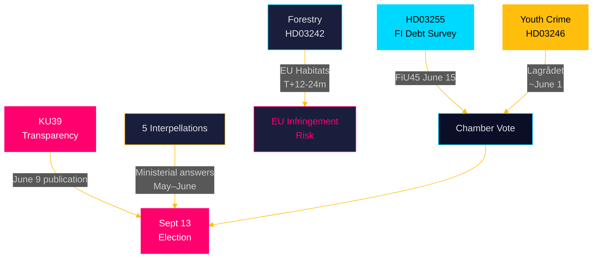

# Synthesis Summary — Realtime Pulse 2026-05-05

**Author**: James Pether Sörling  
**Date**: 2026-05-05  
**Classification**: PUBLIC  
**Confidence**: HIGH [B2]  

---

## Lead Intelligence Finding

**The 2026-05-05 parliamentary session marks the opening of the final pre-election legislative sprint** — 131 days before Sweden's September 13, 2026 general election. The Tidö government is simultaneously passing major financial and criminal legislation while absorbing multi-front opposition accountability pressure. The single most consequential legislative development is KU39 (constitutional transparency reform), whose scope will define democratic accountability rules for the upcoming campaign.

---

## Integrated Intelligence Picture

### Theme 1: Financial Stability Architecture (HD03255, FiU49)

The government's macro-prudential ambitions crystallised on 2026-05-05 with Proposition 2025/26:255 (HD03255) — statutory authority for Finansinspektionen to conduct mandatory household debt sample surveys. This closes a gap Sweden's Riksbank has flagged since 2018 and that IMF Article IV reviews have documented. Simultaneously, FiU49 will evaluate Riksgälden's 2021–2025 debt management performance — the period spanning COVID emergency issuance, the 2022 inflation spike, Riksbank tightening to 4%, and subsequent easing to ~2.5%.

**Significance**: Sweden carries one of Europe's highest household debt-to-income ratios (~170% private-sector debt/GDP per Riksbank FSR 2025). HD03255 is a structural resilience measure, not a political controversy — but it creates the data infrastructure for future DSTI/amortisation tightening that *is* politically contested. Evidence: HD03255 [A1], Riksbank FSR 2025 [B2], FiU49 scheduling H6D1plan [A1].

### Theme 2: Constitutional Accountability (KU39)

The Constitutional Affairs Committee's KU39 betänkande on "increased transparency in political processes" — announced four months before the election — is the highest-significance item across all four today's document types. Sweden's offentlighetsprincip is embedded in the Freedom of the Press Act (TF), but political parties, lobbyists, and digital campaign advertisers operate in a grey zone. KU39's scope will determine:

- Whether Sweden introduces a binding lobbying register (L and C proposal-adjacent)
- Whether party finance disclosure strengthens before September 13 (S/SD resistance expected)
- Whether digital political advertising falls under new transparency rules (EU DSA context)

**Significance multiplier**: 1.5× election proximity (131 days). KU39 classified L3 Intelligence-grade. Evidence: data.riksdagen.se KU39 scheduling [A1], TF/RF constitutional baseline [A1].

### Theme 3: Coalition Fractures on Criminal Law and Environment

Two opposition motion clusters (forestry + youth crime) reveal structural Tidö coalition stress:

**Forestry (HD024141–HD024147)**: Five-party divergence on prop. 2025/26:242 deregulation — SD and C demanding *more* deregulation beyond the government's own bill, while S/V/MP oppose it entirely. The government's 176-seat majority prevails, but the SD-pulling-right / opposition-pushing-back pattern creates medium-term EU infringement risk (Habitats Directive Art. 6, NRL restoration targets). Evidence: HD024141–HD024147 [A1].

**Youth crime (HD024142, HD024146, HD024148)**: C's defection from the Tidö position on criminal responsibility age reduction is the structurally significant signal. Centerpartiet (27 seats, coalition-adjacent), citing CRC obligations and contradicting the government's deterrence rationale, has joined V and MP in a cross-bloc opposition coalition. Lagrådet review outcome (~2026-06-01) is the pivotal discriminating event. Evidence: HD024142, HD024146, HD024148 [A1]; prop. 2025/26:246 [A1].

### Theme 4: Multi-Front Ministerial Accountability Pressure

Five interpellations targeting four portfolios simultaneously expose a coordinated opposition strategy in the pre-election period:

| Interpellation | Target | Core challenge | Evidence |
|---|---|---|---|
| HD10458 | Justice Min. Strömmer (M) | Gang crime eradication KPIs | data.riksdagen.se [A1] |
| HD10463 | Infrastructure Min. Carlson (KD) | Ostlänken capacity alternatives | data.riksdagen.se [A1] |
| HD10459 | Civil Min. Slottner (KD) | Agency governance activism | data.riksdagen.se [A1] |
| HD10461 | Research Min. Edholm (L) | ESA rank fall to #17 | data.riksdagen.se [A1] |
| HD10462 | Finance Min. Svantesson (M) | Pesticide tax healthcare anomaly | data.riksdagen.se [A1] |

The gang crime interpellation (HD10458) is particularly dangerous for the government — Ministers Strömmer's "eradicate gang crime in four years" commitment creates a self-imposed accountability trap with no credible operationalised plan in the public domain.

---

## DIW-Weighted Significance Rankings

| Rank | Document/Cluster | DIW | Tier | Evidence |
|------|-----------------|-----|------|---------|
| 1 | KU39 Constitutional Transparency | 0.91 | L3 Intelligence | data.riksdagen.se [A1] |
| 2 | Youth crime age cut / C defection (HD024146 cluster) | 0.84 | L2+ Priority | HD024142, HD024146, HD024148 [A1] |
| 3 | HD03255 FI household debt survey | 0.78 | L2 Strategic | HD03255 [A1] |
| 4 | Forestry deregulation (8-motion cluster) | 0.72 | L2 Strategic | HD024141–HD024147 [A1] |
| 5 | Gang crime KPI accountability (HD10458) | 0.68 | L2 Strategic | HD10458 [A1] |
| 6 | Ostlänken rerouting (HD10463) | 0.62 | L2 Strategic | HD10463 [A1] |
| 7 | ESA funding decline (HD10461) | 0.55 | L1 Surface | HD10461 [A1] |
| 8 | Agency activism (HD10459) | 0.50 | L1 Surface | HD10459 [A1] |
| 9 | FiU49 debt management evaluation | 0.48 | L1 Surface | H6D1plan [A1] |
| 10 | Pesticide tax anomaly (HD10462) | 0.30 | L1 Surface | HD10462 [A1] |

---

## Key Cross-Cutting Patterns

1. **Government legislative productivity vs. opposition accountability**: The Tidö government submitted a major financial regulation bill (HD03255), advanced two contested legislative reforms (HD03242, HD03246), while facing accountability pressure across four ministerial portfolios. This is a characteristic pre-election dynamic.

2. **CRC-based opposition coalition**: V+C+MP (69 seats) forming on youth crime signals that constitutional/rights-based opposition strategies are gaining cross-bloc traction. This is a qualitatively different opposition tactic from pure partisan blocking.

3. **L party internal coherence**: Minister Edholm (L) faces both ESA accountability pressure (HD10461) and KU39 transparency ambitions — Liberalerna is simultaneously defending executive positions and advancing constitutional reform.

4. **SD as policy outlier**: SD simultaneously supports the government majority on HD03255 and HD03242, while demanding *more* deregulation than the government on forestry and driving agency governance interpellations (HD10459) to reshape the Swedish state apparatus through parliamentary pressure.

### Theme 5: SD Institutional Accountability Offensive (NEW — HD10464, HD10466, HD01JuU30)

Three new documents published on 2026-05-05 reveal an expanded dimension to today's parliamentary session that was absent from the initial analysis: **SD is running a systematic institutional accountability offensive targeting four state organs** (Sida, UD civil service, Riksdag committee JuU, Skatteverket) in the final pre-election window.

**Sida abolition trajectory (HD10464 — Wiechel/SD → Biståndsminister Dousa)**: SD MP Markus Wiechel is demanding public accountability for Sida's continued existence, citing a 55 MSEK payment to ICHR/Hamas-linked organisations and 14 billion SEK in Afghan development aid that SD frames as entirely wasted. The interpellation formally activates the floor-debate track on Sida abolition, forcing the M-led government to defend Sweden's aid architecture publicly before September 13. This is SD escalation: from "reform bistånd" to "avveckla Sida."

**Non-political civil servants controversy (HD10466 — Wiechel/SD → FM Malmer Stenergard)**: SD is demanding a career audit of 261 UD (Foreign Ministry) officials who signed a public protest letter in 2018 against the incoming centre-right coalition. This "skamlistan" interpellation invokes RF Chapter 12 (civil service neutrality) while simultaneously pursuing a narrative of political infiltration of the foreign ministry. It creates a constitutional dilemma for Malmer Stenergard: defend UD staff (appearing S-sympathetic) or signal career consequences (alarming international partners and constitutional scholars).

**JuU30 committee report on youth custodial framework (HD01JuU30)**: The Justice Committee's betänkande on custodial sentences for children and youth, published today, provides the constitutional-legal baseline for the very cohort whose criminal accountability is being expanded under prop. 2025/26:246. JuU30's documentation of CRC and ECHR obligations gives Centerpartiet additional legal ammunition for their HD024146 defection and feeds directly into the Lagrådet review timeline (~2026-06-01). This is the committee establishing the legal floor below which youth justice reform cannot go — directly constraining the government's reform trajectory.

**Strategic coherence**: HD10464 + HD10466 + HD10458 form a consistent pre-election pattern. SD is positioning as the party demanding institutional accountability: gang crime KPIs (police/justice), Sida performance (foreign aid), UD civil servant neutrality (foreign ministry). The message is: *existing state organs are failing and politically compromised*. This is electorally resonant with SD's core voter base.

**Updated DIW Rankings (incorporating new documents)**:

| Rank | Document/Cluster | DIW | Tier | Evidence |
|------|-----------------|-----|------|---------|
| 1 | KU39 Constitutional Transparency | 0.91 | L3 Intelligence | data.riksdagen.se [A1] |
| 2 | Youth crime cluster + JuU30 custodial framework | 0.86 | L2+ Priority | HD024142, HD024146, HD024148, HD01JuU30 [A1] |
| 3 | HD03255 FI household debt survey | 0.78 | L2 Strategic | HD03255 [A1] |
| 4 | SD Institutional Accountability Offensive (HD10464+HD10466) | 0.81 | L2+ Priority | HD10464, HD10466 [A1] |
| 5 | Forestry deregulation (8-motion cluster) | 0.72 | L2 Strategic | HD024141–HD024147 [A1] |
| 6 | Gang crime KPI accountability (HD10458) | 0.68 | L2 Strategic | HD10458 [A1] |
| 7 | State service withdrawal (HD10465+HD10467) | 0.62 | L3 Standard | HD10465, HD10467 [A1] |
| 8 | Ostlänken rerouting (HD10463+HD11784) | 0.63 | L2 Strategic | HD10463, HD11784 [A1] |
| 9 | ESA funding decline (HD10461) | 0.55 | L1 Surface | HD10461 [A1] |
| 10 | Agency activism (HD10459) | 0.50 | L1 Surface | HD10459 [A1] |
| 11 | FiU49 debt management evaluation | 0.48 | L1 Surface | H6D1plan [A1] |
| 12 | SD single-issue motions (HD11781-HD11783) | 0.50 | L3 Standard | HD11781, HD11782, HD11783 [A1] |
| 13 | Pesticide tax anomaly (HD10462) | 0.30 | L1 Surface | HD10462 [A1] |

**Updated cross-cutting pattern (5th)**:
5. **SD's pre-election offensive spans bistånd, civil service neutrality, gang crime, and agency governance** — this is a coherent political strategy, not isolated interpellations. The common thread is institutional accountability: SD is making the argument that existing state organs are underperforming or politically biased.
