# Threat Analysis — Realtime Pulse 2026-05-05

**Author**: James Pether Sörling  
**Date**: 2026-05-05  
**Framework**: Political Threat Taxonomy + Attack Tree  

---

## Political Threat Taxonomy

### Tier 1 — Constitutional/Structural Threats

**T-01: Coalition disintegration cascade**  
Trigger: C formally withdraws support on HD024146 (criminal responsibility age 13) → extends to additional bills. Current signal: C submitted reserved position on HD024146 [A1]. Cascade vector: if C withdraws from one Tidö commitment, SD/C tensions on immigration simultaneously surface, M leadership is forced into reactive management mode.

**T-02: Pre-election constitutional credibility failure (KU39)**  
Trigger: KU39 produces minimal recommendations (no binding lobbying register, weak digital ad transparency). Opposition frames as "pre-election cosmetics." L and KD lose differentiation argument within coalition. Constitutional reform becomes liability rather than asset. Evidence: KU39 committee process, data.riksdagen.se [A1].

### Tier 2 — Electoral Threats

**T-03: Gang crime accountability narrative lock-in**  
Trigger: HD10458 (Justice Minister Strömmer) answer does not provide credible KPI baseline. Opposition extracts April 20 Aftonbladet quote as "4-year commitment, 0 progress" campaign material. High-probability compound: April 20 quote is public record, no mechanism exists to walk it back [A1].

**T-04: Multi-ministry interpellation narrative convergence**  
Trigger: If media frames HD10458 + HD10459 + HD10461 + HD10462 + HD10463 as systemic government failure across Safety/Infrastructure/Research/Civil portfolios, meta-narrative emerges: "government unable to deliver." Threat probability: moderate (0.45) given strong L×I aggregate.

**T-05: Ostlänken regional electoral defection**  
Trigger: S/MP Östergötland candidates make Ostlänken rerouting core platform element in September campaign. HD10463 [A1] creates documented evidence base for accountability claims. Infrastructure Minister Carlson has no credible alternative capacity plan.

### Tier 3 — International/External Threats

**T-06: EU Habitats infringement challenge**  
Trigger: European Commission opens Art. 258 proceedings against Sweden for forestry deregulation exceeding Habitats Directive Art. 6(3) safe-harbour exemptions. Documents HD024141–HD024147 provide pre-legislative opposition paper trail demonstrating domestic political actors raised concerns [A1]. Timeline: T+12–24m.

**T-07: Lagrådet constitutional blocking opinion**  
Trigger: Lagrådet issues negative yttrande on HD03246 (criminal responsibility age 13), citing CRC incompatibility. HD024148 [A1] has already raised CRC argument. If Lagrådet confirms constitutional flaw, government must either modify bill or proceed against constitutional advice — both outcomes damage pre-election law-and-order narrative.

---

## Attack Tree: Gang Crime Narrative Threat (T-03)

```mermaid
%%{init: {'theme': 'dark', 'themeVariables': {'primaryColor': '#00d9ff', 'primaryTextColor': '#e0e0e0', 'primaryBorderColor': '#ff006e', 'lineColor': '#ffbe0b', 'secondaryColor': '#1a1e3d', 'tertiaryColor': '#0a0e27'}}}%%
flowchart TD
    ROOT["🎯 Government gang crime\ncredibility failure"] --> A["Strömmer HD10458\nnon-answer"]
    ROOT --> B["KPI baseline\nnot established"]
    ROOT --> C["April 20 Aftonbladet\nquote weaponised"]
    A --> A1["Riksdag chamber\ndebate failure"]
    A --> A2["Media follow-up\nreporting cycle"]
    B --> B1["No measurable\nyear-1 target"]
    B --> B2["Opposition\nmotion series"]
    C --> C1["Campaign material\nS/V/MP/C/MP"]
    C --> C2["TV debate\ncorner trap"]
    A1 & A2 & B1 & B2 & C1 & C2 --> Z["🔴 Electoral narrative\nGov failed on crime"]
    style ROOT fill:#ff006e,stroke:#ff006e
    style Z fill:#ff006e,stroke:#ff006e
    style A fill:#1a1e3d,stroke:#00d9ff
    style B fill:#1a1e3d,stroke:#00d9ff
    style C fill:#1a1e3d,stroke:#00d9ff
```

---

## DISARM Threat TTPs (Narrative Warfare Dimension)

| TTP | Description | Applied To | Origin |
|-----|-------------|------------|--------|
| T0003 | Amplify existing content | April 20 Aftonbladet quote | S/V/MP/C |
| T0013 | Create deceptive identities | Framing "government's own KPI" | Opposition |
| T0017 | Promote polarizing narratives | "Government chose deregulation over safety" (HD024141) | SD/V |
| T0023 | Flooding information space | 5 simultaneous interpellations (coordination) | S/V/MP/C |
| T0049 | Run polarizing campaigns | Youth crime vs constitutional rights (HD024146/HD024148) | V+C+MP |

---

## Improvement Pass — New Threat Vectors (HD10464, HD10466, HD01JuU30)

### TT-NEW-1 — Sida Abolition Narrative (HD10464)
**Source**: SD via Markus Wiechel  
**Type**: Political institution attack  
**Target**: Sida, M's Biståndsminister Dousa  
**Vector**: Hamas-linked payment allegation (55 MSEK) [A2 unverified] weaponised as accountability frame  
**Risk**: If confirmed → legitimate accountability, Dousa credibility risk; If denied → SD misinformation pattern

### TT-NEW-2 — "Political Civil Servant" Accountability (HD10466)
**Source**: SD via Markus Wiechel  
**Type**: Democratic norm threat / institutional attack  
**Target**: UD civil service, FM Malmer Stenergard  
**Vector**: DISARM T0003 (amplify 2018 skamlistan); demand for career audit of 261 state officials  
**Risk**: Constitutional scholars, EU partners, Nordic allies may perceive as RF Chapter 12 violation attempt  
**DISARM TTP**: T0017 (polarising narrative: "deep state political bias in foreign ministry")

### TT-NEW-3 — JuU30 / Youth Crime Legal Legitimisation (HD01JuU30)
**Source**: JuU committee (bipartisan)  
**Type**: Constitutional legitimacy signal  
**Target**: Prop. 2025/26:246 (criminal age 13) — government reform  
**Vector**: Committee establishes CRC/ECHR baseline that constrains HD03246's constitutionality  
**Risk**: Low (this is the normal legislative process) but the committee report provides legal resources to reform opponents

### Updated DISARM Table

| TTP | Description | Applied To (NEW) | Origin |
|-----|-------------|-----------------|--------|
| T0003 | Amplify existing content | 2018 skamlistan (HD10466) | SD |
| T0017 | Promote polarizing narratives | "State serving ideological interests" (HD10464, HD10466) | SD |
| T0023 | Flooding information space | 7 new interpellations on single day | S/SD coordinated |
