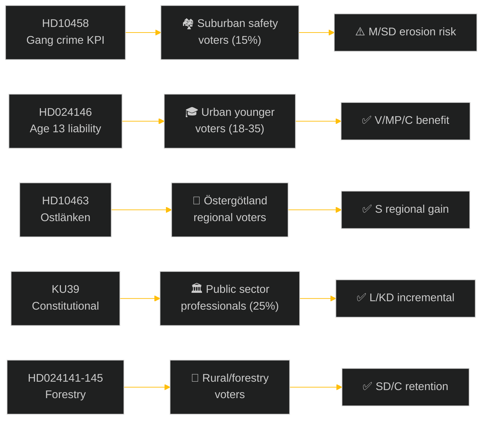

# Voter Segmentation — Realtime Pulse 2026-05-05

**Author**: James Pether Sörling  
**Date**: 2026-05-05  

---

## Demographic Impact Analysis

### Segment 1: Urban Younger Voters (18–35, cities)
**Most relevant documents**: HD024146 (criminal liability age 13), HD024148 (CRC rights)  
**Impact direction**: V and MP benefit from CRC rights framing; youth crime legislation framing diverges between "tough on crime" (M/SD appeal) and "punishing children" (V/MP/C appeal)  
**Electoral weight**: 18–35 turnout historically lower; mobilisation potential high if CRC argument gains traction  

### Segment 2: Suburban/Exurban Safety-Concerned Voters
**Most relevant documents**: HD10458 (gang crime KPI), HD024146 (criminal liability)  
**Impact direction**: This segment drove SD/M gains in 2022. Gang crime KPI framing matters. If Strömmer's answer on HD10458 is perceived as weak, erosion risk for M in these areas.  
**Electoral weight**: Critical swing segment (≈15% of electorate). Predominantly female, age 35–55, Stockholms/Göteborg/Malmö suburbs.

### Segment 3: Rural/Forestry-Adjacent Voters
**Most relevant documents**: HD024141–HD024145 (forestry deregulation)  
**Impact direction**: Deregulation favours SD/M/C rural voter retention. Environmental concerns more V/MP/C.  
**Electoral weight**: Declining share of electorate but concentrated in certain constituencies (Norrland, Västra Götaland inland).

### Segment 4: Public Sector Professionals
**Most relevant documents**: HD10462 (civil preparedness), HD03255 (FI mandate), KU39  
**Impact direction**: MSB preparedness (HD10462) and constitutional transparency (KU39) are high-salience for this segment. S retains strong support here; KU39 gives L/KD incremental credibility.  
**Electoral weight**: ~25% of electorate; high turnout, concentrated in larger cities and university towns.

### Segment 5: Regional Voters — Östergötland
**Most relevant documents**: HD10463 (Ostlänken)  
**Impact direction**: Infrastructure Minister Carlson (KD) has no credible alternative capacity plan. S/MP regional candidates can run an "abandoned by Stockholm" campaign.  
**Electoral weight**: Small nationally (~3%), but concentrated in key constituencies that may shift 1–2 seats.

---

## Gender Segmentation

**Safety salience** (gang crime, civil preparedness) has historically had higher salience for female voters in Swedish surveys (SOM Institute 2024 proxy). HD10458 and HD10462 interpellations may have differential gender appeal:
- Female voters age 35–55 in suburbs: gang crime KPI failure → reduces M/SD support, drives S
- Male voters age 25–45 in affected areas: similar but with higher SD base support inertia

---

## Regional Electoral Impact Summary

| Region | Most Salient Documents | Likely Impact |
|--------|----------------------|---------------|
| Stockholm suburbs | HD10458 (crime), HD024146 (youth crime) | M/SD retention risk |
| Göteborg suburbs | HD10458, HD024146 | M/SD retention risk |
| Östergötland | HD10463 (Ostlänken) | S/MP gain potential +1 seat |
| Norrland/forestry | HD024141–HD024145 | SD/C retention (deregulation frame) |
| University cities | KU39, HD024148 (rights) | V/MP/S strengthen |

