# Scenario Analysis — Tidö Mandate 2022–2026 + Post-Election

**Author**: James Pether Sörling | **Generated**: 2026-05-06 | **Framework**: 4 scenarios × 3 coalition branches = 12 leaves

## Scenario Framing

**Decision node**: The 2026-09-13 election. Four base scenarios driven by:
1. **Tidö holds majority**: L ≥4.0% and Tidö parties total >175 seats
2. **Tidö margin shrinks**: L ≥4.0% but total ≤175 → minority governance
3. **Tidö loses L**: L <4.0% → Tidö loses majority
4. **Red-Green majority**: S-bloc achieves 175+

Each scenario branches into 3 coalition configurations.

## Scenario Tree

```mermaid
%%{init: {'theme': 'dark', 'themeVariables': {'primaryColor': '#00d9ff', 'background': '#0a0e27'}}}%%
graph TD
    START["2026-09-13 Election Anchor"] --> S1["Scenario A<br/>Tidö Full Majority<br/>WEP LIKELY [horizon:election]"]
    START --> S2["Scenario B<br/>Tidö Minority<br/>WEP ROUGHLY EVEN [horizon:election]"]
    START --> S3["Scenario C<br/>L Collapse<br/>WEP UNLIKELY [horizon:election]"]
    START --> S4["Scenario D<br/>Red-Green Majority<br/>WEP UNLIKELY [horizon:election]"]

    S1 --> S1a["A1: M+KD+L+SD formal coalition<br/>WEP LIKELY"]
    S1 --> S1b["A2: M+KD+L minority, SD support<br/>WEP ROUGHLY EVEN"]
    S1 --> S1c["A3: Grand coalition M+S+L<br/>WEP VERY UNLIKELY"]

    S2 --> S2a["B1: M-led minority, SD+KD confidence<br/>WEP LIKELY"]
    S2 --> S2b["B2: Caretaker government<br/>WEP UNLIKELY"]
    S2 --> S2c["B3: New election within 12 months<br/>WEP ROUGHLY EVEN"]

    S3 --> S3a["C1: M+KD+SD 3-party coalition<br/>WEP LIKELY if C3"]
    S3 --> S3b["C2: Blocking minority, no government<br/>WEP ROUGHLY EVEN"]
    S3 --> S3c["C3: S-led minority with L support<br/>WEP UNLIKELY"]

    S4 --> S4a["D1: S-led minority, MP+V support<br/>WEP LIKELY"]
    S4 --> S4b["D2: S+C+L coalition<br/>WEP ROUGHLY EVEN"]
    S4 --> S4c["D3: Grand coalition S+M<br/>WEP VERY UNLIKELY"]

    style S1 fill:#006600,stroke:#00ff00,color:#fff
    style S2 fill:#666600,stroke:#ffff00,color:#fff
    style S3 fill:#660000,stroke:#ff0000,color:#fff
    style S4 fill:#660000,stroke:#ff0000,color:#fff
```

## Scenario Probability Summary

| Scenario | WEP Assessment | Key Condition | Horizon |
|----------|---------------|---------------|---------|
| A: Tidö Full Majority | LIKELY | L stable, Tidö 175+ | [horizon:election] |
| B: Tidö Margin Shrink | ROUGHLY EVEN | Tidö 170-175 | [horizon:election] |
| C: L Collapse | UNLIKELY | L <4.0%, polls miss | [horizon:election] |
| D: Red-Green Majority | UNLIKELY | S-bloc swing +12 seats | [horizon:election] |

**Most probable outcome (2026-05-06 assessment)**: Scenario A (Tidö Full Majority) or Scenario B (Tidö Narrow Majority). Combined probability: >60% WEP LIKELY [horizon:election].

## Welfare Reform Impact on Scenarios (2026-05-06 Insight)

Today's HD01SfU21 and HD01SfU24 committee reports provide L with concrete campaign material. Each +0.1pp L poll movement converts approximately 0.7 seats at current electorate size. If welfare reform messaging raises L to 4.5% by August 2026, Scenario A probability rises from LIKELY to HIGH CONFIDENCE [horizon:election].

## Defence/SIGINT Impact on Scenarios

HD01FöU18 (SIGINT) reduces Scenario C probability by stabilising M and KD voters who prioritise national security — these voters are unlikely to migrate to Red-Green even under economic pressure.

**Pass 2 improvements**: Full 12-leaf scenario tree with Mermaid diagram; WEP tags with horizon-band on every leaf; welfare reform quantitative impact on scenario probabilities; defence narrative impact assessed.
