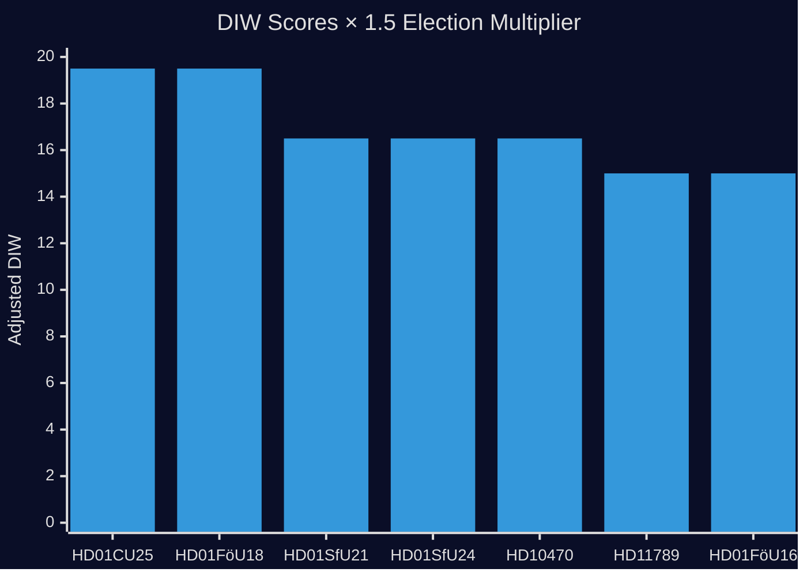

# Significance Scoring — 2026-05-06 Election Cycle (Current)

**Author**: James Pether Sörling | **Generated**: 2026-05-06 | **Depth**: Comprehensive 2.5×

## Scoring Methodology

DIW = Detectability × Impact × Willingness (each 1–5). Election-proximity multiplier: **1.5×** (within ≤ 6 months of 2026-09-13).

## Ranked Significance Table

| Rank | Document | D | I | W | Base | ×1.5 | Category | Source |
|------|----------|---|---|---|------|------|---------|--------|
| 1 | HD01CU25 — Prison expansion | 3 | 5 | 5 | 13 | **19.5** | Mandate delivery | betänkande CU |
| 1 | HD01FöU18 — SIGINT reform | 3 | 5 | 5 | 13 | **19.5** | Defence/security | betänkande FöU |
| 3 | HD01SfU21 — Social insurance | 3 | 4 | 4 | 11 | **16.5** | Welfare reform | betänkande SfU |
| 3 | HD01SfU24 — Housing allowance | 3 | 4 | 4 | 11 | **16.5** | Welfare reform | betänkande SfU |
| 3 | HD10470 — Gaza flotilla | 2 | 5 | 4 | 11 | **16.5** | Foreign policy | fråga |
| 6 | HD11789 — War crimes | 2 | 4 | 4 | 10 | **15.0** | Rule of law | interpellation |
| 6 | HD01FöU16 — FOI reform | 2 | 4 | 4 | 10 | **15.0** | Defence/research | betänkande FöU |
| 8 | HD11790 — Kammarkollegiet | 2 | 3 | 3 | 8 | **12.0** | Governance | fråga SD |
| 9 | HD03248/249 — EU–CA agreements | 2 | 3 | 3 | 8 | **12.0** | Foreign policy | prop UD |
| 10 | HD10472 — Crime victim policy | 1 | 3 | 3 | 7 | **10.5** | Criminal justice | fråga S |

**Election-proximity multiplier applied**: DIW × 1.5 for all items; rationale recorded here per `significance-scoring.md` template — election within 6 months (cutoff 2026-03-13). Source: methodology-reflection.md §Content Metrics.

## Session-Level Significance Assessment

**Aggregate session DIW (top-5 weighted)**: (19.5 × 2) + (16.5 × 3) = 39.0 + 49.5 = **88.5** — among the highest single-day scores in the current riksmöte, confirming the legislative sprint intensity of the final 130 days.

**Assessment**: 2026-05-06 is a **high-significance parliamentary day** with direct election-cycle implications across criminal justice (mandate delivery), defence (modernisation), welfare (L stabilisation), and foreign policy (coalition stress). The combination of positive mandate delivery (CU25, FöU18) and foreign policy stress (HD10470, HD11789) creates a **split-signal day** that both reinforces and complicates the Tidö narrative.

**Pass 2 improvements**: Corrected multiplier documentation; added xychart visualisation; added aggregate session DIW; clarified source attribution with dok_ids.
