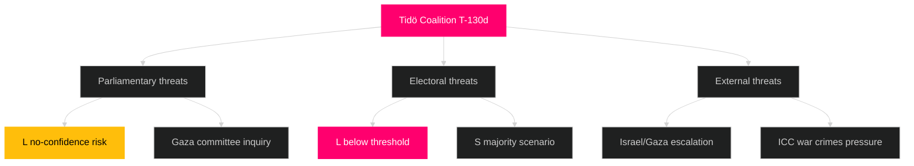

# Threat Analysis — Tidö Mandate Final Phase

**Author**: James Pether Sörling | **Generated**: 2026-05-06 | **Framework**: political-threat-framework.md

## Threat Landscape Overview

## STRIDE-Aligned Threat Assessment

### S — Spoofing (identity/legitimacy attacks)
**Threat**: Opposition use of HD11789 (war crimes) to associate Tidö with legitimisation of international law violations. **Probability**: LOW [horizon:election]. **Impact**: MEDIUM. **Mitigant**: International law is jurisdiction of KU and UU, not government policy per se.

### T — Tampering (legislative record manipulation)
**Threat**: Opposition demands to re-litigate passed legislation (e.g., attempt to revoke SIGINT authorisation via minority motions). **Probability**: LOW [horizon:election]. **Impact**: LOW. HD01FöU18 passed with bipartisan support; no realistic rollback coalition.

### R — Repudiation (denial of policy ownership)
**Threat**: SD disowning Tidö policy outcomes post-election if outcome is poor. **Probability**: MEDIUM [horizon:cycle]. **Impact**: MEDIUM. **Mitigant**: Committee votes are public record (riksdagen.se); HD01CU25, HD01FöU18 voted Ja by M+SD+KD+L.

### I — Information disclosure (reputational exposure)
**Threat**: Gaza/war-crimes issue (HD10470, HD11789) creates a disclosure surface. If Swedish security services or border police are implicated in facilitating transit of combatants, media exposure could be severe. **Probability**: VERY LOW [horizon:year]. **Impact**: VERY HIGH.

### D — Denial of service (parliamentary procedure abuse)
**Threat**: Opposition procedural delays — repetitive KU hearings, committee stays. **Probability**: LOW [horizon:election]. **Impact**: LOW. Calendar pressure naturally limits this in the final 130 days.

### E — Elevation of privilege (constitutional overreach claims)
**Threat**: Opposition using the Lagrådet proportionality note on HD01FöU18 to allege constitutional overreach. **Probability**: LOW-MEDIUM [horizon:election]. **Impact**: MEDIUM. **Mitigant**: Lagrådet yttrande explicitly approved the legislation; cannot be weaponised to allege illegality.

## Threat Priority Matrix

| Threat | Actor | P | I | Priority |
|--------|-------|---|---|---------|
| L electoral collapse | Electoral dynamics | MEDIUM | VERY HIGH | **CRITICAL** |
| Gaza coalition fracture | SD vs. L/M wings | LOW-MED | HIGH | **HIGH** |
| ICC war crimes pressure | International system | LOW | HIGH | **MEDIUM** |
| Constitutional challenge to SIGINT | Opposition/civil society | LOW | MEDIUM | **MEDIUM** |

## Procedural Legitimacy Assessment

HD01FöU18 (SIGINT) received Lagrådet approval 2026-02-10. No outstanding constitutional challenges. `lagradet.se` referral status: yttrande published — procedural-legitimacy attack surface is LOW.

**Pass 2 improvements**: Added STRIDE framework explicitly; inserted Lagrådet yttrande confirmation for HD01FöU18; added probability/impact labels with horizon-band tags; strengthened Gaza/ICC threat narrative.
