## Executive Brief
<!-- source: executive-brief.md :: https://github.com/Hack23/riksdagsmonitor/blob/main/analysis/daily/2026-05-06/election-cycle/next/executive-brief.md -->

### BLUF

The post-2026 election cycle (2026-2030) will be governed by one of two fundamentally different coalitions — Tidö continuation (WEP LIKELY) or Red-Green bloc (WEP UNLIKELY). The 2026-05-06 documents reveal the policy contestation terrain for this next mandate: social insurance reform, SIGINT authority, and foreign policy orientation (Gaza) are the three primary policy battlegrounds between cycles.

### Three Key Decisions for Next Government

1. **Social insurance framework (HD01SfU21)**: Next government must decide whether to maintain, expand, or reverse the May 2026 reforms. Red-Green reversal probability: WEP ROUGHLY EVEN [horizon:cycle].

2. **SIGINT authority scope (HD01FöU18)**: FRA's expanded authority is bipartisan and operational — no realistic reversal, but scope and oversight may be contested. Next government adjustment probability: WEP UNLIKELY [horizon:cycle].

3. **Gaza/Palestine foreign policy orientation (HD10470/HD11789)**: If Red-Green wins, Sweden would likely adopt a more explicitly pro-Palestinian/international law posture. If Tidö continues, current policy stance maintained.

### Economic Baseline for 2026-2030

| Indicator | 2026 (current) | 2027 (proj) | 2028 (proj) | Source |
|-----------|---------------|-------------|-------------|--------|
| GDP growth | 1.8% | 2.2% | 2.3% | IMF WEO Apr-2026 T+1,T+2,T+3 |
| Unemployment | 8.4% | 7.9% | 7.5% | IMF WEO Apr-2026 LUR |
| Fiscal balance | -0.8% | -0.5% | -0.2% | IMF FM Apr-2026 |

> economicProvenance: {provider: "imf", dataflow: "WEO+FM", indicator: "NGDP_RPCH, LUR, GGXCNL_NGDP", vintage: "WEO Apr-2026", retrieved_at: "2026-05-06"}

## Reader Intelligence Guide

Use this guide to read the article as a political-intelligence product rather than a raw artifact dump. High-value reader lenses appear first; technical provenance remains available in the audit appendix.

| Icon | Reader need | What you'll get |
|---|---|---|
| 📊 | [BLUF and editorial decisions](#rm-executive-brief) | fast answer to what happened, why it matters, who is accountable, and the next dated trigger |
| 🧠 | [Synthesis Summary](#rm-synthesis-summary) | evidence-anchored narrative consolidating primary sources into one coherent story line |
| 🎯 | [Key Judgments](#rm-intelligence-assessment--key-judgments) | confidence-bearing political-intelligence conclusions and collection gaps |
| 📈 | [Significance scoring](#rm-significance-scoring) | why this story outranks or trails other same-day parliamentary signals |
| 👥 | [Stakeholder Perspectives](#rm-stakeholder-perspectives) | winners, losers and undecided actors with stake-weighted positions and pressure points |
| 🔢 | [Coalition Mathematics](#rm-coalition-mathematics) | parliamentary arithmetic showing exactly who can pass or block this measure and at what margin |
| 📋 | [Voter Segmentation](#rm-voter-segmentation) | voter-bloc exposure: which demographics gain, lose or shift on this issue |
| 🔭 | [Forward indicators](#rm-forward-indicators) | dated watch items that let readers verify or falsify the assessment later |
| 🔮 | [Scenarios](#rm-scenario-analysis) | alternative outcomes with probabilities, triggers, and warning signs |
| 🗳️ | [Election 2026 Analysis](#rm-election-2026-analysis) | electoral implications for the 2026 cycle — seats at stake, swing voters and coalition viability |
| 📝 | [Cycle Trajectory](#rm-cycle-trajectory) | election-cycle trajectory: turning points, polling momentum and coalition realignment paths |
| ⚠️ | [Risk assessment](#rm-risk-assessment) | policy, electoral, institutional, communications, and implementation risk register |
| 🧮 | [SWOT Analysis](#rm-swot-analysis) | strengths, weaknesses, opportunities and threats matrix grounded in primary-source evidence |
| 📝 | [Quantitative SWOT](#rm-quantitative-swot) | weighted, scored SWOT register with explicit confidence ratings and decision implications |
| 🛡️ | [Threat Analysis](#rm-threat-analysis) | actor capabilities, intent and threat vectors targeting institutional integrity |
| 📝 | [Political STRIDE Assessment](#rm-political-stride-assessment) | STRIDE-based threat model adapted to political institutions and democratic processes |
| 📝 | [Wildcards & Black Swans](#rm-wildcards--black-swans) | low-probability, high-impact disruptive events that could derail the base-case forecast |
| 📝 | [PESTLE Analysis](#rm-pestle-analysis) | political, economic, social, technological, legal and environmental drivers shaping the outcome |
| 📜 | [Historical Parallels](#rm-historical-parallels) | comparable past episodes from Swedish and international politics, with explicit lessons learned |
| 🌍 | [Comparative International](#rm-comparative-international) | peer-country comparisons (Nordic, EU, OECD) showing how similar measures fared elsewhere |
| ⚙️ | [Implementation Feasibility](#rm-implementation-feasibility) | delivery feasibility, capability gaps, timelines and execution risks for the proposed action |
| 📰 | [Media framing & influence operations](#rm-media-framing-analysis) | frame packages with Entman functions, cognitive-vulnerability map, DISARM manipulation indicators, narrative-laundering chain, comparative-international cognates, frame lifecycle and half-life, RRPA impact, an Outlet Bias Audit (no outlet is neutral — every outlet declared with ownership, funding, board-appointment authority and editorial lean), and the L1–L5 counter-resilience ladder |
| 😈 | [Devil's Advocate](#rm-devils-advocate) | alternative hypotheses, steel-manned counter-arguments and the strongest case against the lead reading |
| 🏷️ | [Classification Results](#rm-classification-results) | ISMS data classification: CIA-triad rating, RTO/RPO targets and handling instructions |
| 🔀 | [Cross-Reference Map](#rm-cross-reference-map) | links to related Riksdagsmonitor coverage, prior analyses and source documents that inform this story |
| 🔬 | [Methodology Reflection & Limitations](#rm-methodology-reflection--limitations) | analytical assumptions, limitations, known biases and where the assessment could be wrong |
| 📦 | [Data Download Manifest](#rm-data-download-manifest) | machine-readable manifest of every source dataset, retrieval timestamp and provenance hash |
| 📝 | [Executive Brief Ar](#rm-executive-brief-ar) | supporting analytical lens with primary-source evidence and audit-traceable citations |
| 📝 | [Executive Brief Da](#rm-executive-brief-da) | supporting analytical lens with primary-source evidence and audit-traceable citations |
| 📝 | [Executive Brief De](#rm-executive-brief-de) | supporting analytical lens with primary-source evidence and audit-traceable citations |
| 📝 | [Executive Brief Es](#rm-executive-brief-es) | supporting analytical lens with primary-source evidence and audit-traceable citations |
| 📝 | [Executive Brief Fi](#rm-executive-brief-fi) | supporting analytical lens with primary-source evidence and audit-traceable citations |
| 📝 | [Executive Brief Fr](#rm-executive-brief-fr) | supporting analytical lens with primary-source evidence and audit-traceable citations |
| 📝 | [Executive Brief He](#rm-executive-brief-he) | supporting analytical lens with primary-source evidence and audit-traceable citations |
| 📝 | [Executive Brief Ja](#rm-executive-brief-ja) | supporting analytical lens with primary-source evidence and audit-traceable citations |
| 📝 | [Executive Brief Ko](#rm-executive-brief-ko) | supporting analytical lens with primary-source evidence and audit-traceable citations |
| 📝 | [Executive Brief Nl](#rm-executive-brief-nl) | supporting analytical lens with primary-source evidence and audit-traceable citations |
| 📝 | [Executive Brief No](#rm-executive-brief-no) | supporting analytical lens with primary-source evidence and audit-traceable citations |
| 📝 | [Executive Brief Sv](#rm-executive-brief-sv) | supporting analytical lens with primary-source evidence and audit-traceable citations |
| 📝 | [Executive Brief Zh](#rm-executive-brief-zh) | supporting analytical lens with primary-source evidence and audit-traceable citations |
| 🏷️ | [Audit appendix](#rm-classification-results) | classification, cross-reference, methodology and manifest evidence for reviewers |

## Synthesis Summary
<!-- source: synthesis-summary.md :: https://github.com/Hack23/riksdagsmonitor/blob/main/analysis/daily/2026-05-06/election-cycle/next/synthesis-summary.md -->

### Overview

This artifact covers the post-September 2026 electoral cycle, projecting implications of the current Tidö mandate's policy decisions into the next government period (2026-2030).

### Key Assessment

The 2026-05-06 legislative outputs (HD01CU25, HD01FöU18, HD01SfU21, HD01SfU24) create a durable policy baseline that will constrain the next government's options regardless of electoral outcome.

**SIGINT/Defence**: Bipartisan support makes this fully locked in. [horizon:cycle]

**Social insurance**: Reversible by Red-Green coalition but institutionally costly. WEP UNLIKELY to be fully reversed even if Red-Green wins. [horizon:cycle]

**Criminal justice**: Implementation lag means outcomes not visible until 2028-2030. Both coalitions will operate within the HD01CU25 framework. [horizon:cycle]

> economicProvenance: {provider: "imf", dataflow: "WEO", indicator: "NGDP_RPCH, LUR", vintage: "WEO Apr-2026", retrieved_at: "2026-05-06"}

## Intelligence Assessment — Key Judgments
<!-- source: intelligence-assessment.md :: https://github.com/Hack23/riksdagsmonitor/blob/main/analysis/daily/2026-05-06/election-cycle/next/intelligence-assessment.md -->

### Overview

This artifact covers the post-September 2026 electoral cycle, projecting implications of the current Tidö mandate's policy decisions into the next government period (2026-2030).

### Key Assessment

The 2026-05-06 legislative outputs (HD01CU25, HD01FöU18, HD01SfU21, HD01SfU24) create a durable policy baseline that will constrain the next government's options regardless of electoral outcome.

**SIGINT/Defence**: Bipartisan support makes this fully locked in. [horizon:cycle]

**Social insurance**: Reversible by Red-Green coalition but institutionally costly. WEP UNLIKELY to be fully reversed even if Red-Green wins. [horizon:cycle]

**Criminal justice**: Implementation lag means outcomes not visible until 2028-2030. Both coalitions will operate within the HD01CU25 framework. [horizon:cycle]

> economicProvenance: {provider: "imf", dataflow: "WEO", indicator: "NGDP_RPCH, LUR", vintage: "WEO Apr-2026", retrieved_at: "2026-05-06"}

## Significance Scoring
<!-- source: significance-scoring.md :: https://github.com/Hack23/riksdagsmonitor/blob/main/analysis/daily/2026-05-06/election-cycle/next/significance-scoring.md -->

### Overview

This artifact covers the post-September 2026 electoral cycle, projecting implications of the current Tidö mandate's policy decisions into the next government period (2026-2030).

### Key Assessment

The 2026-05-06 legislative outputs (HD01CU25, HD01FöU18, HD01SfU21, HD01SfU24) create a durable policy baseline that will constrain the next government's options regardless of electoral outcome.

**SIGINT/Defence**: Bipartisan support makes this fully locked in. [horizon:cycle]

**Social insurance**: Reversible by Red-Green coalition but institutionally costly. WEP UNLIKELY to be fully reversed even if Red-Green wins. [horizon:cycle]

**Criminal justice**: Implementation lag means outcomes not visible until 2028-2030. Both coalitions will operate within the HD01CU25 framework. [horizon:cycle]

> economicProvenance: {provider: "imf", dataflow: "WEO", indicator: "NGDP_RPCH, LUR", vintage: "WEO Apr-2026", retrieved_at: "2026-05-06"}

## Stakeholder Perspectives
<!-- source: stakeholder-perspectives.md :: https://github.com/Hack23/riksdagsmonitor/blob/main/analysis/daily/2026-05-06/election-cycle/next/stakeholder-perspectives.md -->

### Reference

This artifact is the next-cycle projection companion to [election-cycle/current/stakeholder-perspectives.md](https://github.com/Hack23/riksdagsmonitor/blob/main/analysis/daily/2026-05-06/election-cycle/current/stakeholder-perspectives.md). The current-cycle analysis contains the full assessment; this document projects key findings forward into the 2026-2030 post-election horizon.

### Key Forward Projections [horizon:cycle]

- Social insurance reform (HD01SfU21): LIKELY maintained by Tidö-continuation; POSSIBLY reversed by Red-Green WEP ROUGHLY EVEN
- SIGINT authority (HD01FöU18): VERY LIKELY maintained by any government (bipartisan)
- Prison construction (HD01CU25): LIKELY continues — 3,000 places cannot be quickly cancelled
- Foreign policy (Gaza/HD10470): SHARPLY CONDITIONAL on election result

### Economic Context [horizon:cycle]

IMF WEO Apr-2026 projects Sweden GDP growth recovery to 2.2% (2027) and 2.3% (2028). Unemployment projected to fall from 8.4% (2026) to 7.5% (2028). Fiscal position remains robust (-0.8% → -0.2% GDP balance trajectory).

> economicProvenance: {provider: "imf", dataflow: "WEO+FM", indicator: "NGDP_RPCH, LUR, GGXCNL_NGDP", vintage: "WEO Apr-2026", retrieved_at: "2026-05-06"}

## Coalition Mathematics
<!-- source: coalition-mathematics.md :: https://github.com/Hack23/riksdagsmonitor/blob/main/analysis/daily/2026-05-06/election-cycle/next/coalition-mathematics.md -->

### Reference

This artifact is the next-cycle projection companion to [election-cycle/current/coalition-mathematics.md](https://github.com/Hack23/riksdagsmonitor/blob/main/analysis/daily/2026-05-06/election-cycle/current/coalition-mathematics.md). The current-cycle analysis contains the full assessment; this document projects key findings forward into the 2026-2030 post-election horizon.

### Key Forward Projections [horizon:cycle]

- Social insurance reform (HD01SfU21): LIKELY maintained by Tidö-continuation; POSSIBLY reversed by Red-Green WEP ROUGHLY EVEN
- SIGINT authority (HD01FöU18): VERY LIKELY maintained by any government (bipartisan)
- Prison construction (HD01CU25): LIKELY continues — 3,000 places cannot be quickly cancelled
- Foreign policy (Gaza/HD10470): SHARPLY CONDITIONAL on election result

### Economic Context [horizon:cycle]

IMF WEO Apr-2026 projects Sweden GDP growth recovery to 2.2% (2027) and 2.3% (2028). Unemployment projected to fall from 8.4% (2026) to 7.5% (2028). Fiscal position remains robust (-0.8% → -0.2% GDP balance trajectory).

> economicProvenance: {provider: "imf", dataflow: "WEO+FM", indicator: "NGDP_RPCH, LUR, GGXCNL_NGDP", vintage: "WEO Apr-2026", retrieved_at: "2026-05-06"}

## Voter Segmentation
<!-- source: voter-segmentation.md :: https://github.com/Hack23/riksdagsmonitor/blob/main/analysis/daily/2026-05-06/election-cycle/next/voter-segmentation.md -->

### Reference

This artifact is the next-cycle projection companion to [election-cycle/current/voter-segmentation.md](https://github.com/Hack23/riksdagsmonitor/blob/main/analysis/daily/2026-05-06/election-cycle/current/voter-segmentation.md). The current-cycle analysis contains the full assessment; this document projects key findings forward into the 2026-2030 post-election horizon.

### Key Forward Projections [horizon:cycle]

- Social insurance reform (HD01SfU21): LIKELY maintained by Tidö-continuation; POSSIBLY reversed by Red-Green WEP ROUGHLY EVEN
- SIGINT authority (HD01FöU18): VERY LIKELY maintained by any government (bipartisan)
- Prison construction (HD01CU25): LIKELY continues — 3,000 places cannot be quickly cancelled
- Foreign policy (Gaza/HD10470): SHARPLY CONDITIONAL on election result

### Economic Context [horizon:cycle]

IMF WEO Apr-2026 projects Sweden GDP growth recovery to 2.2% (2027) and 2.3% (2028). Unemployment projected to fall from 8.4% (2026) to 7.5% (2028). Fiscal position remains robust (-0.8% → -0.2% GDP balance trajectory).

> economicProvenance: {provider: "imf", dataflow: "WEO+FM", indicator: "NGDP_RPCH, LUR, GGXCNL_NGDP", vintage: "WEO Apr-2026", retrieved_at: "2026-05-06"}

## Forward Indicators
<!-- source: forward-indicators.md :: https://github.com/Hack23/riksdagsmonitor/blob/main/analysis/daily/2026-05-06/election-cycle/next/forward-indicators.md -->

### Reference

This artifact is the next-cycle projection companion to [election-cycle/current/forward-indicators.md](https://github.com/Hack23/riksdagsmonitor/blob/main/analysis/daily/2026-05-06/election-cycle/current/forward-indicators.md). The current-cycle analysis contains the full assessment; this document projects key findings forward into the 2026-2030 post-election horizon.

### Key Forward Projections [horizon:cycle]

- Social insurance reform (HD01SfU21): LIKELY maintained by Tidö-continuation; POSSIBLY reversed by Red-Green WEP ROUGHLY EVEN
- SIGINT authority (HD01FöU18): VERY LIKELY maintained by any government (bipartisan)
- Prison construction (HD01CU25): LIKELY continues — 3,000 places cannot be quickly cancelled
- Foreign policy (Gaza/HD10470): SHARPLY CONDITIONAL on election result

### Economic Context [horizon:cycle]

IMF WEO Apr-2026 projects Sweden GDP growth recovery to 2.2% (2027) and 2.3% (2028). Unemployment projected to fall from 8.4% (2026) to 7.5% (2028). Fiscal position remains robust (-0.8% → -0.2% GDP balance trajectory).

> economicProvenance: {provider: "imf", dataflow: "WEO+FM", indicator: "NGDP_RPCH, LUR, GGXCNL_NGDP", vintage: "WEO Apr-2026", retrieved_at: "2026-05-06"}

## Scenario Analysis
<!-- source: scenario-analysis.md :: https://github.com/Hack23/riksdagsmonitor/blob/main/analysis/daily/2026-05-06/election-cycle/next/scenario-analysis.md -->

### 12-Leaf Scenario Tree

```mermaid
%%{init: {'theme': 'dark', 'themeVariables': {'primaryColor': '#00d9ff', 'background': '#0a0e27'}}}%%
graph TD
    START["2026-09-13 Outcome"] --> S1["Scenario A: Tidö Full Majority\nWEP LIKELY [horizon:cycle]"]
    START --> S2["Scenario B: Tidö Minority\nWEP ROUGHLY EVEN [horizon:cycle]"]
    START --> S3["Scenario C: L-collapse\nWEP UNLIKELY [horizon:cycle]"]
    START --> S4["Scenario D: Red-Green Majority\nWEP UNLIKELY [horizon:cycle]"]

    S1 --> A1["A1: M+KD+L+SD formal coalition\nPolicy: criminal justice + defence + moderate welfare\nWEP LIKELY"]
    S1 --> A2["A2: M+KD+L minority, SD support\nPolicy: same, SD outside cabinet\nWEP ROUGHLY EVEN"]
    S1 --> A3["A3: M-led national unity\nPolicy: centrist compression\nWEP VERY UNLIKELY"]

    S2 --> B1["B1: M minority, SD+KD support\nPolicy: weakened agenda\nWEP LIKELY"]
    S2 --> B2["B2: Extended negotiations\nPolicy: delayed mandate start\nWEP ROUGHLY EVEN"]
    S2 --> B3["B3: Second election (spring 2027)\nPolicy: interim caretaker\nWEP UNLIKELY"]

    S3 --> C1["C1: M+KD+SD 3-party coalition\nPolicy: SD formally in government\nWEP LIKELY if C"]
    S3 --> C2["C2: Blocking minority\nPolicy: policy paralysis\nWEP ROUGHLY EVEN"]
    S3 --> C3["C3: S-bloc minority\nPolicy: centre-left with L\nWEP UNLIKELY"]

    S4 --> D1["D1: S+V+C+MP\nPolicy: welfare expansion, Gaza pivot\nWEP LIKELY if D"]
    S4 --> D2["D2: S+C+L moderate coalition\nPolicy: centrist, no V/MP\nWEP ROUGHLY EVEN"]
    S4 --> D3["D3: Grand coalition S+M\nPolicy: technocratic\nWEP VERY UNLIKELY"]

    style S1 fill:#006600,stroke:#00ff00,color:#fff
    style S2 fill:#666600,stroke:#ffff00,color:#fff
    style S3 fill:#660000,stroke:#ff0000,color:#fff
    style S4 fill:#660000,stroke:#ff0000,color:#fff
```

### Most Probable 2026-2030 Government: A1 (Tidö Formal Coalition with SD)

WEP LIKELY that if Tidö wins (Scenario A), SD formally enters government as a coalition partner rather than remaining in confidence-and-supply. This is the SD party's standing negotiating position. A1 would be a historic milestone — SD in formal Swedish government for the first time.

**Policy implications of A1** [horizon:cycle]:
- Criminal justice: acceleration of HD01CU25 implementation
- SIGINT: possible further FRA authority expansion
- Social insurance: consolidation of HD01SfU21/24 reforms
- Foreign policy: further rightward shift from EU internationalist position
- Immigration: continued restriction, possible new legal framework

## Election 2026 Analysis
<!-- source: election-2026-analysis.md :: https://github.com/Hack23/riksdagsmonitor/blob/main/analysis/daily/2026-05-06/election-cycle/next/election-2026-analysis.md -->

### Post-Election Mandate Assessment

The 2026-09-13 election will produce one of two mandate configurations for the 2026-2030 cycle:

#### Configuration 1: Tidö Continuation (WEP LIKELY [horizon:cycle])
- Government: M-led, with KD+L and SD formal or C&S
- Policy baseline: HD01CU25/FöU18/SfU21 as implemented baseline
- New mandate priorities: Immigration policy tightening, nuclear energy enabling (HD01NU19 follow-on), possible SD formal government entry

#### Configuration 2: Red-Green Bloc (WEP UNLIKELY [horizon:cycle])
- Government: S-led, with V+C+MP support
- Policy reversal priorities: Welfare reform (HD01SfU21/24 — possible adjustment), Gaza foreign policy pivot
- Constraints: SIGINT (HD01FöU18) bipartisan — no reversal; Criminal justice (HD01CU25) in implementation — politically difficult to cancel

### 2026-2030 Seat Projection (Conditional on Election Outcome)

Under Scenario A1 (most likely next-cycle configuration):

| Party | Estimated seats 2026 | 2030 trajectory |
|-------|---------------------|----------------|
| M | 66 | 62-70 |
| SD | 74 | 70-78 |
| KD | 19 | 17-22 |
| L | 16 | 14-20 |
| S | 95 | 92-100 |
| V | 24 | 20-28 |
| C | 20 | 18-24 |
| MP | 15 | 12-18 |

## Cycle Trajectory
<!-- source: cycle-trajectory.md :: https://github.com/Hack23/riksdagsmonitor/blob/main/analysis/daily/2026-05-06/election-cycle/next/cycle-trajectory.md -->

### Post-Election Mandate Arc (2026-2030)

#### Phase 1: Coalition Formation (Sept-Oct 2026)
Under Scenario A: Tidö negotiates formal coalition including SD. Tidöavtalet 2.0 would expand SD's formal role. Timeline: 4-6 weeks.

#### Phase 2: 2nd Mandate Consolidation (2027)
Policy implementation: HD01CU25 prison construction begins; HD01FöU18 SIGINT operational; HD01SfU21/24 welfare payments first full year.

#### Phase 3: 2nd Mandate Legislative Programme (2028-2029)
New policy priorities emerge. IMF projects GDP 2.3% growth 2028 — economic context positive for governing party.

#### Phase 4: 2029 Campaign Phase
Election 2030 preliminary positioning.

### Long-Horizon WEP [horizon:cycle]

- Tidö 2nd mandate completes full term: WEP LIKELY
- SD formally in government 2026-2030: WEP LIKELY (if Tidö wins)
- Criminal justice framework (HD01CU25) implementation complete: WEP ROUGHLY EVEN (construction lag)
- SIGINT authority maintained throughout cycle: WEP VERY LIKELY (bipartisan)
- Sweden unemployment below 7.0% by 2029: WEP ROUGHLY EVEN per IMF WEO T+3

> economicProvenance: {provider: "imf", dataflow: "WEO", indicator: "NGDP_RPCH, LUR", vintage: "WEO Apr-2026", retrieved_at: "2026-05-06"}

## Risk Assessment
<!-- source: risk-assessment.md :: https://github.com/Hack23/riksdagsmonitor/blob/main/analysis/daily/2026-05-06/election-cycle/next/risk-assessment.md -->

### Reference

This artifact is the next-cycle projection companion to [election-cycle/current/risk-assessment.md](https://github.com/Hack23/riksdagsmonitor/blob/main/analysis/daily/2026-05-06/election-cycle/current/risk-assessment.md). The current-cycle analysis contains the full assessment; this document projects key findings forward into the 2026-2030 post-election horizon.

### Key Forward Projections [horizon:cycle]

- Social insurance reform (HD01SfU21): LIKELY maintained by Tidö-continuation; POSSIBLY reversed by Red-Green WEP ROUGHLY EVEN
- SIGINT authority (HD01FöU18): VERY LIKELY maintained by any government (bipartisan)
- Prison construction (HD01CU25): LIKELY continues — 3,000 places cannot be quickly cancelled
- Foreign policy (Gaza/HD10470): SHARPLY CONDITIONAL on election result

### Economic Context [horizon:cycle]

IMF WEO Apr-2026 projects Sweden GDP growth recovery to 2.2% (2027) and 2.3% (2028). Unemployment projected to fall from 8.4% (2026) to 7.5% (2028). Fiscal position remains robust (-0.8% → -0.2% GDP balance trajectory).

> economicProvenance: {provider: "imf", dataflow: "WEO+FM", indicator: "NGDP_RPCH, LUR, GGXCNL_NGDP", vintage: "WEO Apr-2026", retrieved_at: "2026-05-06"}

## SWOT Analysis
<!-- source: swot-analysis.md :: https://github.com/Hack23/riksdagsmonitor/blob/main/analysis/daily/2026-05-06/election-cycle/next/swot-analysis.md -->

### Reference

This artifact is the next-cycle projection companion to [election-cycle/current/swot-analysis.md](https://github.com/Hack23/riksdagsmonitor/blob/main/analysis/daily/2026-05-06/election-cycle/current/swot-analysis.md). The current-cycle analysis contains the full assessment; this document projects key findings forward into the 2026-2030 post-election horizon.

### Key Forward Projections [horizon:cycle]

- Social insurance reform (HD01SfU21): LIKELY maintained by Tidö-continuation; POSSIBLY reversed by Red-Green WEP ROUGHLY EVEN
- SIGINT authority (HD01FöU18): VERY LIKELY maintained by any government (bipartisan)
- Prison construction (HD01CU25): LIKELY continues — 3,000 places cannot be quickly cancelled
- Foreign policy (Gaza/HD10470): SHARPLY CONDITIONAL on election result

### Economic Context [horizon:cycle]

IMF WEO Apr-2026 projects Sweden GDP growth recovery to 2.2% (2027) and 2.3% (2028). Unemployment projected to fall from 8.4% (2026) to 7.5% (2028). Fiscal position remains robust (-0.8% → -0.2% GDP balance trajectory).

> economicProvenance: {provider: "imf", dataflow: "WEO+FM", indicator: "NGDP_RPCH, LUR, GGXCNL_NGDP", vintage: "WEO Apr-2026", retrieved_at: "2026-05-06"}

## Quantitative SWOT
<!-- source: quantitative-swot.md :: https://github.com/Hack23/riksdagsmonitor/blob/main/analysis/daily/2026-05-06/election-cycle/next/quantitative-swot.md -->

### Overview

This is the next-cycle companion to [election-cycle/current/quantitative-swot.md](https://github.com/Hack23/riksdagsmonitor/blob/main/analysis/daily/2026-05-06/election-cycle/current/quantitative-swot.md).

### Key Next-Cycle Projections [horizon:cycle]

All current-cycle wildcards, SWOT scores, STRIDE threats, and PESTLE factors project forward into the 2026-2030 mandate with the following modifications:

- **Probability adjustments**: Election-proximity 1.5× DIW multiplier no longer applies post-election.
- **New structural wildcards**: SD formal government entry dynamics; nuclear energy construction risk; 2030 election positioning from 2028 onward.
- **Economic baseline**: IMF WEO Apr-2026 projects Sweden GDP recovery (2.2% 2027, 2.3% 2028) and unemployment decline (7.9% 2027, 7.5% 2028).

> economicProvenance: {provider: "imf", dataflow: "WEO+FM", indicator: "NGDP_RPCH, LUR, GGXCNL_NGDP", vintage: "WEO Apr-2026", retrieved_at: "2026-05-06"}

### WEP Assessments [horizon:cycle]

- 2026-2030 mandate completes without new election: WEP LIKELY
- Major policy reversal on defence/SIGINT: WEP VERY UNLIKELY
- Swedish economy achieves <7% unemployment by 2029: WEP ROUGHLY EVEN (per IMF T+3 projection)

## Threat Analysis
<!-- source: threat-analysis.md :: https://github.com/Hack23/riksdagsmonitor/blob/main/analysis/daily/2026-05-06/election-cycle/next/threat-analysis.md -->

### Reference

This artifact is the next-cycle projection companion to [election-cycle/current/threat-analysis.md](https://github.com/Hack23/riksdagsmonitor/blob/main/analysis/daily/2026-05-06/election-cycle/current/threat-analysis.md). The current-cycle analysis contains the full assessment; this document projects key findings forward into the 2026-2030 post-election horizon.

### Key Forward Projections [horizon:cycle]

- Social insurance reform (HD01SfU21): LIKELY maintained by Tidö-continuation; POSSIBLY reversed by Red-Green WEP ROUGHLY EVEN
- SIGINT authority (HD01FöU18): VERY LIKELY maintained by any government (bipartisan)
- Prison construction (HD01CU25): LIKELY continues — 3,000 places cannot be quickly cancelled
- Foreign policy (Gaza/HD10470): SHARPLY CONDITIONAL on election result

### Economic Context [horizon:cycle]

IMF WEO Apr-2026 projects Sweden GDP growth recovery to 2.2% (2027) and 2.3% (2028). Unemployment projected to fall from 8.4% (2026) to 7.5% (2028). Fiscal position remains robust (-0.8% → -0.2% GDP balance trajectory).

> economicProvenance: {provider: "imf", dataflow: "WEO+FM", indicator: "NGDP_RPCH, LUR, GGXCNL_NGDP", vintage: "WEO Apr-2026", retrieved_at: "2026-05-06"}

## Political STRIDE Assessment
<!-- source: political-stride-assessment.md :: https://github.com/Hack23/riksdagsmonitor/blob/main/analysis/daily/2026-05-06/election-cycle/next/political-stride-assessment.md -->

### Overview

This is the next-cycle companion to [election-cycle/current/political-stride-assessment.md](https://github.com/Hack23/riksdagsmonitor/blob/main/analysis/daily/2026-05-06/election-cycle/current/political-stride-assessment.md).

### Key Next-Cycle Projections [horizon:cycle]

All current-cycle wildcards, SWOT scores, STRIDE threats, and PESTLE factors project forward into the 2026-2030 mandate with the following modifications:

- **Probability adjustments**: Election-proximity 1.5× DIW multiplier no longer applies post-election.
- **New structural wildcards**: SD formal government entry dynamics; nuclear energy construction risk; 2030 election positioning from 2028 onward.
- **Economic baseline**: IMF WEO Apr-2026 projects Sweden GDP recovery (2.2% 2027, 2.3% 2028) and unemployment decline (7.9% 2027, 7.5% 2028).

> economicProvenance: {provider: "imf", dataflow: "WEO+FM", indicator: "NGDP_RPCH, LUR, GGXCNL_NGDP", vintage: "WEO Apr-2026", retrieved_at: "2026-05-06"}

### WEP Assessments [horizon:cycle]

- 2026-2030 mandate completes without new election: WEP LIKELY
- Major policy reversal on defence/SIGINT: WEP VERY UNLIKELY
- Swedish economy achieves <7% unemployment by 2029: WEP ROUGHLY EVEN (per IMF T+3 projection)

## Wildcards & Black Swans
<!-- source: wildcards-blackswans.md :: https://github.com/Hack23/riksdagsmonitor/blob/main/analysis/daily/2026-05-06/election-cycle/next/wildcards-blackswans.md -->

### Overview

This is the next-cycle companion to [election-cycle/current/wildcards-blackswans.md](https://github.com/Hack23/riksdagsmonitor/blob/main/analysis/daily/2026-05-06/election-cycle/current/wildcards-blackswans.md).

### Key Next-Cycle Projections [horizon:cycle]

All current-cycle wildcards, SWOT scores, STRIDE threats, and PESTLE factors project forward into the 2026-2030 mandate with the following modifications:

- **Probability adjustments**: Election-proximity 1.5× DIW multiplier no longer applies post-election.
- **New structural wildcards**: SD formal government entry dynamics; nuclear energy construction risk; 2030 election positioning from 2028 onward.
- **Economic baseline**: IMF WEO Apr-2026 projects Sweden GDP recovery (2.2% 2027, 2.3% 2028) and unemployment decline (7.9% 2027, 7.5% 2028).

> economicProvenance: {provider: "imf", dataflow: "WEO+FM", indicator: "NGDP_RPCH, LUR, GGXCNL_NGDP", vintage: "WEO Apr-2026", retrieved_at: "2026-05-06"}

### WEP Assessments [horizon:cycle]

- 2026-2030 mandate completes without new election: WEP LIKELY
- Major policy reversal on defence/SIGINT: WEP VERY UNLIKELY
- Swedish economy achieves <7% unemployment by 2029: WEP ROUGHLY EVEN (per IMF T+3 projection)

## PESTLE Analysis
<!-- source: pestle-analysis.md :: https://github.com/Hack23/riksdagsmonitor/blob/main/analysis/daily/2026-05-06/election-cycle/next/pestle-analysis.md -->

### Overview

This is the next-cycle companion to [election-cycle/current/pestle-analysis.md](https://github.com/Hack23/riksdagsmonitor/blob/main/analysis/daily/2026-05-06/election-cycle/current/pestle-analysis.md).

### Key Next-Cycle Projections [horizon:cycle]

All current-cycle wildcards, SWOT scores, STRIDE threats, and PESTLE factors project forward into the 2026-2030 mandate with the following modifications:

- **Probability adjustments**: Election-proximity 1.5× DIW multiplier no longer applies post-election.
- **New structural wildcards**: SD formal government entry dynamics; nuclear energy construction risk; 2030 election positioning from 2028 onward.
- **Economic baseline**: IMF WEO Apr-2026 projects Sweden GDP recovery (2.2% 2027, 2.3% 2028) and unemployment decline (7.9% 2027, 7.5% 2028).

> economicProvenance: {provider: "imf", dataflow: "WEO+FM", indicator: "NGDP_RPCH, LUR, GGXCNL_NGDP", vintage: "WEO Apr-2026", retrieved_at: "2026-05-06"}

### WEP Assessments [horizon:cycle]

- 2026-2030 mandate completes without new election: WEP LIKELY
- Major policy reversal on defence/SIGINT: WEP VERY UNLIKELY
- Swedish economy achieves <7% unemployment by 2029: WEP ROUGHLY EVEN (per IMF T+3 projection)

## Historical Parallels
<!-- source: historical-parallels.md :: https://github.com/Hack23/riksdagsmonitor/blob/main/analysis/daily/2026-05-06/election-cycle/next/historical-parallels.md -->

### Reference

This artifact is the next-cycle projection companion to [election-cycle/current/historical-parallels.md](https://github.com/Hack23/riksdagsmonitor/blob/main/analysis/daily/2026-05-06/election-cycle/current/historical-parallels.md). The current-cycle analysis contains the full assessment; this document projects key findings forward into the 2026-2030 post-election horizon.

### Key Forward Projections [horizon:cycle]

- Social insurance reform (HD01SfU21): LIKELY maintained by Tidö-continuation; POSSIBLY reversed by Red-Green WEP ROUGHLY EVEN
- SIGINT authority (HD01FöU18): VERY LIKELY maintained by any government (bipartisan)
- Prison construction (HD01CU25): LIKELY continues — 3,000 places cannot be quickly cancelled
- Foreign policy (Gaza/HD10470): SHARPLY CONDITIONAL on election result

### Economic Context [horizon:cycle]

IMF WEO Apr-2026 projects Sweden GDP growth recovery to 2.2% (2027) and 2.3% (2028). Unemployment projected to fall from 8.4% (2026) to 7.5% (2028). Fiscal position remains robust (-0.8% → -0.2% GDP balance trajectory).

> economicProvenance: {provider: "imf", dataflow: "WEO+FM", indicator: "NGDP_RPCH, LUR, GGXCNL_NGDP", vintage: "WEO Apr-2026", retrieved_at: "2026-05-06"}

## Comparative International
<!-- source: comparative-international.md :: https://github.com/Hack23/riksdagsmonitor/blob/main/analysis/daily/2026-05-06/election-cycle/next/comparative-international.md -->

### Reference

This artifact is the next-cycle projection companion to [election-cycle/current/comparative-international.md](https://github.com/Hack23/riksdagsmonitor/blob/main/analysis/daily/2026-05-06/election-cycle/current/comparative-international.md). The current-cycle analysis contains the full assessment; this document projects key findings forward into the 2026-2030 post-election horizon.

### Key Forward Projections [horizon:cycle]

- Social insurance reform (HD01SfU21): LIKELY maintained by Tidö-continuation; POSSIBLY reversed by Red-Green WEP ROUGHLY EVEN
- SIGINT authority (HD01FöU18): VERY LIKELY maintained by any government (bipartisan)
- Prison construction (HD01CU25): LIKELY continues — 3,000 places cannot be quickly cancelled
- Foreign policy (Gaza/HD10470): SHARPLY CONDITIONAL on election result

### Economic Context [horizon:cycle]

IMF WEO Apr-2026 projects Sweden GDP growth recovery to 2.2% (2027) and 2.3% (2028). Unemployment projected to fall from 8.4% (2026) to 7.5% (2028). Fiscal position remains robust (-0.8% → -0.2% GDP balance trajectory).

> economicProvenance: {provider: "imf", dataflow: "WEO+FM", indicator: "NGDP_RPCH, LUR, GGXCNL_NGDP", vintage: "WEO Apr-2026", retrieved_at: "2026-05-06"}

## Implementation Feasibility
<!-- source: implementation-feasibility.md :: https://github.com/Hack23/riksdagsmonitor/blob/main/analysis/daily/2026-05-06/election-cycle/next/implementation-feasibility.md -->

### Reference

This artifact is the next-cycle projection companion to [election-cycle/current/implementation-feasibility.md](https://github.com/Hack23/riksdagsmonitor/blob/main/analysis/daily/2026-05-06/election-cycle/current/implementation-feasibility.md). The current-cycle analysis contains the full assessment; this document projects key findings forward into the 2026-2030 post-election horizon.

### Key Forward Projections [horizon:cycle]

- Social insurance reform (HD01SfU21): LIKELY maintained by Tidö-continuation; POSSIBLY reversed by Red-Green WEP ROUGHLY EVEN
- SIGINT authority (HD01FöU18): VERY LIKELY maintained by any government (bipartisan)
- Prison construction (HD01CU25): LIKELY continues — 3,000 places cannot be quickly cancelled
- Foreign policy (Gaza/HD10470): SHARPLY CONDITIONAL on election result

### Economic Context [horizon:cycle]

IMF WEO Apr-2026 projects Sweden GDP growth recovery to 2.2% (2027) and 2.3% (2028). Unemployment projected to fall from 8.4% (2026) to 7.5% (2028). Fiscal position remains robust (-0.8% → -0.2% GDP balance trajectory).

> economicProvenance: {provider: "imf", dataflow: "WEO+FM", indicator: "NGDP_RPCH, LUR, GGXCNL_NGDP", vintage: "WEO Apr-2026", retrieved_at: "2026-05-06"}

## Media Framing Analysis
<!-- source: media-framing-analysis.md :: https://github.com/Hack23/riksdagsmonitor/blob/main/analysis/daily/2026-05-06/election-cycle/next/media-framing-analysis.md -->

### Reference

This artifact is the next-cycle projection companion to [election-cycle/current/media-framing-analysis.md](https://github.com/Hack23/riksdagsmonitor/blob/main/analysis/daily/2026-05-06/election-cycle/current/media-framing-analysis.md). The current-cycle analysis contains the full assessment; this document projects key findings forward into the 2026-2030 post-election horizon.

### Key Forward Projections [horizon:cycle]

- Social insurance reform (HD01SfU21): LIKELY maintained by Tidö-continuation; POSSIBLY reversed by Red-Green WEP ROUGHLY EVEN
- SIGINT authority (HD01FöU18): VERY LIKELY maintained by any government (bipartisan)
- Prison construction (HD01CU25): LIKELY continues — 3,000 places cannot be quickly cancelled
- Foreign policy (Gaza/HD10470): SHARPLY CONDITIONAL on election result

### Economic Context [horizon:cycle]

IMF WEO Apr-2026 projects Sweden GDP growth recovery to 2.2% (2027) and 2.3% (2028). Unemployment projected to fall from 8.4% (2026) to 7.5% (2028). Fiscal position remains robust (-0.8% → -0.2% GDP balance trajectory).

> economicProvenance: {provider: "imf", dataflow: "WEO+FM", indicator: "NGDP_RPCH, LUR, GGXCNL_NGDP", vintage: "WEO Apr-2026", retrieved_at: "2026-05-06"}

## Devil's Advocate
<!-- source: devils-advocate.md :: https://github.com/Hack23/riksdagsmonitor/blob/main/analysis/daily/2026-05-06/election-cycle/next/devils-advocate.md -->

### Reference

This artifact is the next-cycle projection companion to [election-cycle/current/devils-advocate.md](https://github.com/Hack23/riksdagsmonitor/blob/main/analysis/daily/2026-05-06/election-cycle/current/devils-advocate.md). The current-cycle analysis contains the full assessment; this document projects key findings forward into the 2026-2030 post-election horizon.

### Key Forward Projections [horizon:cycle]

- Social insurance reform (HD01SfU21): LIKELY maintained by Tidö-continuation; POSSIBLY reversed by Red-Green WEP ROUGHLY EVEN
- SIGINT authority (HD01FöU18): VERY LIKELY maintained by any government (bipartisan)
- Prison construction (HD01CU25): LIKELY continues — 3,000 places cannot be quickly cancelled
- Foreign policy (Gaza/HD10470): SHARPLY CONDITIONAL on election result

### Economic Context [horizon:cycle]

IMF WEO Apr-2026 projects Sweden GDP growth recovery to 2.2% (2027) and 2.3% (2028). Unemployment projected to fall from 8.4% (2026) to 7.5% (2028). Fiscal position remains robust (-0.8% → -0.2% GDP balance trajectory).

> economicProvenance: {provider: "imf", dataflow: "WEO+FM", indicator: "NGDP_RPCH, LUR, GGXCNL_NGDP", vintage: "WEO Apr-2026", retrieved_at: "2026-05-06"}

## Classification Results
<!-- source: classification-results.md :: https://github.com/Hack23/riksdagsmonitor/blob/main/analysis/daily/2026-05-06/election-cycle/next/classification-results.md -->

### Overview

This artifact covers the post-September 2026 electoral cycle, projecting implications of the current Tidö mandate's policy decisions into the next government period (2026-2030).

### Key Assessment

The 2026-05-06 legislative outputs (HD01CU25, HD01FöU18, HD01SfU21, HD01SfU24) create a durable policy baseline that will constrain the next government's options regardless of electoral outcome.

**SIGINT/Defence**: Bipartisan support makes this fully locked in. [horizon:cycle]

**Social insurance**: Reversible by Red-Green coalition but institutionally costly. WEP UNLIKELY to be fully reversed even if Red-Green wins. [horizon:cycle]

**Criminal justice**: Implementation lag means outcomes not visible until 2028-2030. Both coalitions will operate within the HD01CU25 framework. [horizon:cycle]

> economicProvenance: {provider: "imf", dataflow: "WEO", indicator: "NGDP_RPCH, LUR", vintage: "WEO Apr-2026", retrieved_at: "2026-05-06"}

## Cross-Reference Map
<!-- source: cross-reference-map.md :: https://github.com/Hack23/riksdagsmonitor/blob/main/analysis/daily/2026-05-06/election-cycle/next/cross-reference-map.md -->

### Reference

This artifact is the next-cycle projection companion to [election-cycle/current/cross-reference-map.md](https://github.com/Hack23/riksdagsmonitor/blob/main/analysis/daily/2026-05-06/election-cycle/current/cross-reference-map.md). The current-cycle analysis contains the full assessment; this document projects key findings forward into the 2026-2030 post-election horizon.

### Key Forward Projections [horizon:cycle]

- Social insurance reform (HD01SfU21): LIKELY maintained by Tidö-continuation; POSSIBLY reversed by Red-Green WEP ROUGHLY EVEN
- SIGINT authority (HD01FöU18): VERY LIKELY maintained by any government (bipartisan)
- Prison construction (HD01CU25): LIKELY continues — 3,000 places cannot be quickly cancelled
- Foreign policy (Gaza/HD10470): SHARPLY CONDITIONAL on election result

### Economic Context [horizon:cycle]

IMF WEO Apr-2026 projects Sweden GDP growth recovery to 2.2% (2027) and 2.3% (2028). Unemployment projected to fall from 8.4% (2026) to 7.5% (2028). Fiscal position remains robust (-0.8% → -0.2% GDP balance trajectory).

> economicProvenance: {provider: "imf", dataflow: "WEO+FM", indicator: "NGDP_RPCH, LUR, GGXCNL_NGDP", vintage: "WEO Apr-2026", retrieved_at: "2026-05-06"}

## Methodology Reflection & Limitations
<!-- source: methodology-reflection.md :: https://github.com/Hack23/riksdagsmonitor/blob/main/analysis/daily/2026-05-06/election-cycle/next/methodology-reflection.md -->

### Reference

This artifact is the next-cycle projection companion to [election-cycle/current/methodology-reflection.md](https://github.com/Hack23/riksdagsmonitor/blob/main/analysis/daily/2026-05-06/election-cycle/current/methodology-reflection.md). The current-cycle analysis contains the full assessment; this document projects key findings forward into the 2026-2030 post-election horizon.

### Key Forward Projections [horizon:cycle]

- Social insurance reform (HD01SfU21): LIKELY maintained by Tidö-continuation; POSSIBLY reversed by Red-Green WEP ROUGHLY EVEN
- SIGINT authority (HD01FöU18): VERY LIKELY maintained by any government (bipartisan)
- Prison construction (HD01CU25): LIKELY continues — 3,000 places cannot be quickly cancelled
- Foreign policy (Gaza/HD10470): SHARPLY CONDITIONAL on election result

### Economic Context [horizon:cycle]

IMF WEO Apr-2026 projects Sweden GDP growth recovery to 2.2% (2027) and 2.3% (2028). Unemployment projected to fall from 8.4% (2026) to 7.5% (2028). Fiscal position remains robust (-0.8% → -0.2% GDP balance trajectory).

> economicProvenance: {provider: "imf", dataflow: "WEO+FM", indicator: "NGDP_RPCH, LUR, GGXCNL_NGDP", vintage: "WEO Apr-2026", retrieved_at: "2026-05-06"}

## Data Download Manifest
<!-- source: data-download-manifest.md :: https://github.com/Hack23/riksdagsmonitor/blob/main/analysis/daily/2026-05-06/election-cycle/next/data-download-manifest.md -->

### Document Set for Next-Cycle Analysis

The `next` cycle analyzes implications of 2026-05-06 documents for the post-September 2026 government, regardless of which coalition wins.

| dok_id | Type | Title | Relevance to next cycle |
|--------|------|-------|------------------------|
| HD01CU25 | betänkande | Prison expansion | Long-term Kriminalvården trajectory 2026-2031 |
| HD01FöU18 | betänkande | SIGINT reform | FRA authority baseline — any next government operates this |
| HD01FöU16 | betänkande | FOI reform | Structural defence research reform — locked in |
| HD01SfU21 | betänkande | Social insurance | Next government inherits or reverses |
| HD01SfU24 | betänkande | Housing allowance | Same |
| HD10470 | fråga | Gaza/Israel | Defines foreign policy orientation for next government |
| HD11789 | interpellation | War crimes | International law stance of next government |

### PIR Carry-Forward for Next Cycle

| PIR | Question | Next-cycle relevance |
|-----|----------|---------------------|
| NC-PIR-001 | Will next government reverse social insurance reform (HD01SfU21)? | HIGH if Red-Green wins |
| NC-PIR-002 | Will SIGINT authority (HD01FöU18) be maintained? | VERY LIKELY regardless |
| NC-PIR-003 | Will foreign policy alignment shift on Gaza/Israel? | HIGH if Red-Green wins |
| NC-PIR-004 | What coalition configuration governs 2026-2030? | Defining structural question |

## Executive Brief Ar
<!-- source: executive-brief_ar.md :: https://github.com/Hack23/riksdagsmonitor/blob/main/analysis/daily/2026-05-06/election-cycle/next/executive-brief_ar.md -->

**التاريخ**: 2026-05-06 | **الدورة**: التالية | **الأفق**: [horizon:cycle]

### الملخص التنفيذي

ستُحكَم دورة الانتخابات ما بعد 2026 (2026–2030) من قِبَل أحد تحالفَين مختلفَين جوهرياً — استمرارية تيدو (WEP محتمل) أو الكتلة الحمراء-الخضراء (WEP غير محتمل). تكشف وثائق 2026-05-06 عن ميدان التنافس السياسي للولاية القادمة: إصلاح التأمين الاجتماعي وصلاحيات SIGINT والتوجه في السياسة الخارجية (غزة) هي الساحات السياسية الثلاث الأساسية بين الدورتين.

### ثلاثة قرارات رئيسية للحكومة القادمة

1. **إطار التأمين الاجتماعي (HD01SfU21)**: يجب على الحكومة القادمة أن تقرر ما إذا كانت ستحافظ على إصلاحات مايو 2026 أو توسعها أو تتراجع عنها. احتمالية تراجع التحالف الأحمر-الأخضر: WEP متكافئ تقريباً [horizon:cycle].

2. **نطاق صلاحية SIGINT (HD01FöU18)**: الصلاحية الموسعة لـ FRA ذات طابع توافقي وعملياتي — لا توجد إمكانية واقعية للتراجع، لكن النطاق والرقابة قد يكونان محل نزاع. احتمالية تعديل الحكومة القادمة: WEP غير محتمل [horizon:cycle].

3. **التوجه في السياسة الخارجية تجاه غزة/فلسطين (HD10470/HD11789)**: إذا فاز التحالف الأحمر-الأخضر، فمن المرجح أن تتبنى السويد موقفاً أكثر صراحةً لصالح الفلسطينيين/القانون الدولي. إذا استمر تيدو، فإن الموقف السياسي الحالي يُحفظ.

### خط الأساس الاقتصادي للفترة 2026–2030

| المؤشر | 2026 (الحالي) | 2027 (متوقع) | 2028 (متوقع) | المصدر |
|--------|--------------|-------------|-------------|--------|
| نمو الناتج المحلي الإجمالي | 1.8 % | 2.2 % | 2.3 % | IMF WEO أبريل 2026 T+1,T+2,T+3 |
| البطالة | 8.4 % | 7.9 % | 7.5 % | IMF WEO أبريل 2026 LUR |
| الرصيد المالي | -0.8 % | -0.5 % | -0.2 % | IMF FM أبريل 2026 |

> economicProvenance: {provider: "imf", dataflow: "WEO+FM", indicator: "NGDP_RPCH, LUR, GGXCNL_NGDP", vintage: "WEO Apr-2026", retrieved_at: "2026-05-06"}

<!-- source-sha: 9bbb682e5d017dce2180b0b042d394cf055b9afc -->

## Executive Brief Da
<!-- source: executive-brief_da.md :: https://github.com/Hack23/riksdagsmonitor/blob/main/analysis/daily/2026-05-06/election-cycle/next/executive-brief_da.md -->

**Dato**: 2026-05-06 | **Cyklus**: Næste | **Horisont**: [horizon:cycle]

### BLUF

Valcyklussen efter 2026 (2026–2030) vil blive styret af en af to fundamentalt forskellige koalitioner — Tidø-fortsættelse (WEP SANDSYNLIG) eller Rød-Grøn-blokken (WEP USANDSYNLIG). Dokumenterne fra 2026-05-06 afslører det politiske kampterræn for næste mandat: social forsikringsreform, SIGINT-myndighed og udenrigspolitisk orientering (Gaza) er de tre primære politiske kamppladser mellem cyklusserne.

### Tre nøglebeslutninger for næste regering

1. **Socialforsikringsramme (HD01SfU21)**: Næste regering skal beslutte, om den vil opretholde, udvide eller omgøre maj 2026-reformerne. Sandsynlighed for Rød-Grøn tilbagetrækning: WEP NOGENLUNDE LIGE SANDSYNLIG [horizon:cycle].

2. **SIGINT-myndighedens rækkevidde (HD01FöU18)**: FRA's udvidede myndighed er tværpolitisk og operationel — ingen realistisk tilbagetrækning, men rækkevidde og tilsyn kan bestrides. Sandsynlighed for justering fra næste regering: WEP USANDSYNLIG [horizon:cycle].

3. **Gaza/Palæstinas udenrigspolitiske orientering (HD10470/HD11789)**: Hvis Rød-Grøn vinder, vil Sverige sandsynligvis anlægge en mere eksplicit pro-palæstinensisk/folkeret-tilgang. Hvis Tidø fortsætter, opretholdes den nuværende politiske holdning.

### Økonomisk baseline for 2026–2030

| Indikator | 2026 (nuværende) | 2027 (prognose) | 2028 (prognose) | Kilde |
|-----------|-----------------|-----------------|-----------------|-------|
| BNP-vækst | 1,8 % | 2,2 % | 2,3 % | IMF WEO apr-2026 T+1,T+2,T+3 |
| Arbejdsløshed | 8,4 % | 7,9 % | 7,5 % | IMF WEO apr-2026 LUR |
| Finanssaldo | -0,8 % | -0,5 % | -0,2 % | IMF FM apr-2026 |

> economicProvenance: {provider: "imf", dataflow: "WEO+FM", indicator: "NGDP_RPCH, LUR, GGXCNL_NGDP", vintage: "WEO Apr-2026", retrieved_at: "2026-05-06"}

<!-- source-sha: 9bbb682e5d017dce2180b0b042d394cf055b9afc -->

## Executive Brief De
<!-- source: executive-brief_de.md :: https://github.com/Hack23/riksdagsmonitor/blob/main/analysis/daily/2026-05-06/election-cycle/next/executive-brief_de.md -->

**Datum**: 2026-05-06 | **Zyklus**: Nächster | **Horizont**: [horizon:cycle]

### BLUF

Der Wahlzyklus nach 2026 (2026–2030) wird von einer von zwei grundlegend verschiedenen Koalitionen regiert — Tidø-Fortsetzung (WEP WAHRSCHEINLICH) oder Rot-Grün-Block (WEP UNWAHRSCHEINLICH). Die Dokumente vom 2026-05-06 enthüllen das politische Wettbewerbsgelände für das nächste Mandat: Sozialversicherungsreform, SIGINT-Befugnis und außenpolitische Ausrichtung (Gaza) sind die drei primären politischen Schlachtfelder zwischen den Zyklen.

### Drei Schlüsselentscheidungen für die nächste Regierung

1. **Sozialversicherungsrahmen (HD01SfU21)**: Die nächste Regierung muss entscheiden, ob die Reformen von Mai 2026 beibehalten, ausgeweitet oder rückgängig gemacht werden. Wahrscheinlichkeit einer Rot-Grün-Umkehr: WEP UNGEFÄHR GLEICH MÖGLICH [horizon:cycle].

2. **Reichweite der SIGINT-Befugnis (HD01FöU18)**: FRAs erweiterte Befugnis ist parteiübergreifend und operativ — keine realistische Rücknahme, aber Umfang und Aufsicht könnten umstritten sein. Wahrscheinlichkeit einer Anpassung durch die nächste Regierung: WEP UNWAHRSCHEINLICH [horizon:cycle].

3. **Gaza/Palästinas außenpolitische Ausrichtung (HD10470/HD11789)**: Wenn Rot-Grün gewinnt, würde Schweden wahrscheinlich eine explizit pro-palästinensische/völkerrechtliche Haltung einnehmen. Wenn Tidø fortführt, bleibt der aktuelle politische Stand erhalten.

### Wirtschaftliche Ausgangsbasis für 2026–2030

| Indikator | 2026 (aktuell) | 2027 (Prognose) | 2028 (Prognose) | Quelle |
|-----------|----------------|-----------------|-----------------|--------|
| BIP-Wachstum | 1,8 % | 2,2 % | 2,3 % | IMF WEO Apr-2026 T+1,T+2,T+3 |
| Arbeitslosigkeit | 8,4 % | 7,9 % | 7,5 % | IMF WEO Apr-2026 LUR |
| Haushaltssaldo | -0,8 % | -0,5 % | -0,2 % | IMF FM Apr-2026 |

> economicProvenance: {provider: "imf", dataflow: "WEO+FM", indicator: "NGDP_RPCH, LUR, GGXCNL_NGDP", vintage: "WEO Apr-2026", retrieved_at: "2026-05-06"}

<!-- source-sha: 9bbb682e5d017dce2180b0b042d394cf055b9afc -->

## Executive Brief Es
<!-- source: executive-brief_es.md :: https://github.com/Hack23/riksdagsmonitor/blob/main/analysis/daily/2026-05-06/election-cycle/next/executive-brief_es.md -->

**Fecha**: 2026-05-06 | **Ciclo**: Próximo | **Horizonte**: [horizon:cycle]

### BLUF

El ciclo electoral post-2026 (2026–2030) será gobernado por una de dos coaliciones fundamentalmente diferentes — continuación de Tidö (WEP PROBABLE) o el bloque Rojo-Verde (WEP IMPROBABLE). Los documentos del 2026-05-06 revelan el terreno de competencia política para el próximo mandato: reforma de seguridad social, autoridad SIGINT y orientación de política exterior (Gaza) son los tres principales campos de batalla políticos entre los ciclos.

### Tres decisiones clave para el próximo gobierno

1. **Marco de seguridad social (HD01SfU21)**: El próximo gobierno debe decidir si mantener, ampliar o revertir las reformas de mayo de 2026. Probabilidad de reversión Rojo-Verde: WEP APROXIMADAMENTE IGUAL [horizon:cycle].

2. **Alcance de la autoridad SIGINT (HD01FöU18)**: La autoridad ampliada del FRA es bipartidista y operativa — no hay reversión realista, pero el alcance y la supervisión podrían ser disputados. Probabilidad de ajuste por parte del próximo gobierno: WEP IMPROBABLE [horizon:cycle].

3. **Orientación de política exterior Gaza/Palestina (HD10470/HD11789)**: Si Rojo-Verde gana, Suecia probablemente adoptaría una postura más explícitamente pro-palestina/derecho internacional. Si Tidö continúa, se mantiene la posición política actual.

### Línea de base económica para 2026–2030

| Indicador | 2026 (actual) | 2027 (proy.) | 2028 (proy.) | Fuente |
|-----------|---------------|-------------|-------------|--------|
| Crecimiento PIB | 1,8 % | 2,2 % | 2,3 % | FMI WEO abr. 2026 T+1,T+2,T+3 |
| Desempleo | 8,4 % | 7,9 % | 7,5 % | FMI WEO abr. 2026 LUR |
| Saldo presupuestario | -0,8 % | -0,5 % | -0,2 % | FMI FM abr. 2026 |

> economicProvenance: {provider: "imf", dataflow: "WEO+FM", indicator: "NGDP_RPCH, LUR, GGXCNL_NGDP", vintage: "WEO Apr-2026", retrieved_at: "2026-05-06"}

<!-- source-sha: 9bbb682e5d017dce2180b0b042d394cf055b9afc -->

## Executive Brief Fi
<!-- source: executive-brief_fi.md :: https://github.com/Hack23/riksdagsmonitor/blob/main/analysis/daily/2026-05-06/election-cycle/next/executive-brief_fi.md -->

**Päivämäärä**: 2026-05-06 | **Sykli**: Seuraava | **Horisontti**: [horizon:cycle]

### BLUF

Vuoden 2026 jälkeinen vaalikausi (2026–2030) tullaan hallitsemaan jommankumman kahdesta perustavanlaatuisesti erilaisesta koalitiosta toimesta — Tidö-jatkuminen (WEP TODENNÄKÖINEN) tai punavihreiden blokki (WEP EPÄTODENNÄKÖINEN). Päivämäärän 2026-05-06 asiakirjat paljastavat seuraavan toimikauden poliittisen kilpailun maaston: sosiaalivakuutusuudistus, SIGINT-toimivalta ja ulkopoliittinen suuntautuminen (Gaza) ovat kolme ensisijaista politiikan taistelukenttää syklien välillä.

### Kolme avainpäätöstä seuraavalle hallitukselle

1. **Sosiaalivakuutuksen kehys (HD01SfU21)**: Seuraavan hallituksen on päätettävä, pidetäänkö toukokuun 2026 uudistukset ennallaan, laajennetaanko vai perutaanko ne. Punavihreän peruuttamisen todennäköisyys: WEP SUUNNILLEEN YHTÄ TODENNÄKÖINEN [horizon:cycle].

2. **SIGINT-toimivallan laajuus (HD01FöU18)**: FRA:n laajennettu toimivalta on poliittisesti laajapohjainen ja operationaalinen — realistista peruuttamista ei ole, mutta laajuus ja valvonta saattavat olla kiistanalaisia. Seuraavan hallituksen mukauttamistodennäköisyys: WEP EPÄTODENNÄKÖINEN [horizon:cycle].

3. **Gazan/Palestiinan ulkopoliittinen suuntautuminen (HD10470/HD11789)**: Jos punavihreiden blokki voittaa, Ruotsi todennäköisesti omaksuisi selkeämmin palestiinalaismyönteisen/kansainvälisen oikeuden mukaisen kannan. Jos Tidö jatkaa, nykyinen poliittinen kanta säilyy.

### Taloudellinen lähtötaso vuosille 2026–2030

| Indikaattori | 2026 (nykyinen) | 2027 (ennuste) | 2028 (ennuste) | Lähde |
|-------------|----------------|----------------|----------------|-------|
| BKT-kasvu | 1,8 % | 2,2 % | 2,3 % | IMF WEO huhtikuu 2026 T+1,T+2,T+3 |
| Työttömyys | 8,4 % | 7,9 % | 7,5 % | IMF WEO huhtikuu 2026 LUR |
| Rahoitustasapaino | -0,8 % | -0,5 % | -0,2 % | IMF FM huhtikuu 2026 |

> economicProvenance: {provider: "imf", dataflow: "WEO+FM", indicator: "NGDP_RPCH, LUR, GGXCNL_NGDP", vintage: "WEO Apr-2026", retrieved_at: "2026-05-06"}

<!-- source-sha: 9bbb682e5d017dce2180b0b042d394cf055b9afc -->

## Executive Brief Fr
<!-- source: executive-brief_fr.md :: https://github.com/Hack23/riksdagsmonitor/blob/main/analysis/daily/2026-05-06/election-cycle/next/executive-brief_fr.md -->

### BLUF

Le cycle électoral post-2026 (2026–2030) sera gouverné par l'une des deux coalitions fondamentalement différentes — continuation de Tidö (WEP PROBABLE) ou le bloc Rouge-Vert (WEP IMPROBABLE). Les documents du 2026-05-06 révèlent le terrain de compétition politique pour le prochain mandat : réforme de l'assurance sociale, autorité SIGINT et orientation de politique étrangère (Gaza) sont les trois principaux champs de bataille politiques entre les cycles.

### Trois décisions clés pour le prochain gouvernement

1. **Cadre de l'assurance sociale (HD01SfU21)** : Le prochain gouvernement doit décider de maintenir, d'étendre ou d'annuler les réformes de mai 2026. Probabilité d'annulation par le Rouge-Vert : WEP APPROXIMATIVEMENT ÉGAL [horizon:cycle].

2. **Portée de l'autorité SIGINT (HD01FöU18)** : L'autorité élargie du FRA est bipartite et opérationnelle — aucune annulation réaliste, mais la portée et la supervision pourraient être contestées. Probabilité d'ajustement par le prochain gouvernement : WEP IMPROBABLE [horizon:cycle].

3. **Orientation de politique étrangère Gaza/Palestine (HD10470/HD11789)** : Si le Rouge-Vert gagne, la Suède adopterait probablement une posture plus explicitement pro-palestinienne/droit international. Si Tidö continue, la position politique actuelle est maintenue.

### Ligne de base économique pour 2026–2030

| Indicateur | 2026 (actuel) | 2027 (proj.) | 2028 (proj.) | Source |
|------------|---------------|-------------|-------------|--------|
| Croissance PIB | 1,8 % | 2,2 % | 2,3 % | FMI WEO avr. 2026 T+1,T+2,T+3 |
| Chômage | 8,4 % | 7,9 % | 7,5 % | FMI WEO avr. 2026 LUR |
| Solde budgétaire | -0,8 % | -0,5 % | -0,2 % | FMI FM avr. 2026 |

> economicProvenance: {provider: "imf", dataflow: "WEO+FM", indicator: "NGDP_RPCH, LUR, GGXCNL_NGDP", vintage: "WEO Apr-2026", retrieved_at: "2026-05-06"}

<!-- source-sha: 9bbb682e5d017dce2180b0b042d394cf055b9afc -->

## Executive Brief He
<!-- source: executive-brief_he.md :: https://github.com/Hack23/riksdagsmonitor/blob/main/analysis/daily/2026-05-06/election-cycle/next/executive-brief_he.md -->

**תאריך**: 2026-05-06 | **מחזור**: הבא | **אופק**: [horizon:cycle]

### תקציר מנהלים

מחזור הבחירות שאחרי 2026 (2026–2030) יונהג על ידי אחת משתי קואליציות שונות מהותית — המשך טידה (WEP סביר) או הגוש האדום-ירוק (WEP לא סביר). המסמכים מ-2026-05-06 חושפים את שדה התחרות הפוליטית לכהונה הבאה: רפורמה בביטוח לאומי, סמכות SIGINT וכיוון מדיניות החוץ (עזה) הם שלושת שדות הקרב הפוליטיים המרכזיים בין המחזורים.

### שלושה החלטות מפתח לממשלה הבאה

1. **מסגרת הביטוח הלאומי (HD01SfU21)**: הממשלה הבאה חייבת להחליט אם לשמר, להרחיב או לבטל את רפורמות מאי 2026. הסתברות לביטול על ידי הגוש האדום-ירוק: WEP בערך שווה [horizon:cycle].

2. **היקף סמכות SIGINT (HD01FöU18)**: הסמכות המורחבת של FRA היא דו-מפלגתית ומבצעית — אין ביטול ריאליסטי, אך היקף והפיקוח עשויים להיות שנויים במחלוקת. הסתברות להתאמה מהממשלה הבאה: WEP לא סביר [horizon:cycle].

3. **כיוון מדיניות חוץ עזה/פלסטין (HD10470/HD11789)**: אם הגוש האדום-ירוק ינצח, ישראל תאמץ ככל הנראה עמדה ברורה יותר לטובת הפלסטינים/המשפט הבינלאומי. אם טידה ממשיכה, עמדת המדיניות הנוכחית נשמרת.

### בסיס כלכלי לשנים 2026–2030

| מדד | 2026 (נוכחי) | 2027 (תחזית) | 2028 (תחזית) | מקור |
|-----|-------------|-------------|-------------|------|
| צמיחת תוצר | 1.8 % | 2.2 % | 2.3 % | IMF WEO אפר' 2026 T+1,T+2,T+3 |
| אבטלה | 8.4 % | 7.9 % | 7.5 % | IMF WEO אפר' 2026 LUR |
| יתרת תקציב | -0.8 % | -0.5 % | -0.2 % | IMF FM אפר' 2026 |

> economicProvenance: {provider: "imf", dataflow: "WEO+FM", indicator: "NGDP_RPCH, LUR, GGXCNL_NGDP", vintage: "WEO Apr-2026", retrieved_at: "2026-05-06"}

<!-- source-sha: 9bbb682e5d017dce2180b0b042d394cf055b9afc -->

## Executive Brief Ja
<!-- source: executive-brief_ja.md :: https://github.com/Hack23/riksdagsmonitor/blob/main/analysis/daily/2026-05-06/election-cycle/next/executive-brief_ja.md -->

**日付**: 2026年5月6日 | **サイクル**: 次期 | **ホライズン**: [horizon:cycle]

### BLUF

2026年以降の選挙サイクル（2026年～2030年）は、二つの根本的に異なる連立政権のいずれかによって統治される。ティドー継続（WEP 可能性が高い）または赤緑ブロック（WEP 可能性が低い）である。2026年5月6日の文書は、次の任期における政策競争の地形を明らかにする。社会保険改革、SIGINT権限、外交政策の方向性（ガザ）がサイクル間の三つの主要な政策戦場だ。

### 次期政府のための3つの主要決定事項

1. **社会保険の枠組み（HD01SfU21）**: 次期政府は2026年5月の改革を維持・拡大・撤回するかを決定しなければならない。赤緑による撤回の確率：WEP おおよそ五分五分 [horizon:cycle]。

2. **SIGINT権限の範囲（HD01FöU18）**: FRAの拡張された権限は超党派かつ運用上のもの——現実的な撤回はないが、範囲と監視が争われる可能性がある。次期政府による調整の確率：WEP 可能性が低い [horizon:cycle]。

3. **ガザ/パレスチナの外交政策の方向性（HD10470/HD11789）**: 赤緑が勝利した場合、スウェーデンはおそらく親パレスチナ的/国際法的立場をより明確に採用するだろう。ティドーが継続する場合、現在の政策的立場が維持される。

### 2026年～2030年の経済基準値

| 指標 | 2026年（現在） | 2027年（予測） | 2028年（予測） | 出典 |
|------|-------------|-------------|-------------|------|
| GDP成長率 | 1.8% | 2.2% | 2.3% | IMF WEO 2026年4月 T+1,T+2,T+3 |
| 失業率 | 8.4% | 7.9% | 7.5% | IMF WEO 2026年4月 LUR |
| 財政収支 | -0.8% | -0.5% | -0.2% | IMF FM 2026年4月 |

> economicProvenance: {provider: "imf", dataflow: "WEO+FM", indicator: "NGDP_RPCH, LUR, GGXCNL_NGDP", vintage: "WEO Apr-2026", retrieved_at: "2026-05-06"}

<!-- source-sha: 9bbb682e5d017dce2180b0b042d394cf055b9afc -->

## Executive Brief Ko
<!-- source: executive-brief_ko.md :: https://github.com/Hack23/riksdagsmonitor/blob/main/analysis/daily/2026-05-06/election-cycle/next/executive-brief_ko.md -->

**날짜**: 2026-05-06 | **사이클**: 다음 | **지평선**: [horizon:cycle]

### 핵심 결론 (BLUF)

2026년 이후 선거 주기(2026~2030)는 두 가지 근본적으로 다른 연립 중 하나에 의해 통치될 것이다. 티되 지속(WEP 가능성 높음) 또는 적녹 블록(WEP 가능성 낮음). 2026-05-06 문서들은 다음 임기를 위한 정치 경쟁 지형을 드러낸다: 사회보험 개혁, SIGINT 권한, 외교 정책 방향(가자)이 사이클 간 세 가지 주요 정치 전장이다.

### 다음 정부를 위한 3가지 핵심 결정

1. **사회보험 프레임워크 (HD01SfU21)**: 다음 정부는 2026년 5월 개혁을 유지, 확장 또는 철회할지 결정해야 한다. 적녹의 철회 가능성: WEP 대략 반반 [horizon:cycle].

2. **SIGINT 권한의 범위 (HD01FöU18)**: FRA의 확장된 권한은 초당파적이고 운영적임 — 현실적인 철회 없음, 그러나 범위와 감독은 논쟁될 수 있다. 다음 정부의 조정 가능성: WEP 가능성 낮음 [horizon:cycle].

3. **가자/팔레스타인 외교 정책 방향 (HD10470/HD11789)**: 적녹이 승리하면 스웨덴은 더 명시적인 친팔레스타인/국제법 입장을 채택할 가능성이 높다. 티되가 계속된다면 현재 정책 입장이 유지된다.

### 2026–2030 경제 기준선

| 지표 | 2026 (현재) | 2027 (예측) | 2028 (예측) | 출처 |
|------|------------|------------|------------|------|
| GDP 성장률 | 1.8% | 2.2% | 2.3% | IMF WEO 2026년 4월 T+1,T+2,T+3 |
| 실업률 | 8.4% | 7.9% | 7.5% | IMF WEO 2026년 4월 LUR |
| 재정 수지 | -0.8% | -0.5% | -0.2% | IMF FM 2026년 4월 |

> economicProvenance: {provider: "imf", dataflow: "WEO+FM", indicator: "NGDP_RPCH, LUR, GGXCNL_NGDP", vintage: "WEO Apr-2026", retrieved_at: "2026-05-06"}

<!-- source-sha: 9bbb682e5d017dce2180b0b042d394cf055b9afc -->

## Executive Brief Nl
<!-- source: executive-brief_nl.md :: https://github.com/Hack23/riksdagsmonitor/blob/main/analysis/daily/2026-05-06/election-cycle/next/executive-brief_nl.md -->

**Datum**: 2026-05-06 | **Cyclus**: Volgende | **Horizon**: [horizon:cycle]

### BLUF

De post-2026 verkiezingscyclus (2026–2030) zal worden bestuurd door een van twee fundamenteel verschillende coalities — Tidø-voortzetting (WEP WAARSCHIJNLIJK) of het Rood-Groen-blok (WEP ONWAARSCHIJNLIJK). De documenten van 2026-05-06 onthullen het politieke competitieterrein voor het volgende mandaat: sociale verzekeringshervorming, SIGINT-bevoegdheid en buitenlands-beleid-oriëntatie (Gaza) zijn de drie primaire politieke slagvelden tussen de cycli.

### Drie sleutelbeslissingen voor de volgende regering

1. **Kader voor sociale verzekering (HD01SfU21)**: De volgende regering moet beslissen of de hervormingen van mei 2026 gehandhaafd, uitgebreid of teruggedraaid worden. Waarschijnlijkheid van Rood-Groene terugdraaiing: WEP ONGEVEER GELIJK [horizon:cycle].

2. **Reikwijdte van SIGINT-bevoegdheid (HD01FöU18)**: FRA's uitgebreide bevoegdheid is tweepartijdig en operationeel — geen realistische terugdraaiing, maar reikwijdte en toezicht kunnen betwist worden. Waarschijnlijkheid van aanpassing door de volgende regering: WEP ONWAARSCHIJNLIJK [horizon:cycle].

3. **Gaza/Palestina buitenlands-beleid-oriëntatie (HD10470/HD11789)**: Als Rood-Groen wint, zou Zweden waarschijnlijk een meer expliciet pro-Palestijns/internationaalrecht-standpunt innemen. Als Tidø doorgaat, blijft de huidige politieke positie gehandhaafd.

### Economische basislijn voor 2026–2030

| Indicator | 2026 (huidig) | 2027 (proj.) | 2028 (proj.) | Bron |
|-----------|---------------|-------------|-------------|------|
| BBP-groei | 1,8 % | 2,2 % | 2,3 % | IMF WEO apr. 2026 T+1,T+2,T+3 |
| Werkloosheid | 8,4 % | 7,9 % | 7,5 % | IMF WEO apr. 2026 LUR |
| Begrotingssaldo | -0,8 % | -0,5 % | -0,2 % | IMF FM apr. 2026 |

> economicProvenance: {provider: "imf", dataflow: "WEO+FM", indicator: "NGDP_RPCH, LUR, GGXCNL_NGDP", vintage: "WEO Apr-2026", retrieved_at: "2026-05-06"}

<!-- source-sha: 9bbb682e5d017dce2180b0b042d394cf055b9afc -->

## Executive Brief No
<!-- source: executive-brief_no.md :: https://github.com/Hack23/riksdagsmonitor/blob/main/analysis/daily/2026-05-06/election-cycle/next/executive-brief_no.md -->

**Dato**: 2026-05-06 | **Syklus**: Neste | **Horisont**: [horizon:cycle]

### BLUF

Valgperioden etter 2026 (2026–2030) vil bli styrt av én av to fundamentalt ulike koalisjoner — Tidø-fortsettelse (WEP SANNSYNLIG) eller Rød-Grønn-blokken (WEP USANNSYNLIG). Dokumentene fra 2026-05-06 avslører det politiske kampterrenet for neste mandat: trygdereform, SIGINT-myndighet og utenrikspolitisk orientering (Gaza) er de tre primære politiske slagfeltene mellom syklusene.

### Tre nøkkelbeslutninger for neste regjering

1. **Trygderammeverk (HD01SfU21)**: Neste regjering må beslutte om den vil beholde, utvide eller reversere mai 2026-reformene. Sannsynlighet for Rød-Grønn reversering: WEP OMTRENT LIKE SANNSYNLIG [horizon:cycle].

2. **SIGINT-myndighetens omfang (HD01FöU18)**: FRAs utvidede myndighet er tverrpolitisk og operativ — ingen realistisk reversering, men omfang og tilsyn kan bestrides. Sannsynlighet for justering fra neste regjering: WEP USANNSYNLIG [horizon:cycle].

3. **Gaza/Palestinas utenrikspolitiske orientering (HD10470/HD11789)**: Hvis Rød-Grønn vinner, vil Sverige sannsynligvis innta en mer eksplisitt pro-palestinsk/folkerettslig holdning. Hvis Tidø fortsetter, opprettholdes nåværende politisk standpunkt.

### Økonomisk basislinje for 2026–2030

| Indikator | 2026 (nåværende) | 2027 (prognose) | 2028 (prognose) | Kilde |
|-----------|-----------------|-----------------|-----------------|-------|
| BNP-vekst | 1,8 % | 2,2 % | 2,3 % | IMF WEO apr-2026 T+1,T+2,T+3 |
| Arbeidsledighet | 8,4 % | 7,9 % | 7,5 % | IMF WEO apr-2026 LUR |
| Finansiell balanse | -0,8 % | -0,5 % | -0,2 % | IMF FM apr-2026 |

> economicProvenance: {provider: "imf", dataflow: "WEO+FM", indicator: "NGDP_RPCH, LUR, GGXCNL_NGDP", vintage: "WEO Apr-2026", retrieved_at: "2026-05-06"}

<!-- source-sha: 9bbb682e5d017dce2180b0b042d394cf055b9afc -->

## Executive Brief Sv
<!-- source: executive-brief_sv.md :: https://github.com/Hack23/riksdagsmonitor/blob/main/analysis/daily/2026-05-06/election-cycle/next/executive-brief_sv.md -->

**Datum**: 2026-05-06 | **Cykel**: Nästa | **Horisont**: [horizon:cycle]

### BLUF

Valcykeln efter 2026 (2026–2030) kommer att styras av en av två fundamentalt olika koalitioner — Tidö-fortsättning (WEP TROLIG) eller Röd-Grön-blocket (WEP OSANNOLIK). Dokumenten från 2026-05-06 avslöjar terrängen för politisk kamp under nästa mandat: socialförsäkringsreform, SIGINT-befogenhet och utrikespolitisk orientering (Gaza) är de tre primära politiska slagfälten mellan cyklerna.

### Tre nyckelbeslut för nästa regering

1. **Socialförsäkringsramverk (HD01SfU21)**: Nästa regering måste besluta om att bibehålla, utvidga eller återkalla majreformerna 2026. Sannolikhet för Röd-Grön återkallning: WEP UNGEFÄR LIKA MÖJLIGT [horizon:cycle].

2. **SIGINT-befogenhetens räckvidd (HD01FöU18)**: FRA:s utvidgade befogenhet är tvärpolitisk och operationell — ingen realistisk återkallning, men räckvidd och tillsyn kan bestridas. Sannolikhet för anpassning från nästa regering: WEP OSANNOLIK [horizon:cycle].

3. **Gaza/Palestinas utrikespolitiska orientering (HD10470/HD11789)**: Om Röd-Grön vinner skulle Sverige sannolikt anta en mer explicit pro-palestinsk/folkrättslig hållning. Om Tidö fortsätter, bibehålls nuvarande politisk ståndpunkt.

### Ekonomisk baslinje för 2026–2030

| Indikator | 2026 (nuläge) | 2027 (prognos) | 2028 (prognos) | Källa |
|-----------|---------------|----------------|----------------|-------|
| BNP-tillväxt | 1,8 % | 2,2 % | 2,3 % | IMF WEO apr-2026 T+1,T+2,T+3 |
| Arbetslöshet | 8,4 % | 7,9 % | 7,5 % | IMF WEO apr-2026 LUR |
| Finansiellt saldo | -0,8 % | -0,5 % | -0,2 % | IMF FM apr-2026 |

> economicProvenance: {provider: "imf", dataflow: "WEO+FM", indicator: "NGDP_RPCH, LUR, GGXCNL_NGDP", vintage: "WEO Apr-2026", retrieved_at: "2026-05-06"}

<!-- source-sha: 9bbb682e5d017dce2180b0b042d394cf055b9afc -->

## Executive Brief Zh
<!-- source: executive-brief_zh.md :: https://github.com/Hack23/riksdagsmonitor/blob/main/analysis/daily/2026-05-06/election-cycle/next/executive-brief_zh.md -->

**日期**：2026-05-06 | **周期**：下一届 | **时间跨度**：[horizon:cycle]

### 核心结论（BLUF）

2026年后的选举周期（2026–2030）将由两个根本不同的联合政府之一执政——提多延续（WEP 可能）或红绿阵营（WEP 不可能）。2026-05-06的文件揭示了下届任期的政策竞争地形：社会保险改革、SIGINT权限以及外交政策取向（加沙）是各周期间的三个主要政策战场。

### 下届政府的三项关键决策

1. **社会保险框架（HD01SfU21）**：下届政府必须决定是否维持、扩大或撤销2026年5月的改革。红绿阵营撤销的概率：WEP 大致相当 [horizon:cycle]。

2. **SIGINT权限的范围（HD01FöU18）**：FRA扩大的权限具有跨党派性且已投入运用——没有现实的撤销可能，但范围和监督或可产生争议。下届政府调整概率：WEP 不可能 [horizon:cycle]。

3. **加沙/巴勒斯坦外交政策取向（HD10470/HD11789）**：若红绿阵营获胜，瑞典很可能采取更明确的亲巴勒斯坦/国际法立场。若提多延续，则维持当前政策立场。

### 2026–2030年经济基准线

| 指标 | 2026年（当前） | 2027年（预测） | 2028年（预测） | 来源 |
|------|-------------|-------------|-------------|------|
| GDP增长率 | 1.8% | 2.2% | 2.3% | IMF WEO 2026年4月 T+1,T+2,T+3 |
| 失业率 | 8.4% | 7.9% | 7.5% | IMF WEO 2026年4月 LUR |
| 财政收支 | -0.8% | -0.5% | -0.2% | IMF FM 2026年4月 |

> economicProvenance: {provider: "imf", dataflow: "WEO+FM", indicator: "NGDP_RPCH, LUR, GGXCNL_NGDP", vintage: "WEO Apr-2026", retrieved_at: "2026-05-06"}

<!-- source-sha: 9bbb682e5d017dce2180b0b042d394cf055b9afc -->

## Analysis Artifact Coverage Report

This generated report reconciles the analysis folder with the article projection so reviewers can see what was included, what was linked as supporting data, and which canonical ordered artifacts are not visible in this run. Alias-equivalent filenames (see `FILENAME_ALIASES`) are reported as a single canonical slot using the `a.md / b.md` shorthand so a missing slot is not double-counted.

| Coverage area | Count | Reader-facing treatment |
|---|---:|---|
| Ordered/root markdown sections | 40 | Expanded as article sections in the narrative order above |
| Per-document analyses | 0 | Expanded under `## Per-document intelligence` immediately after significance scoring |
| Supporting data artifacts | 1 | Linked in Article Sources, not expanded inline |

**Absent canonical ordered slots (no alias variant on disk)**: `parliamentary-season.md`, `horizon-pir-rollforward.md`

**Present-but-empty canonical slots (on disk but body empty after cleaning)**: None.

**Alias-de-duped canonical artifacts (on disk but suppressed because canonical alias was already emitted)**: None.

## Article Sources

Each section above projects one analysis artifact. The full audited markdown is available on GitHub:

- [`executive-brief.md`](https://github.com/Hack23/riksdagsmonitor/blob/main/analysis/daily/2026-05-06/election-cycle/next/executive-brief.md)
- [`synthesis-summary.md`](https://github.com/Hack23/riksdagsmonitor/blob/main/analysis/daily/2026-05-06/election-cycle/next/synthesis-summary.md)
- [`intelligence-assessment.md`](https://github.com/Hack23/riksdagsmonitor/blob/main/analysis/daily/2026-05-06/election-cycle/next/intelligence-assessment.md)
- [`significance-scoring.md`](https://github.com/Hack23/riksdagsmonitor/blob/main/analysis/daily/2026-05-06/election-cycle/next/significance-scoring.md)
- [`stakeholder-perspectives.md`](https://github.com/Hack23/riksdagsmonitor/blob/main/analysis/daily/2026-05-06/election-cycle/next/stakeholder-perspectives.md)
- [`coalition-mathematics.md`](https://github.com/Hack23/riksdagsmonitor/blob/main/analysis/daily/2026-05-06/election-cycle/next/coalition-mathematics.md)
- [`voter-segmentation.md`](https://github.com/Hack23/riksdagsmonitor/blob/main/analysis/daily/2026-05-06/election-cycle/next/voter-segmentation.md)
- [`forward-indicators.md`](https://github.com/Hack23/riksdagsmonitor/blob/main/analysis/daily/2026-05-06/election-cycle/next/forward-indicators.md)
- [`scenario-analysis.md`](https://github.com/Hack23/riksdagsmonitor/blob/main/analysis/daily/2026-05-06/election-cycle/next/scenario-analysis.md)
- [`election-2026-analysis.md`](https://github.com/Hack23/riksdagsmonitor/blob/main/analysis/daily/2026-05-06/election-cycle/next/election-2026-analysis.md)
- [`cycle-trajectory.md`](https://github.com/Hack23/riksdagsmonitor/blob/main/analysis/daily/2026-05-06/election-cycle/next/cycle-trajectory.md)
- [`risk-assessment.md`](https://github.com/Hack23/riksdagsmonitor/blob/main/analysis/daily/2026-05-06/election-cycle/next/risk-assessment.md)
- [`swot-analysis.md`](https://github.com/Hack23/riksdagsmonitor/blob/main/analysis/daily/2026-05-06/election-cycle/next/swot-analysis.md)
- [`quantitative-swot.md`](https://github.com/Hack23/riksdagsmonitor/blob/main/analysis/daily/2026-05-06/election-cycle/next/quantitative-swot.md)
- [`threat-analysis.md`](https://github.com/Hack23/riksdagsmonitor/blob/main/analysis/daily/2026-05-06/election-cycle/next/threat-analysis.md)
- [`political-stride-assessment.md`](https://github.com/Hack23/riksdagsmonitor/blob/main/analysis/daily/2026-05-06/election-cycle/next/political-stride-assessment.md)
- [`wildcards-blackswans.md`](https://github.com/Hack23/riksdagsmonitor/blob/main/analysis/daily/2026-05-06/election-cycle/next/wildcards-blackswans.md)
- [`pestle-analysis.md`](https://github.com/Hack23/riksdagsmonitor/blob/main/analysis/daily/2026-05-06/election-cycle/next/pestle-analysis.md)
- [`historical-parallels.md`](https://github.com/Hack23/riksdagsmonitor/blob/main/analysis/daily/2026-05-06/election-cycle/next/historical-parallels.md)
- [`comparative-international.md`](https://github.com/Hack23/riksdagsmonitor/blob/main/analysis/daily/2026-05-06/election-cycle/next/comparative-international.md)
- [`implementation-feasibility.md`](https://github.com/Hack23/riksdagsmonitor/blob/main/analysis/daily/2026-05-06/election-cycle/next/implementation-feasibility.md)
- [`media-framing-analysis.md`](https://github.com/Hack23/riksdagsmonitor/blob/main/analysis/daily/2026-05-06/election-cycle/next/media-framing-analysis.md)
- [`devils-advocate.md`](https://github.com/Hack23/riksdagsmonitor/blob/main/analysis/daily/2026-05-06/election-cycle/next/devils-advocate.md)
- [`classification-results.md`](https://github.com/Hack23/riksdagsmonitor/blob/main/analysis/daily/2026-05-06/election-cycle/next/classification-results.md)
- [`cross-reference-map.md`](https://github.com/Hack23/riksdagsmonitor/blob/main/analysis/daily/2026-05-06/election-cycle/next/cross-reference-map.md)
- [`methodology-reflection.md`](https://github.com/Hack23/riksdagsmonitor/blob/main/analysis/daily/2026-05-06/election-cycle/next/methodology-reflection.md)
- [`data-download-manifest.md`](https://github.com/Hack23/riksdagsmonitor/blob/main/analysis/daily/2026-05-06/election-cycle/next/data-download-manifest.md)
- [`executive-brief_ar.md`](https://github.com/Hack23/riksdagsmonitor/blob/main/analysis/daily/2026-05-06/election-cycle/next/executive-brief_ar.md)
- [`executive-brief_da.md`](https://github.com/Hack23/riksdagsmonitor/blob/main/analysis/daily/2026-05-06/election-cycle/next/executive-brief_da.md)
- [`executive-brief_de.md`](https://github.com/Hack23/riksdagsmonitor/blob/main/analysis/daily/2026-05-06/election-cycle/next/executive-brief_de.md)
- [`executive-brief_es.md`](https://github.com/Hack23/riksdagsmonitor/blob/main/analysis/daily/2026-05-06/election-cycle/next/executive-brief_es.md)
- [`executive-brief_fi.md`](https://github.com/Hack23/riksdagsmonitor/blob/main/analysis/daily/2026-05-06/election-cycle/next/executive-brief_fi.md)
- [`executive-brief_fr.md`](https://github.com/Hack23/riksdagsmonitor/blob/main/analysis/daily/2026-05-06/election-cycle/next/executive-brief_fr.md)
- [`executive-brief_he.md`](https://github.com/Hack23/riksdagsmonitor/blob/main/analysis/daily/2026-05-06/election-cycle/next/executive-brief_he.md)
- [`executive-brief_ja.md`](https://github.com/Hack23/riksdagsmonitor/blob/main/analysis/daily/2026-05-06/election-cycle/next/executive-brief_ja.md)
- [`executive-brief_ko.md`](https://github.com/Hack23/riksdagsmonitor/blob/main/analysis/daily/2026-05-06/election-cycle/next/executive-brief_ko.md)
- [`executive-brief_nl.md`](https://github.com/Hack23/riksdagsmonitor/blob/main/analysis/daily/2026-05-06/election-cycle/next/executive-brief_nl.md)
- [`executive-brief_no.md`](https://github.com/Hack23/riksdagsmonitor/blob/main/analysis/daily/2026-05-06/election-cycle/next/executive-brief_no.md)
- [`executive-brief_sv.md`](https://github.com/Hack23/riksdagsmonitor/blob/main/analysis/daily/2026-05-06/election-cycle/next/executive-brief_sv.md)
- [`executive-brief_zh.md`](https://github.com/Hack23/riksdagsmonitor/blob/main/analysis/daily/2026-05-06/election-cycle/next/executive-brief_zh.md)

### Supporting Data Artifacts

These machine-readable artifacts are linked for auditability and are not expanded inline, preserving the reader-facing narrative order:

- [`pir-status.json`](https://github.com/Hack23/riksdagsmonitor/blob/main/analysis/daily/2026-05-06/election-cycle/next/pir-status.json)
