## Executive Brief
<!-- source: executive-brief.md :: https://github.com/Hack23/riksdagsmonitor/blob/main/analysis/daily/2026-05-06/election-cycle/next/executive-brief.md -->

### BLUF

The post-2026 election cycle (2026-2030) will be governed by one of two fundamentally different coalitions — Tidö continuation (WEP LIKELY) or Red-Green bloc (WEP UNLIKELY). The 2026-05-06 documents reveal the policy contestation terrain for this next mandate: social insurance reform, SIGINT authority, and foreign policy orientation (Gaza) are the three primary policy battlegrounds between cycles.

### Three Key Decisions for Next Government

1. **Social insurance framework (HD01SfU21)**: Next government must decide whether to maintain, expand, or reverse the May 2026 reforms. Red-Green reversal probability: WEP ROUGHLY EVEN [horizon:cycle].

2. **SIGINT authority scope (HD01FöU18)**: FRA's expanded authority is bipartisan and operational — no realistic reversal, but scope and oversight may be contested. Next government adjustment probability: WEP UNLIKELY [horizon:cycle].

3. **Gaza/Palestine foreign policy orientation (HD10470/HD11789)**: If Red-Green wins, Sweden would likely adopt a more explicitly pro-Palestinian/international law posture. If Tidö continues, current policy stance maintained.

### Economic Baseline for 2026-2030

| Indicator | 2026 (current) | 2027 (proj) | 2028 (proj) | Source |
|-----------|---------------|-------------|-------------|--------|
| GDP growth | 1.8% | 2.2% | 2.3% | IMF WEO Apr-2026 T+1,T+2,T+3 |
| Unemployment | 8.4% | 7.9% | 7.5% | IMF WEO Apr-2026 LUR |
| Fiscal balance | -0.8% | -0.5% | -0.2% | IMF FM Apr-2026 |

> economicProvenance: {provider: "imf", dataflow: "WEO+FM", indicator: "NGDP_RPCH, LUR, GGXCNL_NGDP", vintage: "WEO Apr-2026", retrieved_at: "2026-05-06"}

## Reader Intelligence Guide

Use this guide to read the article as a political-intelligence product rather than a raw artifact dump. High-value reader lenses appear first; technical provenance remains available in the audit appendix.

| Icon | Reader need | What you'll get |
|---|---|---|
| 📊 | [BLUF and editorial decisions](#rm-executive-brief) | fast answer to what happened, why it matters, who is accountable, and the next dated trigger |
| 🧠 | [Synthesis Summary](#rm-synthesis-summary) | evidence-anchored narrative consolidating primary sources into one coherent story line |
| 🎯 | [Key Judgments](#rm-intelligence-assessment--key-judgments) | confidence-bearing political-intelligence conclusions and collection gaps |
| 📈 | [Significance scoring](#rm-significance-scoring) | why this story outranks or trails other same-day parliamentary signals |
| 👥 | [Stakeholder Perspectives](#rm-stakeholder-perspectives) | winners, losers and undecided actors with stake-weighted positions and pressure points |
| 🔢 | [Coalition Mathematics](#rm-coalition-mathematics) | parliamentary arithmetic showing exactly who can pass or block this measure and at what margin |
| 📋 | [Voter Segmentation](#rm-voter-segmentation) | voter-bloc exposure: which demographics gain, lose or shift on this issue |
| 🔭 | [Forward indicators](#rm-forward-indicators) | dated watch items that let readers verify or falsify the assessment later |
| 🔮 | [Scenarios](#rm-scenario-analysis) | alternative outcomes with probabilities, triggers, and warning signs |
| 🗳️ | [Election 2026 Analysis](#rm-election-2026-analysis) | electoral implications for the 2026 cycle — seats at stake, swing voters and coalition viability |
| 📝 | [Cycle Trajectory](#rm-cycle-trajectory) | election-cycle trajectory: turning points, polling momentum and coalition realignment paths |
| ⚠️ | [Risk assessment](#rm-risk-assessment) | policy, electoral, institutional, communications, and implementation risk register |
| 🧮 | [SWOT Analysis](#rm-swot-analysis) | strengths, weaknesses, opportunities and threats matrix grounded in primary-source evidence |
| 📝 | [Quantitative SWOT](#rm-quantitative-swot) | weighted, scored SWOT register with explicit confidence ratings and decision implications |
| 🛡️ | [Threat Analysis](#rm-threat-analysis) | actor capabilities, intent and threat vectors targeting institutional integrity |
| 📝 | [Political STRIDE Assessment](#rm-political-stride-assessment) | STRIDE-based threat model adapted to political institutions and democratic processes |
| 📝 | [Wildcards & Black Swans](#rm-wildcards--black-swans) | low-probability, high-impact disruptive events that could derail the base-case forecast |
| 📝 | [PESTLE Analysis](#rm-pestle-analysis) | political, economic, social, technological, legal and environmental drivers shaping the outcome |
| 📜 | [Historical Parallels](#rm-historical-parallels) | comparable past episodes from Swedish and international politics, with explicit lessons learned |
| 🌍 | [Comparative International](#rm-comparative-international) | peer-country comparisons (Nordic, EU, OECD) showing how similar measures fared elsewhere |
| ⚙️ | [Implementation Feasibility](#rm-implementation-feasibility) | delivery feasibility, capability gaps, timelines and execution risks for the proposed action |
| 📰 | [Media framing & influence operations](#rm-media-framing-analysis) | frame packages with Entman functions, cognitive-vulnerability map, DISARM manipulation indicators, narrative-laundering chain, comparative-international cognates, frame lifecycle and half-life, RRPA impact, an Outlet Bias Audit (no outlet is neutral — every outlet declared with ownership, funding, board-appointment authority and editorial lean), and the L1–L5 counter-resilience ladder |
| 😈 | [Devil's Advocate](#rm-devils-advocate) | alternative hypotheses, steel-manned counter-arguments and the strongest case against the lead reading |
| 🏷️ | [Classification Results](#rm-classification-results) | ISMS data classification: CIA-triad rating, RTO/RPO targets and handling instructions |
| 🔀 | [Cross-Reference Map](#rm-cross-reference-map) | links to related Riksdagsmonitor coverage, prior analyses and source documents that inform this story |
| 🔬 | [Methodology Reflection & Limitations](#rm-methodology-reflection--limitations) | analytical assumptions, limitations, known biases and where the assessment could be wrong |
| 📦 | [Data Download Manifest](#rm-data-download-manifest) | machine-readable manifest of every source dataset, retrieval timestamp and provenance hash |
| 🏷️ | [Audit appendix](#rm-classification-results) | classification, cross-reference, methodology and manifest evidence for reviewers |

## Synthesis Summary
<!-- source: synthesis-summary.md :: https://github.com/Hack23/riksdagsmonitor/blob/main/analysis/daily/2026-05-06/election-cycle/next/synthesis-summary.md -->

### Overview

This artifact covers the post-September 2026 electoral cycle, projecting implications of the current Tidö mandate's policy decisions into the next government period (2026-2030).

### Key Assessment

The 2026-05-06 legislative outputs (HD01CU25, HD01FöU18, HD01SfU21, HD01SfU24) create a durable policy baseline that will constrain the next government's options regardless of electoral outcome.

**SIGINT/Defence**: Bipartisan support makes this fully locked in. [horizon:cycle]

**Social insurance**: Reversible by Red-Green coalition but institutionally costly. WEP UNLIKELY to be fully reversed even if Red-Green wins. [horizon:cycle]

**Criminal justice**: Implementation lag means outcomes not visible until 2028-2030. Both coalitions will operate within the HD01CU25 framework. [horizon:cycle]

> economicProvenance: {provider: "imf", dataflow: "WEO", indicator: "NGDP_RPCH, LUR", vintage: "WEO Apr-2026", retrieved_at: "2026-05-06"}

## Intelligence Assessment — Key Judgments
<!-- source: intelligence-assessment.md :: https://github.com/Hack23/riksdagsmonitor/blob/main/analysis/daily/2026-05-06/election-cycle/next/intelligence-assessment.md -->

### Overview

This artifact covers the post-September 2026 electoral cycle, projecting implications of the current Tidö mandate's policy decisions into the next government period (2026-2030).

### Key Assessment

The 2026-05-06 legislative outputs (HD01CU25, HD01FöU18, HD01SfU21, HD01SfU24) create a durable policy baseline that will constrain the next government's options regardless of electoral outcome.

**SIGINT/Defence**: Bipartisan support makes this fully locked in. [horizon:cycle]

**Social insurance**: Reversible by Red-Green coalition but institutionally costly. WEP UNLIKELY to be fully reversed even if Red-Green wins. [horizon:cycle]

**Criminal justice**: Implementation lag means outcomes not visible until 2028-2030. Both coalitions will operate within the HD01CU25 framework. [horizon:cycle]

> economicProvenance: {provider: "imf", dataflow: "WEO", indicator: "NGDP_RPCH, LUR", vintage: "WEO Apr-2026", retrieved_at: "2026-05-06"}

## Significance Scoring
<!-- source: significance-scoring.md :: https://github.com/Hack23/riksdagsmonitor/blob/main/analysis/daily/2026-05-06/election-cycle/next/significance-scoring.md -->

### Overview

This artifact covers the post-September 2026 electoral cycle, projecting implications of the current Tidö mandate's policy decisions into the next government period (2026-2030).

### Key Assessment

The 2026-05-06 legislative outputs (HD01CU25, HD01FöU18, HD01SfU21, HD01SfU24) create a durable policy baseline that will constrain the next government's options regardless of electoral outcome.

**SIGINT/Defence**: Bipartisan support makes this fully locked in. [horizon:cycle]

**Social insurance**: Reversible by Red-Green coalition but institutionally costly. WEP UNLIKELY to be fully reversed even if Red-Green wins. [horizon:cycle]

**Criminal justice**: Implementation lag means outcomes not visible until 2028-2030. Both coalitions will operate within the HD01CU25 framework. [horizon:cycle]

> economicProvenance: {provider: "imf", dataflow: "WEO", indicator: "NGDP_RPCH, LUR", vintage: "WEO Apr-2026", retrieved_at: "2026-05-06"}

## Stakeholder Perspectives
<!-- source: stakeholder-perspectives.md :: https://github.com/Hack23/riksdagsmonitor/blob/main/analysis/daily/2026-05-06/election-cycle/next/stakeholder-perspectives.md -->

### Reference

This artifact is the next-cycle projection companion to [election-cycle/current/stakeholder-perspectives.md](https://github.com/Hack23/riksdagsmonitor/blob/main/analysis/daily/2026-05-06/election-cycle/current/stakeholder-perspectives.md). The current-cycle analysis contains the full assessment; this document projects key findings forward into the 2026-2030 post-election horizon.

### Key Forward Projections [horizon:cycle]

- Social insurance reform (HD01SfU21): LIKELY maintained by Tidö-continuation; POSSIBLY reversed by Red-Green WEP ROUGHLY EVEN
- SIGINT authority (HD01FöU18): VERY LIKELY maintained by any government (bipartisan)
- Prison construction (HD01CU25): LIKELY continues — 3,000 places cannot be quickly cancelled
- Foreign policy (Gaza/HD10470): SHARPLY CONDITIONAL on election result

### Economic Context [horizon:cycle]

IMF WEO Apr-2026 projects Sweden GDP growth recovery to 2.2% (2027) and 2.3% (2028). Unemployment projected to fall from 8.4% (2026) to 7.5% (2028). Fiscal position remains robust (-0.8% → -0.2% GDP balance trajectory).

> economicProvenance: {provider: "imf", dataflow: "WEO+FM", indicator: "NGDP_RPCH, LUR, GGXCNL_NGDP", vintage: "WEO Apr-2026", retrieved_at: "2026-05-06"}

## Coalition Mathematics
<!-- source: coalition-mathematics.md :: https://github.com/Hack23/riksdagsmonitor/blob/main/analysis/daily/2026-05-06/election-cycle/next/coalition-mathematics.md -->

### Reference

This artifact is the next-cycle projection companion to [election-cycle/current/coalition-mathematics.md](https://github.com/Hack23/riksdagsmonitor/blob/main/analysis/daily/2026-05-06/election-cycle/current/coalition-mathematics.md). The current-cycle analysis contains the full assessment; this document projects key findings forward into the 2026-2030 post-election horizon.

### Key Forward Projections [horizon:cycle]

- Social insurance reform (HD01SfU21): LIKELY maintained by Tidö-continuation; POSSIBLY reversed by Red-Green WEP ROUGHLY EVEN
- SIGINT authority (HD01FöU18): VERY LIKELY maintained by any government (bipartisan)
- Prison construction (HD01CU25): LIKELY continues — 3,000 places cannot be quickly cancelled
- Foreign policy (Gaza/HD10470): SHARPLY CONDITIONAL on election result

### Economic Context [horizon:cycle]

IMF WEO Apr-2026 projects Sweden GDP growth recovery to 2.2% (2027) and 2.3% (2028). Unemployment projected to fall from 8.4% (2026) to 7.5% (2028). Fiscal position remains robust (-0.8% → -0.2% GDP balance trajectory).

> economicProvenance: {provider: "imf", dataflow: "WEO+FM", indicator: "NGDP_RPCH, LUR, GGXCNL_NGDP", vintage: "WEO Apr-2026", retrieved_at: "2026-05-06"}

## Voter Segmentation
<!-- source: voter-segmentation.md :: https://github.com/Hack23/riksdagsmonitor/blob/main/analysis/daily/2026-05-06/election-cycle/next/voter-segmentation.md -->

### Reference

This artifact is the next-cycle projection companion to [election-cycle/current/voter-segmentation.md](https://github.com/Hack23/riksdagsmonitor/blob/main/analysis/daily/2026-05-06/election-cycle/current/voter-segmentation.md). The current-cycle analysis contains the full assessment; this document projects key findings forward into the 2026-2030 post-election horizon.

### Key Forward Projections [horizon:cycle]

- Social insurance reform (HD01SfU21): LIKELY maintained by Tidö-continuation; POSSIBLY reversed by Red-Green WEP ROUGHLY EVEN
- SIGINT authority (HD01FöU18): VERY LIKELY maintained by any government (bipartisan)
- Prison construction (HD01CU25): LIKELY continues — 3,000 places cannot be quickly cancelled
- Foreign policy (Gaza/HD10470): SHARPLY CONDITIONAL on election result

### Economic Context [horizon:cycle]

IMF WEO Apr-2026 projects Sweden GDP growth recovery to 2.2% (2027) and 2.3% (2028). Unemployment projected to fall from 8.4% (2026) to 7.5% (2028). Fiscal position remains robust (-0.8% → -0.2% GDP balance trajectory).

> economicProvenance: {provider: "imf", dataflow: "WEO+FM", indicator: "NGDP_RPCH, LUR, GGXCNL_NGDP", vintage: "WEO Apr-2026", retrieved_at: "2026-05-06"}

## Forward Indicators
<!-- source: forward-indicators.md :: https://github.com/Hack23/riksdagsmonitor/blob/main/analysis/daily/2026-05-06/election-cycle/next/forward-indicators.md -->

### Reference

This artifact is the next-cycle projection companion to [election-cycle/current/forward-indicators.md](https://github.com/Hack23/riksdagsmonitor/blob/main/analysis/daily/2026-05-06/election-cycle/current/forward-indicators.md). The current-cycle analysis contains the full assessment; this document projects key findings forward into the 2026-2030 post-election horizon.

### Key Forward Projections [horizon:cycle]

- Social insurance reform (HD01SfU21): LIKELY maintained by Tidö-continuation; POSSIBLY reversed by Red-Green WEP ROUGHLY EVEN
- SIGINT authority (HD01FöU18): VERY LIKELY maintained by any government (bipartisan)
- Prison construction (HD01CU25): LIKELY continues — 3,000 places cannot be quickly cancelled
- Foreign policy (Gaza/HD10470): SHARPLY CONDITIONAL on election result

### Economic Context [horizon:cycle]

IMF WEO Apr-2026 projects Sweden GDP growth recovery to 2.2% (2027) and 2.3% (2028). Unemployment projected to fall from 8.4% (2026) to 7.5% (2028). Fiscal position remains robust (-0.8% → -0.2% GDP balance trajectory).

> economicProvenance: {provider: "imf", dataflow: "WEO+FM", indicator: "NGDP_RPCH, LUR, GGXCNL_NGDP", vintage: "WEO Apr-2026", retrieved_at: "2026-05-06"}

## Scenario Analysis
<!-- source: scenario-analysis.md :: https://github.com/Hack23/riksdagsmonitor/blob/main/analysis/daily/2026-05-06/election-cycle/next/scenario-analysis.md -->

### 12-Leaf Scenario Tree

```mermaid
%%{init: {'theme': 'dark', 'themeVariables': {'primaryColor': '#00d9ff', 'background': '#0a0e27'}}}%%
graph TD
    START["2026-09-13 Outcome"] --> S1["Scenario A: Tidö Full Majority\nWEP LIKELY [horizon:cycle]"]
    START --> S2["Scenario B: Tidö Minority\nWEP ROUGHLY EVEN [horizon:cycle]"]
    START --> S3["Scenario C: L-collapse\nWEP UNLIKELY [horizon:cycle]"]
    START --> S4["Scenario D: Red-Green Majority\nWEP UNLIKELY [horizon:cycle]"]

    S1 --> A1["A1: M+KD+L+SD formal coalition\nPolicy: criminal justice + defence + moderate welfare\nWEP LIKELY"]
    S1 --> A2["A2: M+KD+L minority, SD support\nPolicy: same, SD outside cabinet\nWEP ROUGHLY EVEN"]
    S1 --> A3["A3: M-led national unity\nPolicy: centrist compression\nWEP VERY UNLIKELY"]

    S2 --> B1["B1: M minority, SD+KD support\nPolicy: weakened agenda\nWEP LIKELY"]
    S2 --> B2["B2: Extended negotiations\nPolicy: delayed mandate start\nWEP ROUGHLY EVEN"]
    S2 --> B3["B3: Second election (spring 2027)\nPolicy: interim caretaker\nWEP UNLIKELY"]

    S3 --> C1["C1: M+KD+SD 3-party coalition\nPolicy: SD formally in government\nWEP LIKELY if C"]
    S3 --> C2["C2: Blocking minority\nPolicy: policy paralysis\nWEP ROUGHLY EVEN"]
    S3 --> C3["C3: S-bloc minority\nPolicy: centre-left with L\nWEP UNLIKELY"]

    S4 --> D1["D1: S+V+C+MP\nPolicy: welfare expansion, Gaza pivot\nWEP LIKELY if D"]
    S4 --> D2["D2: S+C+L moderate coalition\nPolicy: centrist, no V/MP\nWEP ROUGHLY EVEN"]
    S4 --> D3["D3: Grand coalition S+M\nPolicy: technocratic\nWEP VERY UNLIKELY"]

    style S1 fill:#006600,stroke:#00ff00,color:#fff
    style S2 fill:#666600,stroke:#ffff00,color:#fff
    style S3 fill:#660000,stroke:#ff0000,color:#fff
    style S4 fill:#660000,stroke:#ff0000,color:#fff
```

### Most Probable 2026-2030 Government: A1 (Tidö Formal Coalition with SD)

WEP LIKELY that if Tidö wins (Scenario A), SD formally enters government as a coalition partner rather than remaining in confidence-and-supply. This is the SD party's standing negotiating position. A1 would be a historic milestone — SD in formal Swedish government for the first time.

**Policy implications of A1** [horizon:cycle]:
- Criminal justice: acceleration of HD01CU25 implementation
- SIGINT: possible further FRA authority expansion
- Social insurance: consolidation of HD01SfU21/24 reforms
- Foreign policy: further rightward shift from EU internationalist position
- Immigration: continued restriction, possible new legal framework

## Election 2026 Analysis
<!-- source: election-2026-analysis.md :: https://github.com/Hack23/riksdagsmonitor/blob/main/analysis/daily/2026-05-06/election-cycle/next/election-2026-analysis.md -->

### Post-Election Mandate Assessment

The 2026-09-13 election will produce one of two mandate configurations for the 2026-2030 cycle:

#### Configuration 1: Tidö Continuation (WEP LIKELY [horizon:cycle])
- Government: M-led, with KD+L and SD formal or C&S
- Policy baseline: HD01CU25/FöU18/SfU21 as implemented baseline
- New mandate priorities: Immigration policy tightening, nuclear energy enabling (HD01NU19 follow-on), possible SD formal government entry

#### Configuration 2: Red-Green Bloc (WEP UNLIKELY [horizon:cycle])
- Government: S-led, with V+C+MP support
- Policy reversal priorities: Welfare reform (HD01SfU21/24 — possible adjustment), Gaza foreign policy pivot
- Constraints: SIGINT (HD01FöU18) bipartisan — no reversal; Criminal justice (HD01CU25) in implementation — politically difficult to cancel

### 2026-2030 Seat Projection (Conditional on Election Outcome)

Under Scenario A1 (most likely next-cycle configuration):

| Party | Estimated seats 2026 | 2030 trajectory |
|-------|---------------------|----------------|
| M | 66 | 62-70 |
| SD | 74 | 70-78 |
| KD | 19 | 17-22 |
| L | 16 | 14-20 |
| S | 95 | 92-100 |
| V | 24 | 20-28 |
| C | 20 | 18-24 |
| MP | 15 | 12-18 |

## Cycle Trajectory
<!-- source: cycle-trajectory.md :: https://github.com/Hack23/riksdagsmonitor/blob/main/analysis/daily/2026-05-06/election-cycle/next/cycle-trajectory.md -->

### Post-Election Mandate Arc (2026-2030)

#### Phase 1: Coalition Formation (Sept-Oct 2026)
Under Scenario A: Tidö negotiates formal coalition including SD. Tidöavtalet 2.0 would expand SD's formal role. Timeline: 4-6 weeks.

#### Phase 2: 2nd Mandate Consolidation (2027)
Policy implementation: HD01CU25 prison construction begins; HD01FöU18 SIGINT operational; HD01SfU21/24 welfare payments first full year.

#### Phase 3: 2nd Mandate Legislative Programme (2028-2029)
New policy priorities emerge. IMF projects GDP 2.3% growth 2028 — economic context positive for governing party.

#### Phase 4: 2029 Campaign Phase
Election 2030 preliminary positioning.

### Long-Horizon WEP [horizon:cycle]

- Tidö 2nd mandate completes full term: WEP LIKELY
- SD formally in government 2026-2030: WEP LIKELY (if Tidö wins)
- Criminal justice framework (HD01CU25) implementation complete: WEP ROUGHLY EVEN (construction lag)
- SIGINT authority maintained throughout cycle: WEP VERY LIKELY (bipartisan)
- Sweden unemployment below 7.0% by 2029: WEP ROUGHLY EVEN per IMF WEO T+3

> economicProvenance: {provider: "imf", dataflow: "WEO", indicator: "NGDP_RPCH, LUR", vintage: "WEO Apr-2026", retrieved_at: "2026-05-06"}

## Risk Assessment
<!-- source: risk-assessment.md :: https://github.com/Hack23/riksdagsmonitor/blob/main/analysis/daily/2026-05-06/election-cycle/next/risk-assessment.md -->

### Reference

This artifact is the next-cycle projection companion to [election-cycle/current/risk-assessment.md](https://github.com/Hack23/riksdagsmonitor/blob/main/analysis/daily/2026-05-06/election-cycle/current/risk-assessment.md). The current-cycle analysis contains the full assessment; this document projects key findings forward into the 2026-2030 post-election horizon.

### Key Forward Projections [horizon:cycle]

- Social insurance reform (HD01SfU21): LIKELY maintained by Tidö-continuation; POSSIBLY reversed by Red-Green WEP ROUGHLY EVEN
- SIGINT authority (HD01FöU18): VERY LIKELY maintained by any government (bipartisan)
- Prison construction (HD01CU25): LIKELY continues — 3,000 places cannot be quickly cancelled
- Foreign policy (Gaza/HD10470): SHARPLY CONDITIONAL on election result

### Economic Context [horizon:cycle]

IMF WEO Apr-2026 projects Sweden GDP growth recovery to 2.2% (2027) and 2.3% (2028). Unemployment projected to fall from 8.4% (2026) to 7.5% (2028). Fiscal position remains robust (-0.8% → -0.2% GDP balance trajectory).

> economicProvenance: {provider: "imf", dataflow: "WEO+FM", indicator: "NGDP_RPCH, LUR, GGXCNL_NGDP", vintage: "WEO Apr-2026", retrieved_at: "2026-05-06"}

## SWOT Analysis
<!-- source: swot-analysis.md :: https://github.com/Hack23/riksdagsmonitor/blob/main/analysis/daily/2026-05-06/election-cycle/next/swot-analysis.md -->

### Reference

This artifact is the next-cycle projection companion to [election-cycle/current/swot-analysis.md](https://github.com/Hack23/riksdagsmonitor/blob/main/analysis/daily/2026-05-06/election-cycle/current/swot-analysis.md). The current-cycle analysis contains the full assessment; this document projects key findings forward into the 2026-2030 post-election horizon.

### Key Forward Projections [horizon:cycle]

- Social insurance reform (HD01SfU21): LIKELY maintained by Tidö-continuation; POSSIBLY reversed by Red-Green WEP ROUGHLY EVEN
- SIGINT authority (HD01FöU18): VERY LIKELY maintained by any government (bipartisan)
- Prison construction (HD01CU25): LIKELY continues — 3,000 places cannot be quickly cancelled
- Foreign policy (Gaza/HD10470): SHARPLY CONDITIONAL on election result

### Economic Context [horizon:cycle]

IMF WEO Apr-2026 projects Sweden GDP growth recovery to 2.2% (2027) and 2.3% (2028). Unemployment projected to fall from 8.4% (2026) to 7.5% (2028). Fiscal position remains robust (-0.8% → -0.2% GDP balance trajectory).

> economicProvenance: {provider: "imf", dataflow: "WEO+FM", indicator: "NGDP_RPCH, LUR, GGXCNL_NGDP", vintage: "WEO Apr-2026", retrieved_at: "2026-05-06"}

## Quantitative SWOT
<!-- source: quantitative-swot.md :: https://github.com/Hack23/riksdagsmonitor/blob/main/analysis/daily/2026-05-06/election-cycle/next/quantitative-swot.md -->

### Overview

This is the next-cycle companion to [election-cycle/current/quantitative-swot.md](https://github.com/Hack23/riksdagsmonitor/blob/main/analysis/daily/2026-05-06/election-cycle/current/quantitative-swot.md).

### Key Next-Cycle Projections [horizon:cycle]

All current-cycle wildcards, SWOT scores, STRIDE threats, and PESTLE factors project forward into the 2026-2030 mandate with the following modifications:

- **Probability adjustments**: Election-proximity 1.5× DIW multiplier no longer applies post-election.
- **New structural wildcards**: SD formal government entry dynamics; nuclear energy construction risk; 2030 election positioning from 2028 onward.
- **Economic baseline**: IMF WEO Apr-2026 projects Sweden GDP recovery (2.2% 2027, 2.3% 2028) and unemployment decline (7.9% 2027, 7.5% 2028).

> economicProvenance: {provider: "imf", dataflow: "WEO+FM", indicator: "NGDP_RPCH, LUR, GGXCNL_NGDP", vintage: "WEO Apr-2026", retrieved_at: "2026-05-06"}

### WEP Assessments [horizon:cycle]

- 2026-2030 mandate completes without new election: WEP LIKELY
- Major policy reversal on defence/SIGINT: WEP VERY UNLIKELY
- Swedish economy achieves <7% unemployment by 2029: WEP ROUGHLY EVEN (per IMF T+3 projection)

## Threat Analysis
<!-- source: threat-analysis.md :: https://github.com/Hack23/riksdagsmonitor/blob/main/analysis/daily/2026-05-06/election-cycle/next/threat-analysis.md -->

### Reference

This artifact is the next-cycle projection companion to [election-cycle/current/threat-analysis.md](https://github.com/Hack23/riksdagsmonitor/blob/main/analysis/daily/2026-05-06/election-cycle/current/threat-analysis.md). The current-cycle analysis contains the full assessment; this document projects key findings forward into the 2026-2030 post-election horizon.

### Key Forward Projections [horizon:cycle]

- Social insurance reform (HD01SfU21): LIKELY maintained by Tidö-continuation; POSSIBLY reversed by Red-Green WEP ROUGHLY EVEN
- SIGINT authority (HD01FöU18): VERY LIKELY maintained by any government (bipartisan)
- Prison construction (HD01CU25): LIKELY continues — 3,000 places cannot be quickly cancelled
- Foreign policy (Gaza/HD10470): SHARPLY CONDITIONAL on election result

### Economic Context [horizon:cycle]

IMF WEO Apr-2026 projects Sweden GDP growth recovery to 2.2% (2027) and 2.3% (2028). Unemployment projected to fall from 8.4% (2026) to 7.5% (2028). Fiscal position remains robust (-0.8% → -0.2% GDP balance trajectory).

> economicProvenance: {provider: "imf", dataflow: "WEO+FM", indicator: "NGDP_RPCH, LUR, GGXCNL_NGDP", vintage: "WEO Apr-2026", retrieved_at: "2026-05-06"}

## Political STRIDE Assessment
<!-- source: political-stride-assessment.md :: https://github.com/Hack23/riksdagsmonitor/blob/main/analysis/daily/2026-05-06/election-cycle/next/political-stride-assessment.md -->

### Overview

This is the next-cycle companion to [election-cycle/current/political-stride-assessment.md](https://github.com/Hack23/riksdagsmonitor/blob/main/analysis/daily/2026-05-06/election-cycle/current/political-stride-assessment.md).

### Key Next-Cycle Projections [horizon:cycle]

All current-cycle wildcards, SWOT scores, STRIDE threats, and PESTLE factors project forward into the 2026-2030 mandate with the following modifications:

- **Probability adjustments**: Election-proximity 1.5× DIW multiplier no longer applies post-election.
- **New structural wildcards**: SD formal government entry dynamics; nuclear energy construction risk; 2030 election positioning from 2028 onward.
- **Economic baseline**: IMF WEO Apr-2026 projects Sweden GDP recovery (2.2% 2027, 2.3% 2028) and unemployment decline (7.9% 2027, 7.5% 2028).

> economicProvenance: {provider: "imf", dataflow: "WEO+FM", indicator: "NGDP_RPCH, LUR, GGXCNL_NGDP", vintage: "WEO Apr-2026", retrieved_at: "2026-05-06"}

### WEP Assessments [horizon:cycle]

- 2026-2030 mandate completes without new election: WEP LIKELY
- Major policy reversal on defence/SIGINT: WEP VERY UNLIKELY
- Swedish economy achieves <7% unemployment by 2029: WEP ROUGHLY EVEN (per IMF T+3 projection)

## Wildcards & Black Swans
<!-- source: wildcards-blackswans.md :: https://github.com/Hack23/riksdagsmonitor/blob/main/analysis/daily/2026-05-06/election-cycle/next/wildcards-blackswans.md -->

### Overview

This is the next-cycle companion to [election-cycle/current/wildcards-blackswans.md](https://github.com/Hack23/riksdagsmonitor/blob/main/analysis/daily/2026-05-06/election-cycle/current/wildcards-blackswans.md).

### Key Next-Cycle Projections [horizon:cycle]

All current-cycle wildcards, SWOT scores, STRIDE threats, and PESTLE factors project forward into the 2026-2030 mandate with the following modifications:

- **Probability adjustments**: Election-proximity 1.5× DIW multiplier no longer applies post-election.
- **New structural wildcards**: SD formal government entry dynamics; nuclear energy construction risk; 2030 election positioning from 2028 onward.
- **Economic baseline**: IMF WEO Apr-2026 projects Sweden GDP recovery (2.2% 2027, 2.3% 2028) and unemployment decline (7.9% 2027, 7.5% 2028).

> economicProvenance: {provider: "imf", dataflow: "WEO+FM", indicator: "NGDP_RPCH, LUR, GGXCNL_NGDP", vintage: "WEO Apr-2026", retrieved_at: "2026-05-06"}

### WEP Assessments [horizon:cycle]

- 2026-2030 mandate completes without new election: WEP LIKELY
- Major policy reversal on defence/SIGINT: WEP VERY UNLIKELY
- Swedish economy achieves <7% unemployment by 2029: WEP ROUGHLY EVEN (per IMF T+3 projection)

## PESTLE Analysis
<!-- source: pestle-analysis.md :: https://github.com/Hack23/riksdagsmonitor/blob/main/analysis/daily/2026-05-06/election-cycle/next/pestle-analysis.md -->

### Overview

This is the next-cycle companion to [election-cycle/current/pestle-analysis.md](https://github.com/Hack23/riksdagsmonitor/blob/main/analysis/daily/2026-05-06/election-cycle/current/pestle-analysis.md).

### Key Next-Cycle Projections [horizon:cycle]

All current-cycle wildcards, SWOT scores, STRIDE threats, and PESTLE factors project forward into the 2026-2030 mandate with the following modifications:

- **Probability adjustments**: Election-proximity 1.5× DIW multiplier no longer applies post-election.
- **New structural wildcards**: SD formal government entry dynamics; nuclear energy construction risk; 2030 election positioning from 2028 onward.
- **Economic baseline**: IMF WEO Apr-2026 projects Sweden GDP recovery (2.2% 2027, 2.3% 2028) and unemployment decline (7.9% 2027, 7.5% 2028).

> economicProvenance: {provider: "imf", dataflow: "WEO+FM", indicator: "NGDP_RPCH, LUR, GGXCNL_NGDP", vintage: "WEO Apr-2026", retrieved_at: "2026-05-06"}

### WEP Assessments [horizon:cycle]

- 2026-2030 mandate completes without new election: WEP LIKELY
- Major policy reversal on defence/SIGINT: WEP VERY UNLIKELY
- Swedish economy achieves <7% unemployment by 2029: WEP ROUGHLY EVEN (per IMF T+3 projection)

## Historical Parallels
<!-- source: historical-parallels.md :: https://github.com/Hack23/riksdagsmonitor/blob/main/analysis/daily/2026-05-06/election-cycle/next/historical-parallels.md -->

### Reference

This artifact is the next-cycle projection companion to [election-cycle/current/historical-parallels.md](https://github.com/Hack23/riksdagsmonitor/blob/main/analysis/daily/2026-05-06/election-cycle/current/historical-parallels.md). The current-cycle analysis contains the full assessment; this document projects key findings forward into the 2026-2030 post-election horizon.

### Key Forward Projections [horizon:cycle]

- Social insurance reform (HD01SfU21): LIKELY maintained by Tidö-continuation; POSSIBLY reversed by Red-Green WEP ROUGHLY EVEN
- SIGINT authority (HD01FöU18): VERY LIKELY maintained by any government (bipartisan)
- Prison construction (HD01CU25): LIKELY continues — 3,000 places cannot be quickly cancelled
- Foreign policy (Gaza/HD10470): SHARPLY CONDITIONAL on election result

### Economic Context [horizon:cycle]

IMF WEO Apr-2026 projects Sweden GDP growth recovery to 2.2% (2027) and 2.3% (2028). Unemployment projected to fall from 8.4% (2026) to 7.5% (2028). Fiscal position remains robust (-0.8% → -0.2% GDP balance trajectory).

> economicProvenance: {provider: "imf", dataflow: "WEO+FM", indicator: "NGDP_RPCH, LUR, GGXCNL_NGDP", vintage: "WEO Apr-2026", retrieved_at: "2026-05-06"}

## Comparative International
<!-- source: comparative-international.md :: https://github.com/Hack23/riksdagsmonitor/blob/main/analysis/daily/2026-05-06/election-cycle/next/comparative-international.md -->

### Reference

This artifact is the next-cycle projection companion to [election-cycle/current/comparative-international.md](https://github.com/Hack23/riksdagsmonitor/blob/main/analysis/daily/2026-05-06/election-cycle/current/comparative-international.md). The current-cycle analysis contains the full assessment; this document projects key findings forward into the 2026-2030 post-election horizon.

### Key Forward Projections [horizon:cycle]

- Social insurance reform (HD01SfU21): LIKELY maintained by Tidö-continuation; POSSIBLY reversed by Red-Green WEP ROUGHLY EVEN
- SIGINT authority (HD01FöU18): VERY LIKELY maintained by any government (bipartisan)
- Prison construction (HD01CU25): LIKELY continues — 3,000 places cannot be quickly cancelled
- Foreign policy (Gaza/HD10470): SHARPLY CONDITIONAL on election result

### Economic Context [horizon:cycle]

IMF WEO Apr-2026 projects Sweden GDP growth recovery to 2.2% (2027) and 2.3% (2028). Unemployment projected to fall from 8.4% (2026) to 7.5% (2028). Fiscal position remains robust (-0.8% → -0.2% GDP balance trajectory).

> economicProvenance: {provider: "imf", dataflow: "WEO+FM", indicator: "NGDP_RPCH, LUR, GGXCNL_NGDP", vintage: "WEO Apr-2026", retrieved_at: "2026-05-06"}

## Implementation Feasibility
<!-- source: implementation-feasibility.md :: https://github.com/Hack23/riksdagsmonitor/blob/main/analysis/daily/2026-05-06/election-cycle/next/implementation-feasibility.md -->

### Reference

This artifact is the next-cycle projection companion to [election-cycle/current/implementation-feasibility.md](https://github.com/Hack23/riksdagsmonitor/blob/main/analysis/daily/2026-05-06/election-cycle/current/implementation-feasibility.md). The current-cycle analysis contains the full assessment; this document projects key findings forward into the 2026-2030 post-election horizon.

### Key Forward Projections [horizon:cycle]

- Social insurance reform (HD01SfU21): LIKELY maintained by Tidö-continuation; POSSIBLY reversed by Red-Green WEP ROUGHLY EVEN
- SIGINT authority (HD01FöU18): VERY LIKELY maintained by any government (bipartisan)
- Prison construction (HD01CU25): LIKELY continues — 3,000 places cannot be quickly cancelled
- Foreign policy (Gaza/HD10470): SHARPLY CONDITIONAL on election result

### Economic Context [horizon:cycle]

IMF WEO Apr-2026 projects Sweden GDP growth recovery to 2.2% (2027) and 2.3% (2028). Unemployment projected to fall from 8.4% (2026) to 7.5% (2028). Fiscal position remains robust (-0.8% → -0.2% GDP balance trajectory).

> economicProvenance: {provider: "imf", dataflow: "WEO+FM", indicator: "NGDP_RPCH, LUR, GGXCNL_NGDP", vintage: "WEO Apr-2026", retrieved_at: "2026-05-06"}

## Media Framing Analysis
<!-- source: media-framing-analysis.md :: https://github.com/Hack23/riksdagsmonitor/blob/main/analysis/daily/2026-05-06/election-cycle/next/media-framing-analysis.md -->

### Reference

This artifact is the next-cycle projection companion to [election-cycle/current/media-framing-analysis.md](https://github.com/Hack23/riksdagsmonitor/blob/main/analysis/daily/2026-05-06/election-cycle/current/media-framing-analysis.md). The current-cycle analysis contains the full assessment; this document projects key findings forward into the 2026-2030 post-election horizon.

### Key Forward Projections [horizon:cycle]

- Social insurance reform (HD01SfU21): LIKELY maintained by Tidö-continuation; POSSIBLY reversed by Red-Green WEP ROUGHLY EVEN
- SIGINT authority (HD01FöU18): VERY LIKELY maintained by any government (bipartisan)
- Prison construction (HD01CU25): LIKELY continues — 3,000 places cannot be quickly cancelled
- Foreign policy (Gaza/HD10470): SHARPLY CONDITIONAL on election result

### Economic Context [horizon:cycle]

IMF WEO Apr-2026 projects Sweden GDP growth recovery to 2.2% (2027) and 2.3% (2028). Unemployment projected to fall from 8.4% (2026) to 7.5% (2028). Fiscal position remains robust (-0.8% → -0.2% GDP balance trajectory).

> economicProvenance: {provider: "imf", dataflow: "WEO+FM", indicator: "NGDP_RPCH, LUR, GGXCNL_NGDP", vintage: "WEO Apr-2026", retrieved_at: "2026-05-06"}

## Devil's Advocate
<!-- source: devils-advocate.md :: https://github.com/Hack23/riksdagsmonitor/blob/main/analysis/daily/2026-05-06/election-cycle/next/devils-advocate.md -->

### Reference

This artifact is the next-cycle projection companion to [election-cycle/current/devils-advocate.md](https://github.com/Hack23/riksdagsmonitor/blob/main/analysis/daily/2026-05-06/election-cycle/current/devils-advocate.md). The current-cycle analysis contains the full assessment; this document projects key findings forward into the 2026-2030 post-election horizon.

### Key Forward Projections [horizon:cycle]

- Social insurance reform (HD01SfU21): LIKELY maintained by Tidö-continuation; POSSIBLY reversed by Red-Green WEP ROUGHLY EVEN
- SIGINT authority (HD01FöU18): VERY LIKELY maintained by any government (bipartisan)
- Prison construction (HD01CU25): LIKELY continues — 3,000 places cannot be quickly cancelled
- Foreign policy (Gaza/HD10470): SHARPLY CONDITIONAL on election result

### Economic Context [horizon:cycle]

IMF WEO Apr-2026 projects Sweden GDP growth recovery to 2.2% (2027) and 2.3% (2028). Unemployment projected to fall from 8.4% (2026) to 7.5% (2028). Fiscal position remains robust (-0.8% → -0.2% GDP balance trajectory).

> economicProvenance: {provider: "imf", dataflow: "WEO+FM", indicator: "NGDP_RPCH, LUR, GGXCNL_NGDP", vintage: "WEO Apr-2026", retrieved_at: "2026-05-06"}

## Classification Results
<!-- source: classification-results.md :: https://github.com/Hack23/riksdagsmonitor/blob/main/analysis/daily/2026-05-06/election-cycle/next/classification-results.md -->

### Overview

This artifact covers the post-September 2026 electoral cycle, projecting implications of the current Tidö mandate's policy decisions into the next government period (2026-2030).

### Key Assessment

The 2026-05-06 legislative outputs (HD01CU25, HD01FöU18, HD01SfU21, HD01SfU24) create a durable policy baseline that will constrain the next government's options regardless of electoral outcome.

**SIGINT/Defence**: Bipartisan support makes this fully locked in. [horizon:cycle]

**Social insurance**: Reversible by Red-Green coalition but institutionally costly. WEP UNLIKELY to be fully reversed even if Red-Green wins. [horizon:cycle]

**Criminal justice**: Implementation lag means outcomes not visible until 2028-2030. Both coalitions will operate within the HD01CU25 framework. [horizon:cycle]

> economicProvenance: {provider: "imf", dataflow: "WEO", indicator: "NGDP_RPCH, LUR", vintage: "WEO Apr-2026", retrieved_at: "2026-05-06"}

## Cross-Reference Map
<!-- source: cross-reference-map.md :: https://github.com/Hack23/riksdagsmonitor/blob/main/analysis/daily/2026-05-06/election-cycle/next/cross-reference-map.md -->

### Reference

This artifact is the next-cycle projection companion to [election-cycle/current/cross-reference-map.md](https://github.com/Hack23/riksdagsmonitor/blob/main/analysis/daily/2026-05-06/election-cycle/current/cross-reference-map.md). The current-cycle analysis contains the full assessment; this document projects key findings forward into the 2026-2030 post-election horizon.

### Key Forward Projections [horizon:cycle]

- Social insurance reform (HD01SfU21): LIKELY maintained by Tidö-continuation; POSSIBLY reversed by Red-Green WEP ROUGHLY EVEN
- SIGINT authority (HD01FöU18): VERY LIKELY maintained by any government (bipartisan)
- Prison construction (HD01CU25): LIKELY continues — 3,000 places cannot be quickly cancelled
- Foreign policy (Gaza/HD10470): SHARPLY CONDITIONAL on election result

### Economic Context [horizon:cycle]

IMF WEO Apr-2026 projects Sweden GDP growth recovery to 2.2% (2027) and 2.3% (2028). Unemployment projected to fall from 8.4% (2026) to 7.5% (2028). Fiscal position remains robust (-0.8% → -0.2% GDP balance trajectory).

> economicProvenance: {provider: "imf", dataflow: "WEO+FM", indicator: "NGDP_RPCH, LUR, GGXCNL_NGDP", vintage: "WEO Apr-2026", retrieved_at: "2026-05-06"}

## Methodology Reflection & Limitations
<!-- source: methodology-reflection.md :: https://github.com/Hack23/riksdagsmonitor/blob/main/analysis/daily/2026-05-06/election-cycle/next/methodology-reflection.md -->

### Reference

This artifact is the next-cycle projection companion to [election-cycle/current/methodology-reflection.md](https://github.com/Hack23/riksdagsmonitor/blob/main/analysis/daily/2026-05-06/election-cycle/current/methodology-reflection.md). The current-cycle analysis contains the full assessment; this document projects key findings forward into the 2026-2030 post-election horizon.

### Key Forward Projections [horizon:cycle]

- Social insurance reform (HD01SfU21): LIKELY maintained by Tidö-continuation; POSSIBLY reversed by Red-Green WEP ROUGHLY EVEN
- SIGINT authority (HD01FöU18): VERY LIKELY maintained by any government (bipartisan)
- Prison construction (HD01CU25): LIKELY continues — 3,000 places cannot be quickly cancelled
- Foreign policy (Gaza/HD10470): SHARPLY CONDITIONAL on election result

### Economic Context [horizon:cycle]

IMF WEO Apr-2026 projects Sweden GDP growth recovery to 2.2% (2027) and 2.3% (2028). Unemployment projected to fall from 8.4% (2026) to 7.5% (2028). Fiscal position remains robust (-0.8% → -0.2% GDP balance trajectory).

> economicProvenance: {provider: "imf", dataflow: "WEO+FM", indicator: "NGDP_RPCH, LUR, GGXCNL_NGDP", vintage: "WEO Apr-2026", retrieved_at: "2026-05-06"}

## Data Download Manifest
<!-- source: data-download-manifest.md :: https://github.com/Hack23/riksdagsmonitor/blob/main/analysis/daily/2026-05-06/election-cycle/next/data-download-manifest.md -->

### Document Set for Next-Cycle Analysis

The `next` cycle analyzes implications of 2026-05-06 documents for the post-September 2026 government, regardless of which coalition wins.

| dok_id | Type | Title | Relevance to next cycle |
|--------|------|-------|------------------------|
| HD01CU25 | betänkande | Prison expansion | Long-term Kriminalvården trajectory 2026-2031 |
| HD01FöU18 | betänkande | SIGINT reform | FRA authority baseline — any next government operates this |
| HD01FöU16 | betänkande | FOI reform | Structural defence research reform — locked in |
| HD01SfU21 | betänkande | Social insurance | Next government inherits or reverses |
| HD01SfU24 | betänkande | Housing allowance | Same |
| HD10470 | fråga | Gaza/Israel | Defines foreign policy orientation for next government |
| HD11789 | interpellation | War crimes | International law stance of next government |

### PIR Carry-Forward for Next Cycle

| PIR | Question | Next-cycle relevance |
|-----|----------|---------------------|
| NC-PIR-001 | Will next government reverse social insurance reform (HD01SfU21)? | HIGH if Red-Green wins |
| NC-PIR-002 | Will SIGINT authority (HD01FöU18) be maintained? | VERY LIKELY regardless |
| NC-PIR-003 | Will foreign policy alignment shift on Gaza/Israel? | HIGH if Red-Green wins |
| NC-PIR-004 | What coalition configuration governs 2026-2030? | Defining structural question |

## Analysis Artifact Coverage Report

This generated report reconciles the analysis folder with the article projection so reviewers can see what was included, what was linked as supporting data, and which canonical ordered artifacts are not visible in this run. Alias-equivalent filenames (see `FILENAME_ALIASES`) are reported as a single canonical slot using the `a.md / b.md` shorthand so a missing slot is not double-counted.

| Coverage area | Count | Reader-facing treatment |
|---|---:|---|
| Ordered/root markdown sections | 27 | Expanded as article sections in the narrative order above |
| Per-document analyses | 0 | Expanded under `## Per-document intelligence` immediately after significance scoring |
| Supporting data artifacts | 1 | Linked in Article Sources, not expanded inline |

**Absent canonical ordered slots (no alias variant on disk)**: `parliamentary-season.md`, `horizon-pir-rollforward.md`

**Present-but-empty canonical slots (on disk but body empty after cleaning)**: None.

**Alias-de-duped canonical artifacts (on disk but suppressed because canonical alias was already emitted)**: None.

## Article Sources

Each section above projects one analysis artifact. The full audited markdown is available on GitHub:

- [`executive-brief.md`](https://github.com/Hack23/riksdagsmonitor/blob/main/analysis/daily/2026-05-06/election-cycle/next/executive-brief.md)
- [`synthesis-summary.md`](https://github.com/Hack23/riksdagsmonitor/blob/main/analysis/daily/2026-05-06/election-cycle/next/synthesis-summary.md)
- [`intelligence-assessment.md`](https://github.com/Hack23/riksdagsmonitor/blob/main/analysis/daily/2026-05-06/election-cycle/next/intelligence-assessment.md)
- [`significance-scoring.md`](https://github.com/Hack23/riksdagsmonitor/blob/main/analysis/daily/2026-05-06/election-cycle/next/significance-scoring.md)
- [`stakeholder-perspectives.md`](https://github.com/Hack23/riksdagsmonitor/blob/main/analysis/daily/2026-05-06/election-cycle/next/stakeholder-perspectives.md)
- [`coalition-mathematics.md`](https://github.com/Hack23/riksdagsmonitor/blob/main/analysis/daily/2026-05-06/election-cycle/next/coalition-mathematics.md)
- [`voter-segmentation.md`](https://github.com/Hack23/riksdagsmonitor/blob/main/analysis/daily/2026-05-06/election-cycle/next/voter-segmentation.md)
- [`forward-indicators.md`](https://github.com/Hack23/riksdagsmonitor/blob/main/analysis/daily/2026-05-06/election-cycle/next/forward-indicators.md)
- [`scenario-analysis.md`](https://github.com/Hack23/riksdagsmonitor/blob/main/analysis/daily/2026-05-06/election-cycle/next/scenario-analysis.md)
- [`election-2026-analysis.md`](https://github.com/Hack23/riksdagsmonitor/blob/main/analysis/daily/2026-05-06/election-cycle/next/election-2026-analysis.md)
- [`cycle-trajectory.md`](https://github.com/Hack23/riksdagsmonitor/blob/main/analysis/daily/2026-05-06/election-cycle/next/cycle-trajectory.md)
- [`risk-assessment.md`](https://github.com/Hack23/riksdagsmonitor/blob/main/analysis/daily/2026-05-06/election-cycle/next/risk-assessment.md)
- [`swot-analysis.md`](https://github.com/Hack23/riksdagsmonitor/blob/main/analysis/daily/2026-05-06/election-cycle/next/swot-analysis.md)
- [`quantitative-swot.md`](https://github.com/Hack23/riksdagsmonitor/blob/main/analysis/daily/2026-05-06/election-cycle/next/quantitative-swot.md)
- [`threat-analysis.md`](https://github.com/Hack23/riksdagsmonitor/blob/main/analysis/daily/2026-05-06/election-cycle/next/threat-analysis.md)
- [`political-stride-assessment.md`](https://github.com/Hack23/riksdagsmonitor/blob/main/analysis/daily/2026-05-06/election-cycle/next/political-stride-assessment.md)
- [`wildcards-blackswans.md`](https://github.com/Hack23/riksdagsmonitor/blob/main/analysis/daily/2026-05-06/election-cycle/next/wildcards-blackswans.md)
- [`pestle-analysis.md`](https://github.com/Hack23/riksdagsmonitor/blob/main/analysis/daily/2026-05-06/election-cycle/next/pestle-analysis.md)
- [`historical-parallels.md`](https://github.com/Hack23/riksdagsmonitor/blob/main/analysis/daily/2026-05-06/election-cycle/next/historical-parallels.md)
- [`comparative-international.md`](https://github.com/Hack23/riksdagsmonitor/blob/main/analysis/daily/2026-05-06/election-cycle/next/comparative-international.md)
- [`implementation-feasibility.md`](https://github.com/Hack23/riksdagsmonitor/blob/main/analysis/daily/2026-05-06/election-cycle/next/implementation-feasibility.md)
- [`media-framing-analysis.md`](https://github.com/Hack23/riksdagsmonitor/blob/main/analysis/daily/2026-05-06/election-cycle/next/media-framing-analysis.md)
- [`devils-advocate.md`](https://github.com/Hack23/riksdagsmonitor/blob/main/analysis/daily/2026-05-06/election-cycle/next/devils-advocate.md)
- [`classification-results.md`](https://github.com/Hack23/riksdagsmonitor/blob/main/analysis/daily/2026-05-06/election-cycle/next/classification-results.md)
- [`cross-reference-map.md`](https://github.com/Hack23/riksdagsmonitor/blob/main/analysis/daily/2026-05-06/election-cycle/next/cross-reference-map.md)
- [`methodology-reflection.md`](https://github.com/Hack23/riksdagsmonitor/blob/main/analysis/daily/2026-05-06/election-cycle/next/methodology-reflection.md)
- [`data-download-manifest.md`](https://github.com/Hack23/riksdagsmonitor/blob/main/analysis/daily/2026-05-06/election-cycle/next/data-download-manifest.md)

### Supporting Data Artifacts

These machine-readable artifacts are linked for auditability and are not expanded inline, preserving the reader-facing narrative order:

- [`pir-status.json`](https://github.com/Hack23/riksdagsmonitor/blob/main/analysis/daily/2026-05-06/election-cycle/next/pir-status.json)
