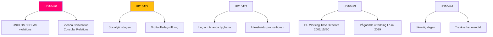

# Cross-Reference Map — Interpellation Debates, 2026-05-06

**Classification**: PUBLIC | **Confidence**: B2 [Admiralty] | **Generated**: 2026-05-06T20:48:30Z

---

## Policy clusters

### Cluster A: Foreign policy / International humanitarian law
**Documents**: HD10470  
**Legislative chain**: UNCLOS Art.98 → SOLAS Chapter IV → Vienna Convention on Consular Relations → EU Common Foreign and Security Policy framework → Swedish foreign policy doctrine (folkrätten)  
**Committee**: Utrikesutskottet (UU)  
**Related government output**: Utrikesminister's public statements on Global Sumud (cited as "following the situation" in HD10470 text)

### Cluster B: Crime victims / Social protection
**Documents**: HD10472  
**Legislative chain**: Brottsbalkens brottsofferparagrafer → Socialtjänstlagen → Länsstyrelsernas tillsynsuppdrag → Government's brottsofferpolitik  
**Committee**: Justitieutskottet (JuU)  
**Related documents**: BRÅ statistics on shelter placements [unconfirmed — not yet retrieved]; Nationellt centrum mot våld i nära relationer (NCK) reports

### Cluster C: Transport infrastructure  
**Documents**: HD10471, HD10473, HD10474  
**Legislative chain**: Infrastrukturpropositionen → Trafikverkets uppdrag → EU Working Time Directive (2002/15/EC, as amended) → Järnvägslagen → Lag om Arlanda flygbana  
**Committee**: Trafikutskottet (TU)  
**Related government output**: Ongoing government review on truck parking (to 2029 per HD10473 text); prior Arlandabanan investigator report (cited in HD10471)

---

## Coordinated activity patterns

**Pattern 1**: Eva Lindh (S) filed two interpellations (HD10473, HD10474) on the same day to the same minister — a coordinated infrastructure critique designed to maximise debate time and signal systemic failure rather than isolated issues.

**Pattern 2**: Three S MPs (Kasirga, Backeskog, Lindh) filed on the same day — likely coordinated party strategy to create multi-front pressure on the Tidö government the week after 2026-05-05.

**Pattern 3**: Lorena Delgado Varas (-) filing the most explosive interpellation (HD10470) as an independent — likely coordinated with (or aligned to) left-wing civil society but strategically filed as non-partisan to broaden appeal.

---

## Legislative chain diagram

