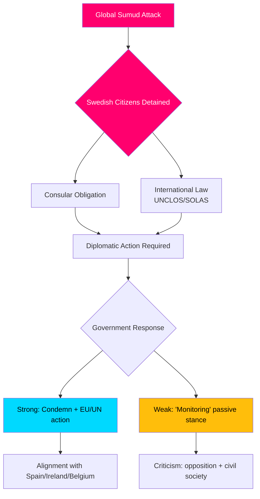

# Executive Brief — Interpellation Debates, 2026-05-06

**Classification**: PUBLIC | **Confidence**: B2 [Admiralty] | **Generated**: 2026-05-06T20:42:00Z  
**Author**: James Pether Sörling | **Riksmöte**: 2025/26

---

## BLUF (Bottom Line Up Front)

Five interpellations filed 2026-05-06 reveal a Swedish opposition (S, independents) pressing the Tidö government on three policy fronts simultaneously: (1) a politically explosive international crisis — Israel's armed boarding of the Gaza-bound flotilla Global Sumud with 175 civilian detainees including two Swedish citizens — testing Sweden's capacity and will to enforce international law and consular obligations; (2) systemic infrastructure deficits at Arlanda airport and in road/rail logistics; and (3) declining crime-victim protections for vulnerable women. The flotilla crisis (HD10470) is the highest-salience item and creates immediate diplomatic and domestic political pressure on the government: inaction risks comparison to Spain, Ireland, and Belgium who have taken stronger stances, while action strains the government's strategic position on the Israel-Palestine conflict.

---

## Decisions supported by this analysis

1. **Diplomatic response calculus** — What diplomatic actions should Sweden take regarding detained Swedish citizens on the Global Sumud flotilla? Risk of reputational damage from passivity vs. coalition/NATO alignment costs of confrontation with Israel.
2. **Crime victim policy review** — Is the decline in sheltered placements for at-risk women a resource failure, regulatory gap, or structural problem in the government's brottsofferpolitik?
3. **Arlanda connectivity prioritisation** — Does the Arlanda High Speed Rail/Arlandabanan reform require government action before the 2026 election?

---

## 60-second briefing bullets

- 🔴 **Flotilla crisis (HD10470)**: Israeli military boarded the humanitarian flotilla Global Sumud in international waters (~45nm west of Kythera, Greece), detained 175 civilians including 2 Swedish citizens. Lorena Delgado Varas (-) asks Foreign Minister Maria Malmer Stenergard what diplomatic action Sweden will take. Sweden has so far only said it is "monitoring the situation" — significantly weaker than Spain, Ireland, Belgium responses.
- 🟠 **Arlanda accessibility (HD10471)**: Kadir Kasirga (S) challenges Infrastructure Minister Andreas Carlson on high Arlanda Express costs and inadequate rail connectivity, citing the government's own investigator findings. The issue has electoral salience in the Stockholm region.
- 🟡 **Crime victim policy (HD10472)**: Sanna Backeskog (S) challenges Justice Minister Gunnar Strömmer on declining placements in sheltered housing for domestic violence victims. Women's shelters have warned of capacity crisis despite unchanged threat levels.
- 🟡 **Heavy vehicle parking (HD10473)**: Eva Lindh (S) challenges Infrastructure Minister Carlson on urgent shortage of parking/staging areas for heavy goods vehicles — a pressing transport safety and EU compliance issue.
- 🟡 **Railway intrusions (HD10474)**: Eva Lindh (S) challenges Carlson again on unauthorized persons on railway tracks as a growing cause of delays — regulation and operational competence to reduce police dependency.

---

## Top forward trigger

**Watch**: Government response to Swedish citizens detained on Global Sumud flotilla (expected within 48h). Escalation risk: if Israel does not release the detainees, Sweden faces pressure to act in EU Foreign Affairs Council and UN Security Council.

**Confidence**: B2 — Direct sources from official Riksdag interpellation text HD10470 filed 2026-05-06; verified via riksdag-regering MCP.

