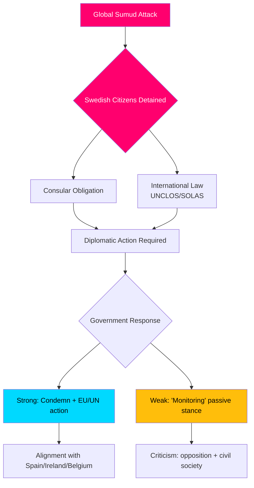

&#x202B;# إحاطة استخباراتية — مناقشات الاستجواب البرلماني، 2026-05-06

**التصنيف**: عام | **مستوى الثقة**: B2 [Admiralty] | **تاريخ الإنتاج**: 2026-05-06T20:42:00Z  
**المؤلف**: James Pether Sörling | **دورة البرلمان**: 2025/26

---

## الخلاصة التنفيذية (BLUF)

كشفت خمسة استجوابات برلمانية مقدمة في 2026-05-06 أن المعارضة السويدية (حزب S، مستقلون) تضغط على حكومة Tidö في ثلاثة محاور سياسية متزامنة: (1) أزمة دولية متفجرة سياسياً — اعتراض إسرائيل المسلح للسفينة الإنسانية المتجهة إلى غزة Global Sumud مع 175 مدنياً محتجزاً بينهم مواطنان سويديان — مما يختبر قدرة السويد واستعدادها لتطبيق القانون الدولي والالتزامات القنصلية؛ (2) إخفاقات بنية تحتية منهجية في مطار Arlanda وفي لوجستيات الطرق/السكك الحديدية؛ و(3) تراجع الحماية لضحايا الجريمة من النساء المستضعفات. تعد أزمة الأسطول (HD10470) أبرز هذه القضايا وتخلق ضغطاً دبلوماسياً وداخلياً فورياً على الحكومة: اللامبالاة تخاطر بمقارنات مع إسبانيا وأيرلندا وبلجيكا التي اتخذت مواقف أقوى، بينما يُثقل التحرك الموقف الاستراتيجي للحكومة في الصراع الإسرائيلي-الفلسطيني.

---

## القرارات التي يدعمها هذا التحليل

1. **حساب الاستجابة الدبلوماسية** — ما الخطوات الدبلوماسية التي يجب على السويد اتخاذها بشأن المواطنين السويديين المحتجزين على متن أسطول Global Sumud؟ مخاطر الضرر السمعي جراء السلبية في مقابل تكاليف التوافق مع الائتلاف/الناتو في مواجهة إسرائيل.
2. **مراجعة سياسة ضحايا الجريمة** — هل انخفاض الإيواء في مساكن الحماية للنساء المهددات يمثل إخفاقاً في الموارد أم ثغرة تنظيمية أم مشكلة هيكلية في سياسة brottsofferpolitik للحكومة؟
3. **أولوية ربط Arlanda** — هل يتطلب إصلاح سكة حديد Arlanda/Arlandabanan إجراءً حكومياً قبل انتخابات 2026؟

---

## نقاط المعلومات في 60 ثانية

- 🔴 **أزمة الأسطول (HD10470)**: اعترضت القوات الإسرائيلية السفينة الإنسانية Global Sumud في المياه الدولية (~45 ميلاً بحرياً غرب كيثيرا، اليونان)، واحتجزت 175 مدنياً بينهم مواطنان سويديان. Lorena Delgado Varas (-) تسأل وزيرة الخارجية Maria Malmer Stenergard عن الخطوات الدبلوماسية التي ستتخذها السويد. اكتفت السويد حتى الآن بالقول إنها "ترصد الوضع" — أضعف بكثير من ردود إسبانيا وأيرلندا وبلجيكا.
- 🟠 **إمكانية الوصول إلى Arlanda (HD10471)**: Kadir Kasirga (S) يستجوب وزير البنية التحتية Andreas Carlson بشأن ارتفاع تكاليف Arlanda Express وضعف ربط السكك الحديدية، في إشارة إلى نتائج تحقيقات الحكومة ذاتها. القضية ذات أهمية انتخابية في منطقة ستوكهولم.
- 🟡 **سياسة ضحايا الجريمة (HD10472)**: Sanna Backeskog (S) تستجوب وزير العدل Gunnar Strömmer بشأن انخفاض إيواء ضحايا العنف الأسري في مساكن الحماية. أبدت مراكز إيواء النساء تحذيراً من أزمة طاقة استيعابية رغم عدم تغير مستويات التهديد.
- 🟡 **ركن المركبات الثقيلة (HD10473)**: Eva Lindh (S) تستجوب الوزير Carlson بشأن الشُح الحاد في مواقف التجمع للمركبات الثقيلة — قضية عاجلة تتعلق بالسلامة المرورية والامتثال للوائح الاتحاد الأوروبي.
- 🟡 **التعدي على السكك الحديدية (HD10474)**: Eva Lindh (S) تستجوب Carlson مجدداً بشأن وجود أشخاص غير مرخص لهم على مسارات السكك الحديدية بوصفه سبباً متنامياً للتأخيرات — التنظيم والقدرة التشغيلية للحد من الاعتماد على الشرطة.

---

## أهم محفز مستقبلي

**للمراقبة**: رد الحكومة على المواطنين السويديين المحتجزين في أسطول Global Sumud (متوقع خلال 48 ساعة). مخاطر التصعيد: إن لم تفرج إسرائيل عن المحتجزين، ستجد السويد نفسها تحت ضغط للتصرف في مجلس الشؤون الخارجية بالاتحاد الأوروبي ومجلس الأمن الأممي.

**مستوى الثقة**: B2 — مصادر مباشرة من نص الاستجواب الرسمي HD10470 المقدم في 2026-05-06؛ تم التحقق منه عبر riksdag-regering MCP.

<!-- source-sha: 215d03e02ff7af33e95ff32888a799a81633820d -->
