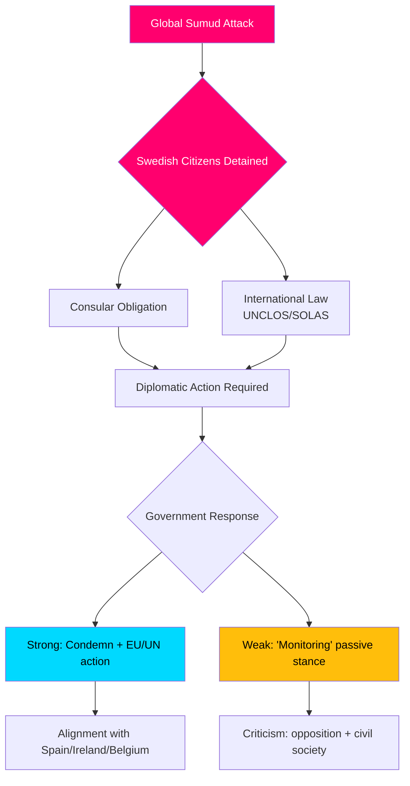

# Efterretningsbriefing — Interpellationsdebatter, 2026-05-06

**Klassificering**: OFFENTLIG | **Konfidensniveau**: B2 [Admiralty] | **Genereret**: 2026-05-06T20:42:00Z  
**Forfatter**: James Pether Sörling | **Riksmøde**: 2025/26

---

## Konklusion på forhånd (BLUF)

Fem interpellationer indgivet den 2026-05-06 afslører, at en svensk opposition (S, uafhængige) presser Tidø-regeringen på tre politiske fronter samtidigt: (1) en politisk eksplosiv international krise — Israels væbnede opbringning af den Gaza-bundne flotille Global Sumud med 175 civile tilbageholdte inklusive to svenske statsborgere — der tester Sveriges kapacitet og vilje til at håndhæve folkeretten og konsulære forpligtelser; (2) systemiske infrastrukturmangler i Arlanda lufthavn og i vej-/jernbanelogistik; og (3) faldende beskyttelse af ofre for forbrydelser mod sårbare kvinder. Flotillekrisen (HD10470) er den mest alvorlige sag og skaber umiddelbart diplomatisk og indenrigspolitisk pres på regeringen: passivitet risikerer sammenligning med Spanien, Irland og Belgien, der har indtaget stærkere holdninger, mens handling belaster regeringens strategiske position i Israel-Palæstina-konflikten.

---

## Beslutninger understøttet af denne analyse

1. **Diplomatisk svarskalkule** — Hvilke diplomatiske handlinger bør Sverige tage vedrørende tilbageholdte svenske statsborgere på flotillen Global Sumud? Risiko for omdømmeskade fra passivitet vs. koalitions-/NATO-tilpasningsomkostninger ved konfrontation med Israel.
2. **Gennemgang af kriminalitetsofferpolitik** — Er faldet i beskyttede boliger for truede kvinder et ressourcemæssigt svigt, et reguleringsmæssigt hul eller et strukturelt problem i regeringens kriminalitetsofferpolitik?
3. **Arlanda-konnektivitetsprioritering** — Kræver Arlanda-højhastighedsbanens/Arlandabanans reform regeringshandling inden valget i 2026?

---

## 60-sekunders informationspunkter

- 🔴 **Flotillekrisen (HD10470)**: Israelisk militær opbragte den humanitære flotille Global Sumud i internationalt farvand (~45 sømil vest for Kythera, Grækenland), tilbageholdt 175 civile herunder 2 svenske statsborgere. Lorena Delgado Varas (-) spørger udenrigsminister Maria Malmer Stenergard, hvilke diplomatiske handlinger Sverige vil tage. Sverige har hidtil kun sagt, at det "overvåger situationen" — markant svagere end Spaniens, Irlands, Belgiens reaktioner.
- 🟠 **Arlanda-tilgængelighed (HD10471)**: Kadir Kasirga (S) udfordrer infrastrukturminister Andreas Carlson om høje Arlanda Express-priser og utilstrækkelig jernbanekonnektivitet med reference til regeringens egne undersøgelsesresultater. Sagen har valgmæssig relevans i Stockholmsregionen.
- 🟡 **Kriminalitetsofferpolitik (HD10472)**: Sanna Backeskog (S) udfordrer justitsminister Gunnar Strömmer om faldende anbringelser i beskyttet bolig for ofre for partnervold. Kvindekrisecentre har advaret om kapacitetskrise trods uændrede trusselsniveauer.
- 🟡 **Tungt køretøjsparkering (HD10473)**: Eva Lindh (S) udfordrer infrastrukturminister Carlson om akut mangel på parkerings-/opsamlingsområder for tunge godsbiler — et presserende spørgsmål om trafiksikkerhed og EU-overholdelse.
- 🟡 **Jernbaneindbrud (HD10474)**: Eva Lindh (S) udfordrer Carlson igen om uautoriserede personer på jernbanespor som en voksende årsag til forsinkelser — regulering og operationel kompetence til at reducere politiafhængighed.

---

## Vigtigste fremtidige udløser

**Overvåg**: Regeringens svar på svenske statsborgere tilbageholdt på flotillen Global Sumud (forventet inden for 48t). Eskaleringsrisiko: hvis Israel ikke løslader de tilbageholdte, udsættes Sverige for pres om at handle i EU's Råd for Udenrigsanliggender og FN's Sikkerhedsråd.

**Konfidensniveau**: B2 — Direkte kilder fra officiel riksdagsinterpellationstekst HD10470 indgivet 2026-05-06; verificeret via riksdag-regering MCP.

<!-- source-sha: 215d03e02ff7af33e95ff32888a799a81633820d -->
