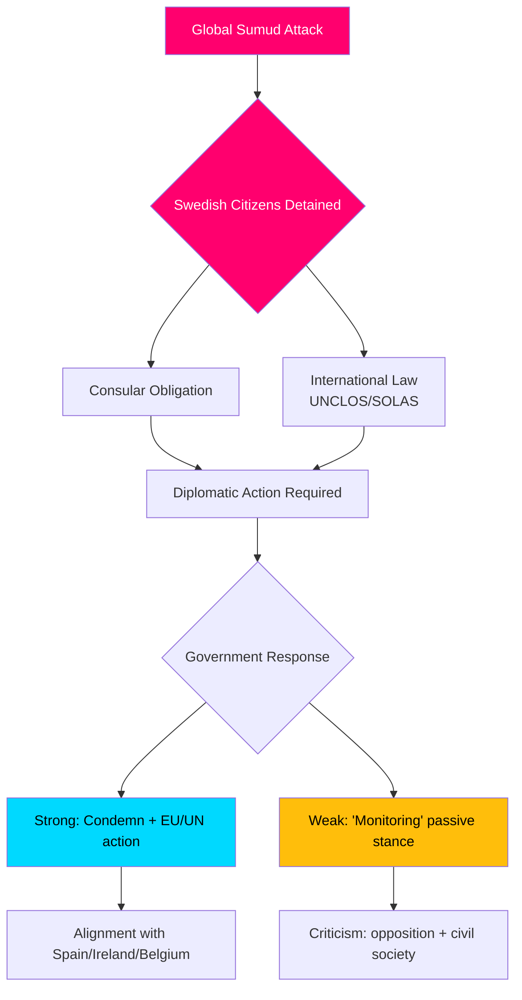

# Geheimdienst-Briefing — Interpellationsdebatten, 2026-05-06

**Einstufung**: ÖFFENTLICH | **Vertrauensniveau**: B2 [Admiralty] | **Erstellt**: 2026-05-06T20:42:00Z  
**Autor**: James Pether Sörling | **Reichstag**: 2025/26

---

## Zusammenfassung (BLUF)

Fünf am 2026-05-06 eingereichte Interpellationen zeigen, dass die schwedische Opposition (S, Unabhängige) die Tidö-Regierung gleichzeitig auf drei politischen Fronten unter Druck setzt: (1) eine politisch explosive internationale Krise — die israelische Beschlagnahme des Gaza-gebundenen humanitären Flotillenschiffs Global Sumud mit 175 inhaftierten Zivilisten einschließlich zweier schwedischer Staatsbürger — die Schwedens Kapazität und Bereitschaft zur Durchsetzung von Völkerrecht und konsularen Verpflichtungen testet; (2) systemische Infrastrukturmängel am Flughafen Arlanda und in der Straßen-/Eisenbahnlogistik; und (3) abnehmender Schutz für Verbrechensopfer unter gefährdeten Frauen. Die Flotillenkrise (HD10470) ist der brisanteste Fall und erzeugt unmittelbaren diplomatischen und innenpolitischen Druck auf die Regierung: Passivität riskiert Vergleiche mit Spanien, Irland und Belgien, die stärkere Positionen eingenommen haben, während Handeln die strategische Position der Regierung im israelisch-palästinensischen Konflikt belastet.

---

## Von dieser Analyse unterstützte Entscheidungen

1. **Diplomatische Reaktionskalkulation** — Welche diplomatischen Schritte sollte Schweden bezüglich inhaftierter schwedischer Staatsbürger an Bord der Flotille Global Sumud unternehmen? Reputationsrisiko durch Passivität vs. Koalitions-/NATO-Abstimmungskosten bei Konfrontation mit Israel.
2. **Überprüfung der Verbrechensopferpolitik** — Ist der Rückgang bei Schutzwohnungen für bedrohte Frauen ein Ressourcenversagen, eine Regulierungslücke oder ein strukturelles Problem in der Regierungs-Brottsofferpolitik?
3. **Arlanda-Konnektivitätspriorisierung** — Erfordert die Reform der Arlanda-Hochgeschwindigkeitsbahn/Arlandabanan Regierungshandlungen vor der Wahl 2026?

---

## 60-Sekunden-Informationspunkte

- 🔴 **Flotillenkrise (HD10470)**: Israelisches Militär beschlagnahmte das humanitäre Flotillenschiff Global Sumud in internationalen Gewässern (~45 Seemeilen westlich von Kythera, Griechenland), verhaftete 175 Zivilisten einschließlich 2 schwedischer Staatsbürger. Lorena Delgado Varas (-) fragt Außenministerin Maria Malmer Stenergard, welche diplomatischen Maßnahmen Schweden ergreifen wird. Schweden hat bisher nur gesagt, dass es die Situation „beobachtet" — deutlich schwächer als die Reaktionen Spaniens, Irlands, Belgiens.
- 🟠 **Arlanda-Zugänglichkeit (HD10471)**: Kadir Kasirga (S) fordert Infrastrukturminister Andreas Carlson bezüglich hoher Arlanda Express-Kosten und unzureichender Eisenbahnanbindung heraus, unter Berufung auf die Ergebnisse eigener Regierungsuntersuchungen. Das Thema hat wahlmäßige Relevanz in der Stockholmer Region.
- 🟡 **Verbrechensopferpolitik (HD10472)**: Sanna Backeskog (S) fordert Justizminister Gunnar Strömmer bezüglich des Rückgangs bei Schutzwohnungsunterbringungen für Opfer häuslicher Gewalt heraus. Frauenhäuser haben trotz unveränderter Bedrohungslagen vor einer Kapazitätskrise gewarnt.
- 🟡 **Schwerfahrzeugparken (HD10473)**: Eva Lindh (S) fordert Infrastrukturminister Carlson bezüglich des akuten Mangels an Park-/Aufstellflächen für schwere Güterfahrzeuge heraus — eine dringende Frage der Verkehrssicherheit und EU-Konformität.
- 🟡 **Eisenbahneinbrüche (HD10474)**: Eva Lindh (S) fordert Carlson erneut bezüglich unbefugter Personen auf Eisenbahngleisen als wachsender Ursache für Verspätungen heraus — Regulierung und betriebliche Kapazität zur Verringerung der Polizeiabhängigkeit.

---

## Wichtigster zukünftiger Auslöser

**Beobachten**: Regierungsantwort auf inhaftierte schwedische Staatsbürger auf der Flotille Global Sumud (erwartet innerhalb 48h). Eskalationsrisiko: Falls Israel die Inhaftierten nicht freilässt, steht Schweden unter Druck, im EU-Rat für Auswärtige Angelegenheiten und im UN-Sicherheitsrat zu handeln.

**Vertrauensniveau**: B2 — Direkte Quellen aus dem offiziellen Riksdag-Interpellationstext HD10470 eingereicht 2026-05-06; verifiziert über riksdag-regering MCP.

<!-- source-sha: 215d03e02ff7af33e95ff32888a799a81633820d -->
