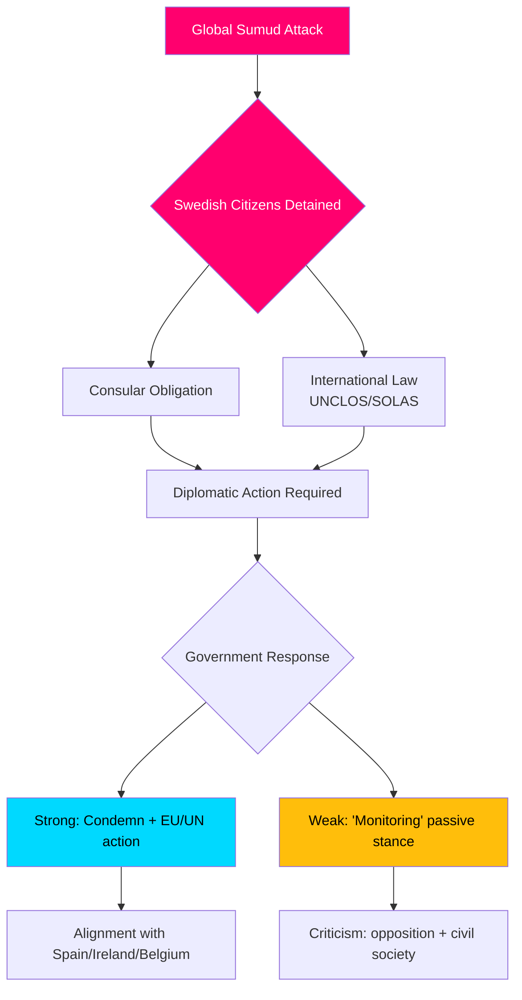

# Informe de Inteligencia — Debates de Interpelación, 2026-05-06

**Clasificación**: PÚBLICO | **Nivel de confianza**: B2 [Admiralty] | **Generado**: 2026-05-06T20:42:00Z  
**Autor**: James Pether Sörling | **Sesión parlamentaria**: 2025/26

---

## Conclusión al frente (BLUF)

Cinco interpelaciones presentadas el 2026-05-06 revelan que la oposición sueca (S, independientes) presiona al gobierno Tidö en tres frentes políticos simultáneamente: (1) una crisis internacional políticamente explosiva — la intercepción armada por Israel del barco humanitario Gaza-bound Global Sumud con 175 civiles detenidos incluyendo dos ciudadanos suecos — que pone a prueba la capacidad y voluntad de Suecia para hacer cumplir el derecho internacional y las obligaciones consulares; (2) deficiencias infraestructurales sistémicas en el aeropuerto de Arlanda y en la logística vial/ferroviaria; y (3) protección decreciente de las víctimas de delitos entre mujeres vulnerables. La crisis de la flotilla (HD10470) es el caso más destacado y genera presión diplomática e interna inmediata sobre el gobierno: la pasividad arriesga comparaciones con España, Irlanda y Bélgica, que han adoptado posiciones más firmes, mientras que la acción pesa sobre la posición estratégica del gobierno en el conflicto israelí-palestino.

---

## Decisiones apoyadas por este análisis

1. **Cálculo de respuesta diplomática** — ¿Qué medidas diplomáticas debería tomar Suecia respecto a los ciudadanos suecos detenidos a bordo de la flotilla Global Sumud? Riesgo de daño reputacional por pasividad vs. costos de alineación de coalición/OTAN en confrontación con Israel.
2. **Revisión de la política de víctimas de delitos** — ¿La disminución en viviendas protegidas para mujeres amenazadas es un fallo de recursos, una laguna regulatoria o un problema estructural en la política brottsofferpolitik del gobierno?
3. **Priorización de la conectividad de Arlanda** — ¿Requiere la reforma del tren de alta velocidad de Arlanda/Arlandabanan acción gubernamental antes de las elecciones de 2026?

---

## Puntos de información en 60 segundos

- 🔴 **Crisis de la flotilla (HD10470)**: Militares israelíes abordaron el barco humanitario Global Sumud en aguas internacionales (~45 millas náuticas al oeste de Citera, Grecia), deteniendo 175 civiles incluyendo 2 ciudadanos suecos. Lorena Delgado Varas (-) pregunta a la ministra de Asuntos Exteriores Maria Malmer Stenergard qué medidas diplomáticas tomará Suecia. Suecia hasta ahora solo ha dicho que "monitorea la situación" — notablemente más débil que las respuestas de España, Irlanda, Bélgica.
- 🟠 **Accesibilidad de Arlanda (HD10471)**: Kadir Kasirga (S) interpela al ministro de Infraestructura Andreas Carlson sobre los altos costos del Arlanda Express y la conectividad ferroviaria insuficiente, haciendo referencia a los resultados de las propias investigaciones del gobierno. El tema tiene relevancia electoral en la región de Estocolmo.
- 🟡 **Política de víctimas de delitos (HD10472)**: Sanna Backeskog (S) interpela al ministro de Justicia Gunnar Strömmer sobre la disminución en el alojamiento en viviendas protegidas para víctimas de violencia de pareja. Los centros de acogida para mujeres han advertido sobre una crisis de capacidad a pesar de niveles de amenaza sin cambios.
- 🟡 **Estacionamiento de vehículos pesados (HD10473)**: Eva Lindh (S) interpela al ministro Carlson sobre la aguda escasez de áreas de estacionamiento/agrupamiento para vehículos pesados de carga — una cuestión urgente de seguridad vial y cumplimiento de la UE.
- 🟡 **Intrusiones ferroviarias (HD10474)**: Eva Lindh (S) interpela a Carlson nuevamente sobre personas no autorizadas en vías férreas como causa creciente de retrasos — regulación y capacidad operativa para reducir la dependencia policial.

---

## Desencadenante futuro más importante

**Monitorear**: Respuesta del gobierno a ciudadanos suecos detenidos en la flotilla Global Sumud (esperado en 48h). Riesgo de escalada: si Israel no libera a los detenidos, Suecia estará bajo presión para actuar en el Consejo de Asuntos Exteriores de la UE y el Consejo de Seguridad de la ONU.

**Nivel de confianza**: B2 — Fuentes directas del texto oficial de interpelación HD10470 presentado el 2026-05-06; verificado a través de riksdag-regering MCP.

<!-- source-sha: 215d03e02ff7af33e95ff32888a799a81633820d -->
