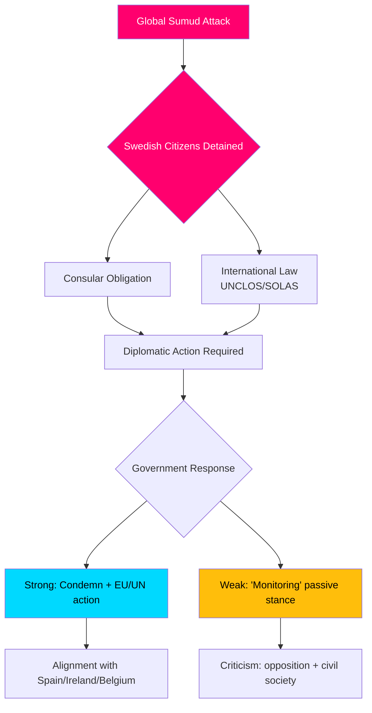

# Tiedustelubriefing — Välikysymyskeskustelut, 2026-05-06

**Luokitus**: JULKINEN | **Luotettavuustaso**: B2 [Admiralty] | **Laadittu**: 2026-05-06T20:42:00Z  
**Tekijä**: James Pether Sörling | **Valtiopäivät**: 2025/26

---

## Tiivistelmä (BLUF)

Viisi 2026-05-06 jätettyä välikysymystä paljastaa, että ruotsalainen oppositio (S, riippumattomat) painostaa Tidö-hallitusta kolmella poliittisella rintamalla samanaikaisesti: (1) poliittisesti räjähdysherkkä kansainvälinen kriisi — Israelin aseellinen hyökkäys Gaza-suuntautuvaan laivastoalus Global Sumudiin, jolla on 175 siviilivankia mukaan lukien kaksi ruotsalaista kansalaista — joka testaa Ruotsin kapasiteettia ja halukkuutta panna täytäntöön kansainvälistä oikeutta ja konsulaarisia velvoitteita; (2) systemaattiset infrastruktuuripuutteet Arlanda-lentokentällä ja tie-/rautatielogistiikassa; sekä (3) heikentyneehaksuoriktimisuoja haavoittuville naisille. Laivastokriisi (HD10470) on korkein profiili ja luo välitöntä diplomaattista ja kotimaista poliittista painetta hallitukselle: passiivisuus riskeeraa vertailun Espanjaan, Irlantiin ja Belgiaan, jotka ovat ottaneet tiukemman kannan, kun taas toimiminen haastaa hallituksen strategisen aseman Israel-Palestiina-konfliktissa.

---

## Päätökset, joita tämä analyysi tukee

1. **Diplomaattinen vastauslaskenta** — Mitä diplomaattisia toimia Ruotsin tulisi tehdä Global Sumud -laivastolta pidätettyjen ruotsalaisten kansalaisten asiassa? Maineen heikkenemisen riski passiivisuudesta vs. liitto-/NATO-yhteensovittamiskustannukset Israeliin kohdistuvassa konfrontaatiossa.
2. **Rikosuhripolitiikan arviointi** — Onko lasku uhrien turvakotipaikkoja saavien uhkailtujen naisten kohdalla resurssivirhe, sääntöaukko vai rakenteellinen ongelma hallituksen brottsofferpolitiikassa?
3. **Arlanda-yhteyksien priorisointi** — Vaatiiko Arlanda-suurnopeusradan/Arlandabanans-uudistus hallituksen toimia ennen vuoden 2026 vaaleja?

---

## 60 sekunnin tietopisteet

- 🔴 **Laivastokriisi (HD10470)**: Israelilaiset sotilaat hyökkäsivät humanitaariseen laivastoalukseen Global Sumud kansainvälisillä vesillä (~45 meripenikulmaa Kreikan Kytheran länsipuolella), pidätti 175 siviiliä mukaan lukien 2 ruotsalaista kansalaista. Lorena Delgado Varas (-) kysyy ulkoministeri Maria Malmer Stenergardilta, mitä diplomaattisia toimia Ruotsi aikoo tehdä. Ruotsi on tähän mennessä vain sanonut "seuraavansa tilannetta" — huomattavasti heikompi kanta kuin Espanjalla, Irlannilla ja Belgialla.
- 🟠 **Arlanda-saavutettavuus (HD10471)**: Kadir Kasirga (S) haastaa infrastruktuuriministeri Andreas Carlsonin Arlanda Expressin korkeista hinnoista ja riittämättömästä rautatieyhteyksistä viitaten hallituksen omiin selvitystuloksiin. Asia on vaalimerkityksellinen Tukholman alueella.
- 🟡 **Rikosuhripolitiikka (HD10472)**: Sanna Backeskog (S) haastaa oikeusministeri Gunnar Strömmerin laskusta parisuhdeväkivallan uhrien turvakotisijoituksissa. Naisten turvakotikeskukset ovat varoittaneet kapasiteettikriisistä uhkatasojen pysyessä muuttumattomina.
- 🟡 **Raskaiden ajoneuvojen pysäköinti (HD10473)**: Eva Lindh (S) haastaa infrastruktuuriministeri Carlsonin akuutista raskaiden ajoneuvojen pysäköinti-/odotusalueiden puutteesta — kiireellinen liikenneturvallisuus- ja EU-vaatimusten noudattamiskysymys.
- 🟡 **Rautatietunkeutuminen (HD10474)**: Eva Lindh (S) haastaa Carlsonin jälleen luvattomista henkilöistä rautateillä kasvavana viivästymisten syynä — sääntely ja operatiivinen kapasiteetti poliisiriippuvuuden vähentämiseksi.

---

## Tärkein tuleva laukaisin

**Seuraa**: Hallituksen vastaus Global Sumud -laivastolla pidätetyille ruotsalaisille kansalaisille (odotetaan 48t sisällä). Eskalaatioriski: jos Israel ei vapauta pidätettyjä, Ruotsi kohtaa paineita toimia EU:n ulkoasiainneuvostossa ja YK:n turvallisuusneuvostossa.

**Luotettavuustaso**: B2 — Suorat lähteet virallisesta riksdag-välikysymystekstistä HD10470, jätetty 2026-05-06; vahvistettu riksdag-regering MCP:n kautta.

<!-- source-sha: 215d03e02ff7af33e95ff32888a799a81633820d -->
