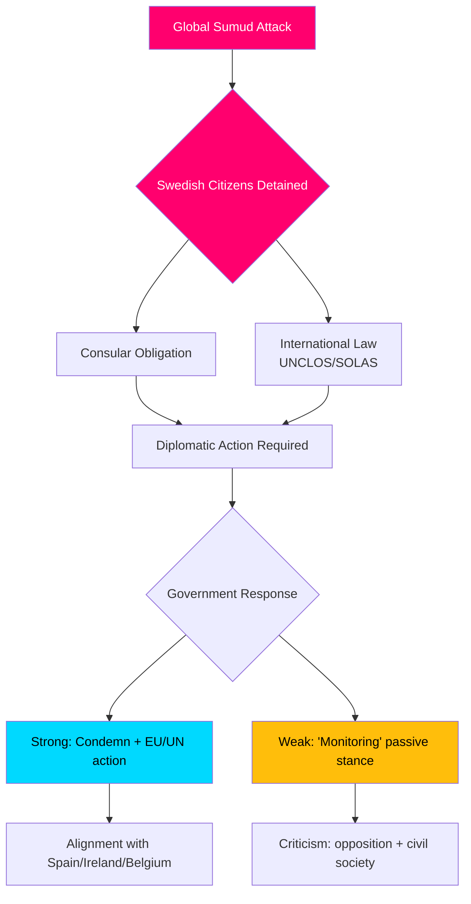

# Briefing de renseignement — Débats d'interpellation, 2026-05-06

**Classification**: PUBLIC | **Niveau de confiance**: B2 [Admiralty] | **Généré**: 2026-05-06T20:42:00Z  
**Auteur**: James Pether Sörling | **Session**: 2025/26

---

## Conclusion en tête (BLUF)

Cinq interpellations déposées le 2026-05-06 révèlent que l'opposition suédoise (S, indépendants) presse le gouvernement Tidö sur trois fronts politiques simultanément : (1) une crise internationale politiquement explosive — l'interception armée par Israël du navire humanitaire Gaza-bound Global Sumud avec 175 civils détenus dont deux ressortissants suédois — qui met à l'épreuve la capacité et la volonté de la Suède à faire respecter le droit international et les obligations consulaires ; (2) des défaillances infrastructurelles systémiques à l'aéroport d'Arlanda et dans la logistique routière/ferroviaire ; et (3) une protection décroissante des victimes de crimes parmi les femmes vulnérables. La crise de la flottille (HD10470) est la plus médiatisée et crée une pression diplomatique et intérieure immédiate sur le gouvernement : la passivité risque la comparaison avec l'Espagne, l'Irlande et la Belgique qui ont adopté des positions plus fermes, tandis que l'action pèse sur la position stratégique du gouvernement dans le conflit israélo-palestinien.

---

## Décisions soutenues par cette analyse

1. **Calcul de la réponse diplomatique** — Quelles mesures diplomatiques la Suède devrait-elle prendre concernant les ressortissants suédois détenus à bord de la flottille Global Sumud ? Risque d'atteinte à la réputation due à la passivité vs. coûts d'alignement de coalition/OTAN en cas de confrontation avec Israël.
2. **Révision de la politique à l'égard des victimes de crimes** — La baisse des hébergements protégés pour les femmes menacées est-elle un échec de ressources, une lacune réglementaire ou un problème structurel dans la politique brottsofferpolitik du gouvernement ?
3. **Priorisation de la connectivité d'Arlanda** — La réforme du train à grande vitesse d'Arlanda/Arlandabanan nécessite-t-elle une action gouvernementale avant les élections de 2026 ?

---

## Points d'information en 60 secondes

- 🔴 **Crise de la flottille (HD10470)** : Les militaires israéliens ont arraisonné le navire humanitaire Global Sumud en eaux internationales (~45 milles nautiques à l'ouest de Cythère, Grèce), détenant 175 civils dont 2 ressortissants suédois. Lorena Delgado Varas (-) interroge la ministre des Affaires étrangères Maria Malmer Stenergard sur les mesures diplomatiques que la Suède prendra. La Suède a jusqu'à présent seulement déclaré « surveiller la situation » — nettement plus faible que les réponses de l'Espagne, de l'Irlande, de la Belgique.
- 🟠 **Accessibilité d'Arlanda (HD10471)** : Kadir Kasirga (S) interpelle le ministre des Infrastructures Andreas Carlson sur les tarifs élevés de l'Arlanda Express et la connectivité ferroviaire insuffisante, en se référant aux résultats des propres enquêtes du gouvernement. L'enjeu a une pertinence électorale dans la région de Stockholm.
- 🟡 **Politique envers les victimes de crimes (HD10472)** : Sanna Backeskog (S) interpelle le ministre de la Justice Gunnar Strömmer sur la baisse des hébergements en logement protégé pour les victimes de violence conjugale. Les centres d'hébergement pour femmes ont mis en garde contre une crise de capacité malgré des niveaux de menace inchangés.
- 🟡 **Stationnement poids lourds (HD10473)** : Eva Lindh (S) interpelle le ministre Carlson sur la pénurie aiguë d'aires de stationnement/regroupement pour poids lourds — une question urgente de sécurité routière et de conformité UE.
- 🟡 **Intrusions ferroviaires (HD10474)** : Eva Lindh (S) interpelle à nouveau Carlson sur les personnes non autorisées sur les voies ferrées comme cause croissante de retards — réglementation et capacité opérationnelle pour réduire la dépendance à la police.

---

## Déclencheur futur le plus important

**Surveiller** : Réponse du gouvernement aux ressortissants suédois détenus sur la flottille Global Sumud (attendue dans les 48h). Risque d'escalade : si Israël ne libère pas les détenus, la Suède sera soumise à des pressions pour agir au Conseil des affaires étrangères de l'UE et au Conseil de sécurité de l'ONU.

**Niveau de confiance** : B2 — Sources directes du texte officiel d'interpellation HD10470 déposé le 2026-05-06 ; vérifié via riksdag-regering MCP.

<!-- source-sha: 215d03e02ff7af33e95ff32888a799a81633820d -->
