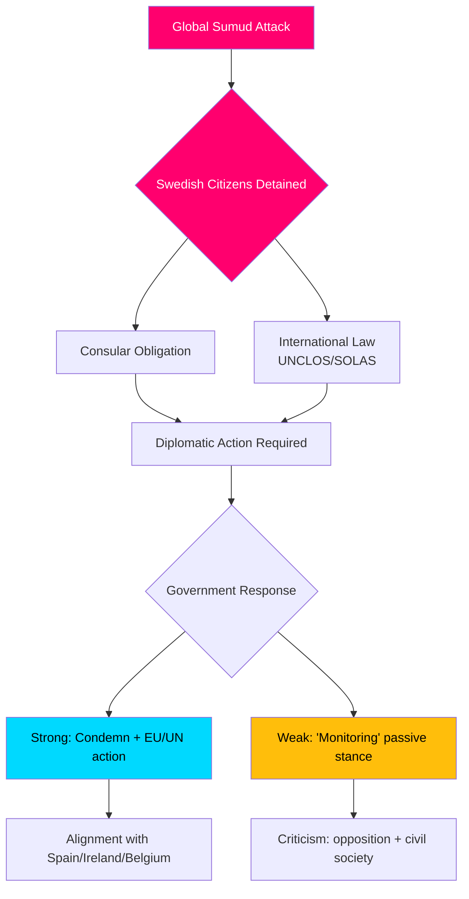

&#x202B;# סיכום מודיעיני — דיוני שאילתות פרלמנטריות, 2026-05-06

**סיווג**: ציבורי | **רמת אמינות**: B2 [Admiralty] | **נוצר**: 2026-05-06T20:42:00Z  
**מחבר**: James Pether Sörling | **מושב פרלמנטרי**: 2025/26

---

## סיכום (BLUF)

חמש שאילתות פרלמנטריות שהוגשו ב-2026-05-06 חושפות שהאופוזיציה השוודית (S, עצמאיים) לוחצת על ממשלת Tidö בשלושה חזיתות מדיניות בו-זמנית: (1) משבר בינלאומי פוליטי נפיץ — עיכוב ישראלי מזוין של ספינת הסיוע ההומניטרי Global Sumud המיועדת לעזה עם 175 אזרחים עצורים כולל שני אזרחים שוודיים — הבוחן את יכולת שוודיה ונכונותה לאכוף את המשפט הבינלאומי והתחייבויות קונסולריות; (2) כשלים תשתיתיים מערכתיים בנמל התעופה ארלנדה ובלוגיסטיקת הדרכים/הרכבות; ו-(3) ירידה בהגנה על קורבנות עבירה בקרב נשים פגיעות. משבר הציים (HD10470) הוא הבולט ביותר ויוצר לחץ דיפלומטי ופנים-פוליטי מיידי על הממשלה: חוסר פעולה מסכן השוואות לספרד, אירלנד ובלגיה שנקטו עמדות חזקות יותר, בעוד שפעולה מכבידה על עמדת הממשלה האסטרטגית בסכסוך הישראלי-פלסטיני.

---

## החלטות נתמכות על ידי ניתוח זה

1. **חישוב תגובה דיפלומטית** — אילו צעדים דיפלומטיים צריכה שוודיה לנקוט בנוגע לאזרחים שוודיים עצורים על ספינת הצי Global Sumud? סיכון נזק מוניטין מחוסר פעילות לעומת עלויות יישור קו עם הקואליציה/נאטו בעימות עם ישראל.
2. **סקירת מדיניות קורבנות עבירה** — האם ירידת הסידור בדיור מוגן לנשים מאוימות היא כשל משאבים, פער רגולטורי או בעיה מבנית במדיניות brottsofferpolitik של הממשלה?
3. **תעדוף קישוריות ארלנדה** — האם רפורמת רכבת המהירות של ארלנדה/Arlandabanan דורשת פעולה ממשלתית לפני בחירות 2026?

---

## נקודות מידע ב-60 שניות

- 🔴 **משבר הצי (HD10470)**: כוחות ישראלים עצרו את ספינת הסיוע ההומניטרי Global Sumud במימים בינלאומיים (~45 מיל ימי מערבית לקיתירה, יוון), עצרו 175 אזרחים כולל 2 אזרחים שוודיים. Lorena Delgado Varas (-) שואלת את שרת החוץ Maria Malmer Stenergard אילו צעדים דיפלומטיים תנקוט שוודיה. שוודיה אמרה עד כה רק שהיא "עוקבת אחר המצב" — חלש בהרבה מתגובות ספרד, אירלנד, בלגיה.
- 🟠 **נגישות ארלנדה (HD10471)**: Kadir Kasirga (S) מאתגר את שר התשתיות Andreas Carlson על עלויות Arlanda Express הגבוהות וקישוריות רכבת בלתי מספקת, תוך התייחסות לממצאי חקירות הממשלה עצמה. הנושא בעל רלוונטיות בחירותית באזור סטוקהולם.
- 🟡 **מדיניות קורבנות עבירה (HD10472)**: Sanna Backeskog (S) מאתגרת את שר המשפטים Gunnar Strömmer על ירידה בסידור בדיור מוגן לקורבנות אלימות פרטנרית. מקלטי נשים הזהירו מפני משבר ​קיבולת למרות רמות איום ללא שינוי.
- 🟡 **חניית רכבים כבדים (HD10473)**: Eva Lindh (S) מאתגרת את השר Carlson על מחסור חריף בשטחי חניה/התכנסות למשאיות כבדות — שאלה דחופה של בטיחות תנועה ועמידה בתקנות האיחוד האירופי.
- 🟡 **חדירות למסילות ברזל (HD10474)**: Eva Lindh (S) מאתגרת שוב את Carlson על אנשים בלתי מורשים על מסילות רכבת כגורם הולך וגדל לעיכובים — רגולציה וכושר מבצעי להפחתת תלות במשטרה.

---

## הטריגר העתידי החשוב ביותר

**מעקב**: תגובת הממשלה לאזרחים שוודיים עצורים בצי Global Sumud (צפוי תוך 48 שעות). סיכון הסלמה: אם ישראל לא תשחרר את העצורים, שוודיה תעמוד בפני לחץ לפעול במועצת ענייני החוץ של האיחוד האירופי ובמועצת הביטחון של האו"ם.

**רמת אמינות**: B2 — מקורות ישירים מטקסט השאילתה הפרלמנטרית הרשמית HD10470 שהוגשה ב-2026-05-06; אומת דרך riksdag-regering MCP.

<!-- source-sha: 215d03e02ff7af33e95ff32888a799a81633820d -->
