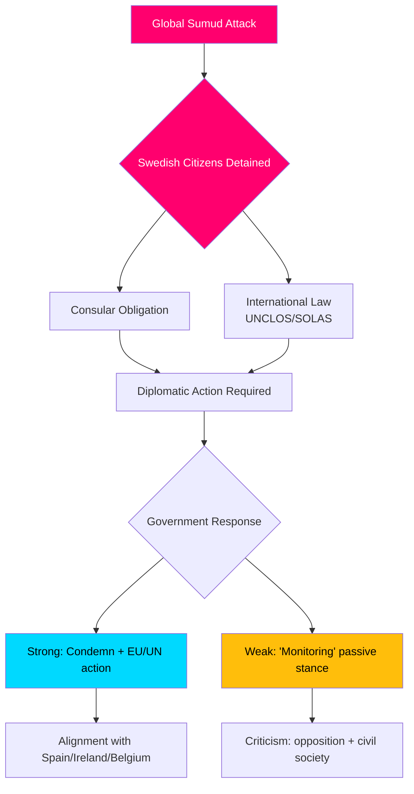

# インテリジェンス・ブリーフィング — 質問主意書討論、2026-05-06

**分類**: 公開 | **信頼度**: B2 [Admiralty] | **作成日時**: 2026-05-06T20:42:00Z  
**著者**: James Pether Sörling | **議会会期**: 2025/26

---

## 先頭結論（BLUF）

2026-05-06に提出された5件の質問主意書は、スウェーデン野党（S、無所属）がTidö政権に三つの政策戦線で同時に圧力をかけていることを示している：(1) 政治的に爆発的な国際危機 — ガザ行きの人道支援船Global Sumudに対するイスラエルの武装拿捕で、スウェーデン国民2名を含む175名の民間人が拘束されており、スウェーデンの国際法と領事義務を執行する能力と意志が試されている；(2) アルランダ空港および道路・鉄道ロジスティクスにおける体系的インフラ欠陥；(3) 脆弱な女性に対する犯罪被害者保護の低下。flotilla危機（HD10470）は最も注目されており、政府に対して即座の外交的・国内政治的圧力を生じさせている：不作為はより強硬な立場をとったスペイン、アイルランド、ベルギーとの比較リスクをはらみ、行動はイスラエル・パレスチナ紛争における政府の戦略的立場を損なう。

---

## この分析が支援する意思決定

1. **外交的対応の計算** — Global Sumudフロティラに乗船しているスウェーデン国民の拘束に関して、スウェーデンはどのような外交的措置を講じるべきか？不作為による評判損害のリスク vs. イスラエルとの対立における連立/NATO調整コスト。
2. **犯罪被害者政策の見直し** — 脅威にさらされた女性に対する保護住宅の減少は、資源不足なのか、規制上の欠陥なのか、それとも政府のbrottsofferpolitikの構造的問題なのか？
3. **アルランダ接続性の優先順位付け** — アルランダ高速鉄道/Arlandabananの改革は、2026年選挙前に政府の行動を必要とするか？

---

## 60秒情報ポイント

- 🔴 **フロティラ危機（HD10470）**：イスラエル軍は人道支援船Global Sumudを国際海域（ギリシャ・キティラ島の西約45海里）で拿捕し、スウェーデン国民2名を含む175名の民間人を拘束した。Lorena Delgado Varas（-）は外務大臣Maria Malmer Stenergardにスウェーデンが講じる外交的措置について質問。スウェーデンは現在まで「状況を監視している」とのみ述べており、スペイン、アイルランド、ベルギーの対応と比較して著しく弱い。
- 🟠 **アルランダへのアクセス（HD10471）**：Kadir Kasirga（S）が、政府自身の調査結果を引用してArlanda Expressの高コストと鉄道接続の不十分さについてインフラ大臣Andreas Carlsonに迫る。この問題はストックホルム地域における選挙的重要性を持つ。
- 🟡 **犯罪被害者政策（HD10472）**：Sanna Backeskog（S）がパートナー暴力被害者の保護住宅入居数の減少について法務大臣Gunnar Strömmertに迫る。女性シェルターは脅威レベルが変わらないにもかかわらず容量危機を警告。
- 🟡 **重量車両駐車（HD10473）**：Eva Lindh（S）がインフラ大臣Carlsonに重量貨物車両の駐車・集合スペースの深刻な不足について迫る — 交通安全とEUコンプライアンスの緊急課題。
- 🟡 **鉄道不法侵入（HD10474）**：Eva Lindh（S）が不法侵入者による遅延の増大を理由に再びCarlsonに迫る — 警察依存を減らすための規制と運用能力。

---

## 最も重要な将来のトリガー

**監視対象**：Global Sumudフロティラで拘束されているスウェーデン国民への政府の対応（48時間以内に予想）。エスカレーションリスク：イスラエルが拘束者を釈放しない場合、スウェーデンはEU外相理事会および国連安全保障理事会で行動するよう圧力を受ける。

**信頼度**：B2 — 2026-05-06に提出された公式riksdag質問主意書テキストHD10470からの直接ソース；riksdag-regering MCPで検証済み。

<!-- source-sha: 215d03e02ff7af33e95ff32888a799a81633820d -->
