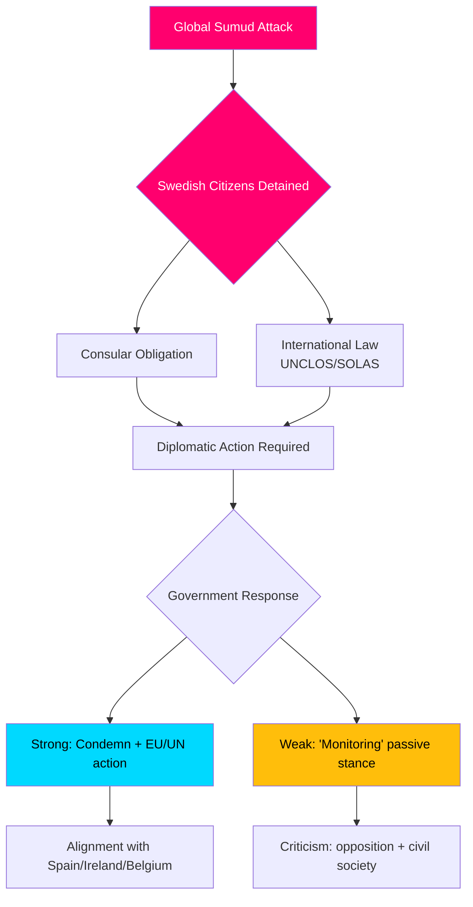

# 정보 브리핑 — 대정부 질문 토론, 2026-05-06

**분류**: 공개 | **신뢰도**: B2 [Admiralty] | **생성일시**: 2026-05-06T20:42:00Z  
**저자**: James Pether Sörling | **의회 회기**: 2025/26

---

## 선두 결론 (BLUF)

2026-05-06에 제출된 5건의 대정부 질문은 스웨덴 야당(S, 무소속)이 Tidö 정부에 세 가지 정책 전선에서 동시에 압박을 가하고 있음을 보여준다: (1) 정치적으로 폭발적인 국제 위기 — 가자행 인도주의 선박 Global Sumud에 대한 이스라엘의 무장 나포로 스웨덴 국민 2명을 포함한 175명의 민간인이 억류되어 있으며, 스웨덴의 국제법과 영사 의무 이행 능력과 의지를 시험하고 있다; (2) 알란다 공항과 도로/철도 물류에서의 체계적인 인프라 결함; (3) 취약한 여성들에 대한 범죄 피해자 보호 감소. 선단 위기(HD10470)가 가장 주목받고 있으며, 정부에 즉각적인 외교적·국내 정치적 압박을 야기한다: 무대응은 더 강경한 입장을 취한 스페인, 아일랜드, 벨기에와의 비교 위험을 안고 있으며, 행동은 이스라엘-팔레스타인 분쟁에서 정부의 전략적 위치를 부담스럽게 한다.

---

## 이 분석이 지원하는 결정

1. **외교적 대응 계산** — 스웨덴은 Global Sumud 선단에 억류된 스웨덴 국민에 대해 어떤 외교적 조치를 취해야 하는가? 무대응으로 인한 명성 손상 위험 vs. 이스라엘과의 대립 시 연립/NATO 조정 비용.
2. **범죄 피해자 정책 검토** — 위협받는 여성에 대한 보호 주거 감소가 자원 실패인가, 규제 공백인가, 아니면 정부의 brottsofferpolitik에서의 구조적 문제인가?
3. **알란다 연결성 우선순위** — 알란다 고속철도/Arlandabanan 개혁이 2026년 선거 전에 정부 조치를 필요로 하는가?

---

## 60초 정보 포인트

- 🔴 **선단 위기 (HD10470)**: 이스라엘 군이 인도주의 선박 Global Sumud를 국제 해역(그리스 키티라 서쪽 약 45해리)에서 나포하여 스웨덴 국민 2명을 포함한 175명의 민간인을 억류했다. Lorena Delgado Varas(-)가 외무부 장관 Maria Malmer Stenergard에게 스웨덴이 취할 외교적 조치에 대해 질문한다. 스웨덴은 현재까지 "상황을 모니터링하고 있다"고만 밝혔으며 — 스페인, 아일랜드, 벨기에의 대응보다 현저히 약하다.
- 🟠 **알란다 접근성 (HD10471)**: Kadir Kasirga(S)가 정부 자체 조사 결과를 인용하며 Arlanda Express의 높은 비용과 불충분한 철도 연결에 대해 인프라부 장관 Andreas Carlson에게 도전한다. 이 문제는 스톡홀름 지역에서 선거적 중요성을 가진다.
- 🟡 **범죄 피해자 정책 (HD10472)**: Sanna Backeskog(S)가 파트너 폭력 피해자의 보호 주거 입소 감소에 대해 법무부 장관 Gunnar Strömmer에게 도전한다. 여성 쉼터들은 위협 수준이 변하지 않음에도 용량 위기를 경고해왔다.
- 🟡 **중량 차량 주차 (HD10473)**: Eva Lindh(S)가 중량 화물차량의 주차/집합 공간의 심각한 부족에 대해 장관 Carlson에게 도전한다 — 교통 안전과 EU 준수에 관한 긴급 문제.
- 🟡 **철도 침입 (HD10474)**: Eva Lindh(S)가 지연의 증가 원인으로 철도에 무단 침입하는 사람들에 대해 다시 Carlson에게 도전한다 — 경찰 의존도를 줄이기 위한 규제 및 운영 능력.

---

## 가장 중요한 미래 촉발 요인

**모니터링**: Global Sumud 선단에 억류된 스웨덴 국민에 대한 정부 대응(48시간 내 예상). 에스컬레이션 위험: 이스라엘이 억류자를 석방하지 않을 경우 스웨덴은 EU 외무이사회와 UN 안전보장이사회에서 행동하라는 압박을 받게 된다.

**신뢰도**: B2 — 2026-05-06 제출된 공식 riksdag 대정부 질문 텍스트 HD10470의 직접 소스; riksdag-regering MCP를 통해 검증됨.

<!-- source-sha: 215d03e02ff7af33e95ff32888a799a81633820d -->
