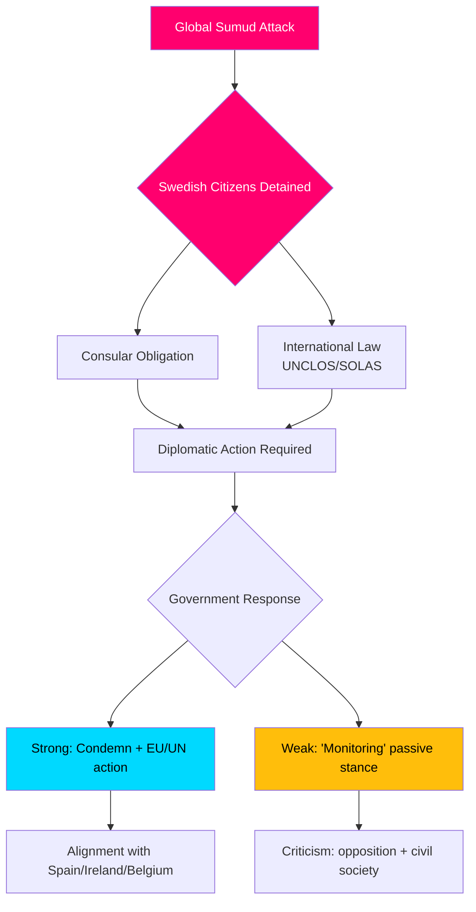

# Inlichtingenbriefing — Interpellatiedebats, 2026-05-06

**Classificatie**: OPENBAAR | **Betrouwbaarheidsniveau**: B2 [Admiralty] | **Gegenereerd**: 2026-05-06T20:42:00Z  
**Auteur**: James Pether Sörling | **Rijksdagzitting**: 2025/26

---

## Conclusie vooraf (BLUF)

Vijf op 2026-05-06 ingediende interpellaties onthullen dat een Zweedse oppositie (S, onafhankelijken) de Tidö-regering tegelijkertijd op drie politieke fronten onder druk zet: (1) een politiek explosieve internationale crisis — de gewapende onderschepping door Israël van het Gaza-gebonden humanitaire vlootschip Global Sumud met 175 gedetineerde burgers inclusief twee Zweedse staatsburgers — die Zweden's capaciteit en bereidheid om internationaal recht en consulaire verplichtingen te handhaven op de proef stelt; (2) systemische infrastructuurgebreken op Arlanda Airport en in weg-/spoorweglogistiek; en (3) afnemende bescherming van misdaadslachtoffers onder kwetsbare vrouwen. De vlootcrisis (HD10470) is het meest geprofileerd en creëert onmiddellijke diplomatieke en binnenlandse politieke druk op de regering: passiviteit riskeert vergelijkingen met Spanje, Ierland en België die sterkere standpunten hebben ingenomen, terwijl handelen de strategische positie van de regering in het Israëlisch-Palestijnse conflict belast.

---

## Beslissingen ondersteund door deze analyse

1. **Diplomatieke reactiekalk** — Welke diplomatieke stappen moet Zweden ondernemen met betrekking tot gedetineerde Zweedse staatsburgers aan boord van de vloot Global Sumud? Reputatierisico door passiviteit vs. coalitie-/NAVO-afstemmingskosten bij confrontatie met Israël.
2. **Herziening misdaadslachtofferbeleid** — Is de daling in beschut wonen voor bedreigde vrouwen een gebrek aan middelen, een regelgevingskloof of een structureel probleem in het brottsofferpolitik van de regering?
3. **Arlanda-connectiviteitsprioriteit** — Vereist de hervorming van de Arlanda hogesnelheidslijn/Arlandabanan regeringsactie vóór de verkiezingen van 2026?

---

## 60-seconden informatiepunten

- 🔴 **Vlootcrisis (HD10470)**: Het Israëlische leger heeft het humanitaire vlootschip Global Sumud in internationale wateren geënterd (~45 zeemijl ten westen van Kythera, Griekenland), 175 burgers gedetineerd inclusief 2 Zweedse staatsburgers. Lorena Delgado Varas (-) vraagt minister van Buitenlandse Zaken Maria Malmer Stenergard welke diplomatieke stappen Zweden zal nemen. Zweden heeft tot nu toe alleen gezegd dat het de situatie "monitort" — beduidend zwakker dan de reacties van Spanje, Ierland, België.
- 🟠 **Arlanda-bereikbaarheid (HD10471)**: Kadir Kasirga (S) daagt infrastructuurminister Andreas Carlson uit over hoge Arlanda Express-kosten en onvoldoende spoorverbindingen, verwijzend naar de resultaten van eigen overheidsonderzoeken. Het onderwerp heeft electorale relevantie in de regio Stockholm.
- 🟡 **Misdaadslachtofferbeleid (HD10472)**: Sanna Backeskog (S) daagt minister van Justitie Gunnar Strömmer uit over de daling in opvang in beschut wonen voor slachtoffers van partnergeweld. Vrouwenopvangcentra hebben ondanks ongewijzigde dreigingsniveaus gewaarschuwd voor een capaciteitscrisis.
- 🟡 **Parkeren zwaar verkeer (HD10473)**: Eva Lindh (S) daagt minister Carlson uit over het acute gebrek aan parkeer-/opstelplaatsen voor zwaar goederenverkeer — een dringende kwestie van verkeersveiligheid en EU-naleving.
- 🟡 **Spoorwegindringers (HD10474)**: Eva Lindh (S) daagt Carlson opnieuw uit over onbevoegde personen op spoorwegen als groeiende oorzaak van vertragingen — regelgeving en operationele capaciteit om politie-afhankelijkheid te verminderen.

---

## Belangrijkste toekomstige trigger

**Bewaak**: Regeringsreactie op Zweedse staatsburgers gedetineerd op de vloot Global Sumud (verwacht binnen 48u). Escalatierisico: als Israël de gedetineerden niet vrijlaat, staat Zweden onder druk om te handelen in de EU Raad voor Buitenlandse Zaken en de VN Veiligheidsraad.

**Betrouwbaarheidsniveau**: B2 — Directe bronnen van de officiële Riksdag-interpellatietekst HD10470 ingediend 2026-05-06; geverifieerd via riksdag-regering MCP.

<!-- source-sha: 215d03e02ff7af33e95ff32888a799a81633820d -->
