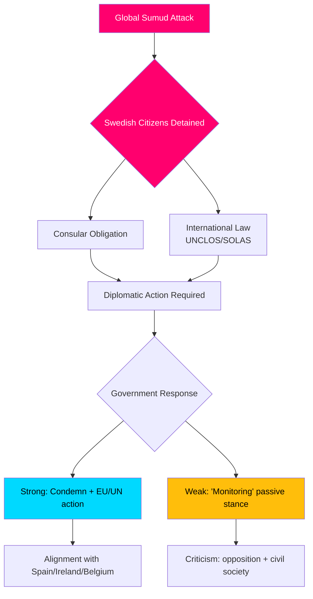

# Etterretningsbriefing — Interpellasjonsdebatter, 2026-05-06

**Klassifisering**: OFFENTLIG | **Konfidensnivå**: B2 [Admiralty] | **Generert**: 2026-05-06T20:42:00Z  
**Forfatter**: James Pether Sörling | **Riksmøte**: 2025/26

---

## Konklusjon på forhånd (BLUF)

Fem interpellasjoner innlevert 2026-05-06 avslører at en svensk opposisjon (S, uavhengige) presser Tidø-regjeringen på tre politiske fronter samtidig: (1) en politisk eksplosiv internasjonal krise — Israels væpnede bording av den Gaza-bundne flotillen Global Sumud med 175 sivile fengslede inkludert to svenske borgere — som tester Sveriges kapasitet og vilje til å håndheve folkeretten og konsulære forpliktelser; (2) systemiske infrastrukturmangler ved Arlanda lufthavn og i vei-/jernbanelogistikk; og (3) avtagende beskyttelse av ofre for forbrytelser mot sårbare kvinner. Flotillekrisen (HD10470) er det høyest profilerte sakset og skaper umiddelbart diplomatisk og innenrikspolitisk press på regjeringen: passivitet risikerer sammenligning med Spania, Irland og Belgia som har inntatt sterkere standpunkter, mens handling belaster regjeringens strategiske posisjon i Israel-Palestina-konflikten.

---

## Beslutninger støttet av denne analysen

1. **Diplomatisk svarkalkyle** — Hvilke diplomatiske tiltak bør Sverige ta angående fengslete svenske borgere om bord på flotillen Global Sumud? Risiko for omdømmeskade fra passivitet vs. koalisjons-/NATO-tilpasningskostnader ved konfrontasjon med Israel.
2. **Gjennomgang av kriminalitetsofferpolitikk** — Er nedgangen i beskyttet bolig for truede kvinner en ressurssvikt, et reguleringsunderskudd eller et strukturelt problem i regjeringens brottsofferpolitikk?
3. **Arlanda-konnektivitetsprioritering** — Krever Arlanda høyhastighetsbane/Arlandabanen-reformen regjeringshandling før valget i 2026?

---

## 60-sekunders informasjonspunkter

- 🔴 **Flotillekrisen (HD10470)**: Israelske militære bordet den humanitære flotillen Global Sumud i internasjonalt farvann (~45 nautiske mil vest for Kythera, Hellas), fengslet 175 sivile inkludert 2 svenske borgere. Lorena Delgado Varas (-) spør utenriksminister Maria Malmer Stenergard hvilke diplomatiske tiltak Sverige vil ta. Sverige har så langt bare sagt at det "overvåker situasjonen" — betydelig svakere enn Spanias, Irlands, Belgias respons.
- 🟠 **Arlanda-tilgjengelighet (HD10471)**: Kadir Kasirga (S) utfordrer infrastrukturminister Andreas Carlson om høye Arlanda Express-kostnader og utilstrekkelig jernbanekonnektivitet, med referanse til regjeringens egne utredningsresultater. Saken har valgmessig relevans i Stockholmsregionen.
- 🟡 **Kriminalitetsofferpolitikk (HD10472)**: Sanna Backeskog (S) utfordrer justisminister Gunnar Strömmer om nedgang i plasseringer i beskyttet bolig for ofre for partnervold. Krisesentre for kvinner har advart om kapasitetskrise til tross for uendrede trusselsnivåer.
- 🟡 **Tungtrafikparkering (HD10473)**: Eva Lindh (S) utfordrer infrastrukturminister Carlson om akut mangel på parkerings-/oppstillingsplasser for tunge kjøretøy — et presserende spørsmål om trafikksikkerhet og EU-etterlevelse.
- 🟡 **Jernbaneinntrenging (HD10474)**: Eva Lindh (S) utfordrer Carlson igjen om uautoriserte personer på jernbanespor som en voksende årsak til forsinkelser — regulering og operativ kompetanse for å redusere politiavhengighet.

---

## Viktigste fremtidige utløser

**Følg med på**: Regjeringens svar på svenske borgere fengslet på flotillen Global Sumud (forventet innen 48t). Eskaleringsrisiko: hvis Israel ikke løslater de fengslede, vil Sverige stå under press om å handle i EUs utenrikspolitiske råd og FNs sikkerhetsråd.

**Konfidensnivå**: B2 — Direkte kilder fra offisiell riksdagsinterpellasjonstekst HD10470 innlevert 2026-05-06; verifisert via riksdag-regering MCP.

<!-- source-sha: 215d03e02ff7af33e95ff32888a799a81633820d -->
