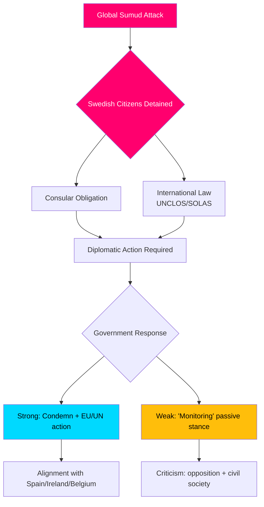

# Underrättelsebriefing — Interpellationsdebatter, 2026-05-06

**Klassificering**: OFFENTLIG | **Konfidensgrad**: B2 [Admiralty] | **Genererad**: 2026-05-06T20:42:00Z  
**Upphovsman**: James Pether Sörling | **Riksmöte**: 2025/26

---

## Slutsats i korthet (BLUF)

Fem interpellationer inlämnade 2026-05-06 avslöjar att en svensk opposition (S, oberoende) pressar Tidöregeringen på tre politikfronter samtidigt: (1) en politiskt explosiv internationell kris — Israels väpnade boarding av den Gazabound flottilja Global Sumud med 175 civila frihetsberövade inklusive två svenska medborgare — som testar Sveriges kapacitet och vilja att upprätthålla folkrätten och konsulära skyldigheter; (2) systemiska infrastrukturbrister vid Arlanda flygplats och inom väg-/järnvägslogistiken; och (3) sjunkande skydd för brottsoffer för utsatta kvinnor. Flottilje-krisen (HD10470) är det viktigaste ärendet och skapar omedelbart diplomatiskt och inrikespolitiskt tryck på regeringen: passivitet riskerar jämförelse med Spanien, Irland och Belgien som intagit hårdare ståndpunkter, medan action belastar regeringens strategiska position i Israel-Palestinakonflikten.

---

## Beslut som stöds av denna analys

1. **Diplomatisk svarskalkyl** — Vilka diplomatiska åtgärder bör Sverige vidta angående svenska medborgare som hålls som frihetsberövade ombord på flottilja Global Sumud? Risk för anseendeskada vid passivitet kontra koalitions-/NATO-anpassningskostnader vid konfrontation med Israel.
2. **Granskning av brottsofferpolitiken** — Är minskningen av skyddsplaceringar för hotade kvinnor ett resursmisslyckande, ett regleringsglapp eller ett strukturellt problem i regeringens brottsofferpolitik?
3. **Prioritering av Arlanda-konnektivitet** — Kräver Arlanda-höghastighetsbanans/Arlandasbananreformen regeringsåtgärder före valet 2026?

---

## 60-sekunders informationspunkter

- 🔴 **Flottilje-krisen (HD10470)**: Israeliskt militär boardade den humanitära flottilja Global Sumud i internationellt vatten (~45 nautiska mil väster om Kythera, Grekland), frihetsberövade 175 civila inklusive 2 svenska medborgare. Lorena Delgado Varas (-) frågar utrikesminister Maria Malmer Stenergard vilka diplomatiska åtgärder Sverige kommer att vidta. Sverige har hittills bara sagt att det "bevakar situationen" — avsevärt svagare än Spaniens, Irlands, Belgiens reaktioner.
- 🟠 **Arlanda-tillgänglighet (HD10471)**: Kadir Kasirga (S) utmanar infrastrukturminister Andreas Carlson om höga Arlanda Express-kostnader och otillräcklig järnvägskonnektivitet, med hänvisning till regeringens egna utredarresultat. Frågan har valrelevans i Stockholmsregionen.
- 🟡 **Brottsofferpolitik (HD10472)**: Sanna Backeskog (S) utmanar justitieminister Gunnar Strömmer om minskande placeringar i skyddsboenden för offer för våld i nära relationer. Kvinnojourer har varnat för kapacitetskris trots oförändrade hotnivåer.
- 🟡 **Tungtrafikparkering (HD10473)**: Eva Lindh (S) utmanar infrastrukturminister Carlson om akut brist på parkerings-/uppställningsplatser för tunga fordon — en brådskande fråga om trafiksäkerhet och EU-efterlevnad.
- 🟡 **Järnvägsintrång (HD10474)**: Eva Lindh (S) utmanar Carlson igen om obehöriga personer på järnvägsspår som en växande orsak till förseningar — reglering och operativ kompetens för att minska polisberoendet.

---

## Viktigaste framåtutlösare

**Bevaka**: Regeringens svar på svenska medborgare som frihetsberövas på flottilja Global Sumud (förväntat inom 48h). Eskaleringsrisk: om Israel inte frigör de frihetsberövade, utsätts Sverige för tryck att agera i EU:s råd för utrikes frågor och FN:s säkerhetsråd.

**Konfidensgrad**: B2 — Direktkällor från officiell riksdagsinterpellationstext HD10470 inlämnad 2026-05-06; verifierad via riksdag-regering MCP.

<!-- source-sha: 215d03e02ff7af33e95ff32888a799a81633820d -->
