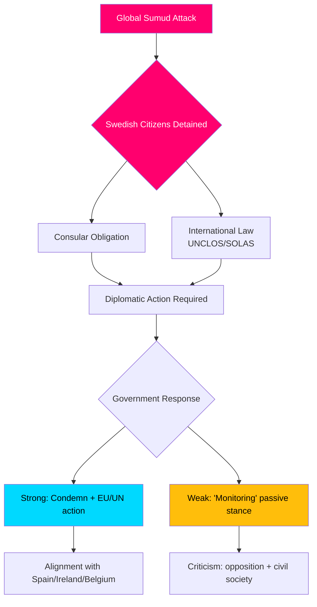

# 情报简报 — 质询辩论，2026-05-06

**密级**：公开 | **可信度**：B2 [Admiralty] | **生成时间**：2026-05-06T20:42:00Z  
**作者**：James Pether Sörling | **议会届次**：2025/26

---

## 先行结论（BLUF）

2026-05-06提交的五份质询揭示，瑞典反对党（S、独立人士）正同时在三条政策战线向Tidö政府施压：(1) 一场政治上极为敏感的国际危机——以色列武装拦截前往加沙的人道主义船只Global Sumud，175名平民被扣押，其中包括两名瑞典公民——考验瑞典执行国际法和领事义务的能力与意愿；(2) 阿尔兰达机场及公路/铁路物流中存在系统性基础设施缺陷；(3) 对脆弱女性犯罪受害者的保护力度下降。船队危机（HD10470）最为瞩目，给政府造成即时外交和国内政治压力：消极应对面临与采取更强硬立场的西班牙、爱尔兰、比利时相比较的风险，而采取行动则会给政府在以巴冲突中的战略立场增添负担。

---

## 本分析支持的决策

1. **外交应对测算** — 瑞典应就乘坐Global Sumud船队被扣押的瑞典公民采取哪些外交措施？消极应对的声誉损害风险 vs. 与以色列正面交锋时的联盟/北约协调成本。
2. **犯罪受害者政策审查** — 受威胁女性受保护住房名额下降是资源不足、监管漏洞，还是政府brottsofferpolitik中的结构性问题？
3. **阿尔兰达连接优先级** — 阿尔兰达高铁/Arlandabanan改革是否需要在2026年大选前采取政府行动？

---

## 60秒信息要点

- 🔴 **船队危机（HD10470）**：以色列军队在国际水域（希腊基西拉岛以西约45海里）拦截并登上人道主义船只Global Sumud，扣押175名平民，其中包括2名瑞典公民。Lorena Delgado Varas（-）向外交部长Maria Malmer Stenergard询问瑞典将采取哪些外交措施。迄今为止，瑞典仅表示"正在关注局势"——明显弱于西班牙、爱尔兰、比利时的回应。
- 🟠 **阿尔兰达可达性（HD10471）**：Kadir Kasirga（S）援引政府自身调查结论，就阿尔兰达特快列车高昂费用及铁路连接不足质询基础设施部长Andreas Carlson。该议题在斯德哥尔摩地区具有选举重要性。
- 🟡 **犯罪受害者政策（HD10472）**：Sanna Backeskog（S）就家庭暴力受害者受保护住房安置数量下降质询司法部长Gunnar Strömmer。尽管威胁等级未变，女性庇护中心已就容量危机发出警告。
- 🟡 **重型车辆停车（HD10473）**：Eva Lindh（S）就重型货车停车/集结区域严重短缺质询Carlson部长——一个紧迫的交通安全与欧盟合规问题。
- 🟡 **铁路侵入（HD10474）**：Eva Lindh（S）再次就未经授权人员进入铁路轨道导致延误问题质询Carlson——以减少警务依赖为目标的监管与运营能力问题。

---

## 最重要的未来触发因素

**监测**：政府对Global Sumud船队上被扣押瑞典公民的回应（预计48小时内）。升级风险：若以色列不释放被扣押人员，瑞典将面临在欧盟外交事务委员会和联合国安理会采取行动的压力。

**可信度**：B2 — 来自2026-05-06提交的官方riksdag质询文本HD10470的直接信源；已通过riksdag-regering MCP验证。

<!-- source-sha: 215d03e02ff7af33e95ff32888a799a81633820d -->
