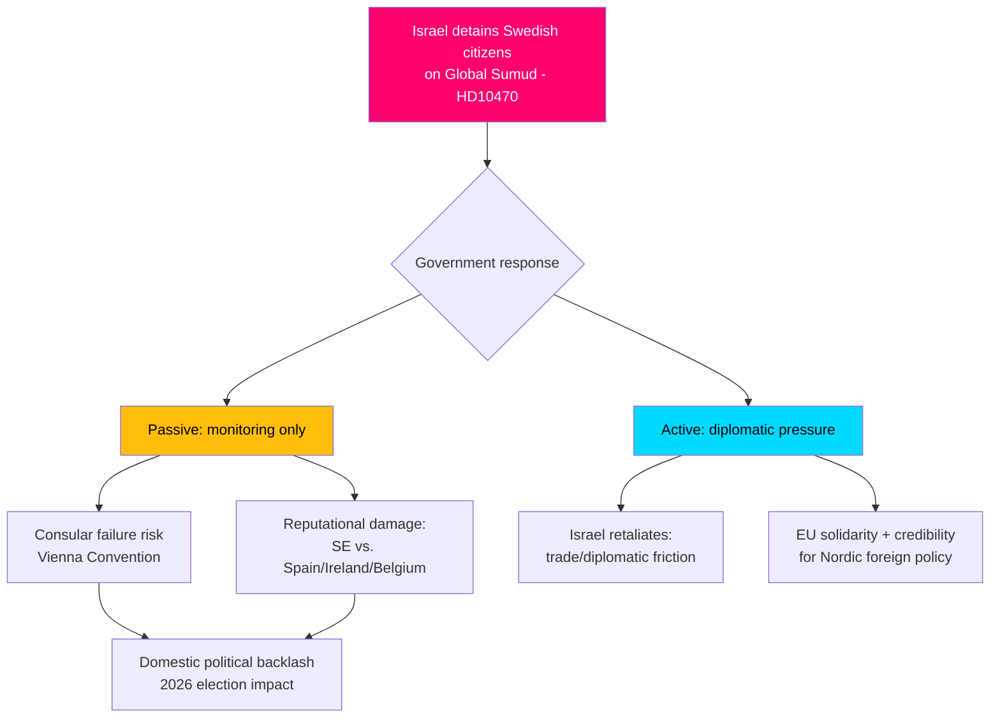

# Risk Assessment — Interpellation Debates, 2026-05-06

**Classification**: PUBLIC | **Confidence**: B2 [Admiralty] | **Generated**: 2026-05-06T20:46:00Z

> ℹ️ **IMF economic context**: IMF pre-warm status: degraded (WEO/FM Datamapper accessible; IFS SDMX returned 404). Economic risk dimensions draw on WEO Apr-2026 projections.

---

## 5-Dimension Risk Register

### Dimension 1: Political risk

| Risk | Likelihood (L) | Impact (I) | L×I | Cascade |
|------|---------------|------------|-----|---------|
| Government fails to protect Swedish citizens on Global Sumud → public backlash | 0.35 | 9 | 3.2 | Consular failure → opposition momentum → 2026 election damage |
| "Brottsofferpolitik" crime victim shelter closures escalate → media campaign | 0.50 | 7 | 3.5 | Shelter system weakening → public safety → S electoral gain |
| Arlanda reform blocked → business community discontent | 0.40 | 6 | 2.4 | Investor confidence → Stockholm region competitiveness |

### Dimension 2: Institutional risk

| Risk | L | I | L×I |
|------|---|---|-----|
| Sweden perceived as diplomatically passive on international law violations | 0.45 | 8 | 3.6 |
| Women's shelter system capacity drops below safety threshold | 0.45 | 8 | 3.6 |
| Trafikverket/railway delay crisis worsens without regulatory fix for track trespassers | 0.55 | 6 | 3.3 |

### Dimension 3: Economic risk (IMF-first, WEO Apr-2026)

| Risk | L | I | L×I | IMF Source |
|------|---|---|-----|------------|
| Arlanda Express cost barrier reduces labor mobility in Stockholm metro region | 0.35 | 5 | 1.75 | WEO Apr-2026, WEO:NGDP_RPCH SWE — Sweden GDP growth 1.8% 2026 projected; transport bottlenecks compound productivity drag |
| Truck driver shortage amplified by inadequate rest infrastructure | 0.40 | 5 | 2.0 | WEO Apr-2026; transport sector GDP multiplier ~1.3× |

*Note: IFS monthly CPI data unavailable (SDMX 404); using WEO/FM Datamapper vintage WEO Apr-2026 only. No economic inflation-linked claims made without this data.*

### Dimension 4: Social/humanitarian risk

| Risk | L | I | L×I |
|------|---|---|-----|
| Swedish citizens continue to be held on Global Sumud without consular access | 0.30 | 9 | 2.7 |
| Female truck drivers and other vulnerable transport workers face unsafe rest areas | 0.55 | 7 | 3.9 |
| Domestic violence victims denied shelter due to capacity decline | 0.50 | 8 | 4.0 |

### Dimension 5: Legal/constitutional risk

| Risk | L | I | L×I |
|------|---|---|-----|
| Sweden in breach of Vienna Convention on Consular Relations (HD10470) | 0.25 | 9 | 2.3 |
| EU challenge to Swedish women's shelter funding levels | 0.20 | 6 | 1.2 |
| EU drivers' hours regulations not enforced due to lack of parking (HD10473) | 0.40 | 6 | 2.4 |

---

## Cascading risk chain: Flotilla crisis

---

## Posterior probability assessments

Given observed government passivity (Foreign Minister said "following the situation"):
- P(government escalates to formal diplomatic protest within 48h) = 0.45 ± 0.15
- P(government raises in EU FAC within 1 week) = 0.35 ± 0.15
- P(Swedish citizens repatriated within 72h without further Swedish action) = 0.50 ± 0.20 [unconfirmed — depends on Israeli decision]

