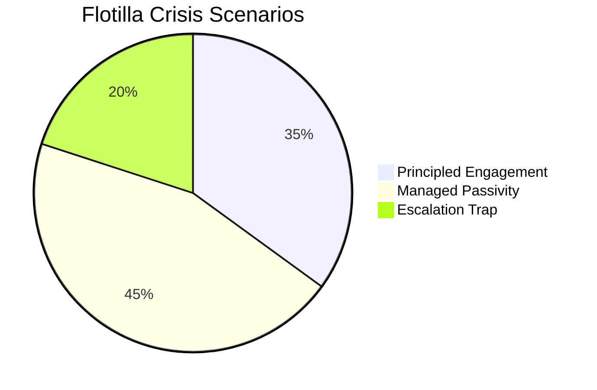

# Scenario Analysis — Interpellation Debates, 2026-05-06

**Classification**: PUBLIC | **Confidence**: B2 [Admiralty] | **Generated**: 2026-05-06T20:49:00Z

---

## Primary scenario set: HD10470 flotilla crisis

### Scenario 1: "Principled Engagement" (P = 0.35)
Sweden issues a formal diplomatic protest to Israel, raises the matter in EU FAC, demands release of detainees including Swedish citizens under Vienna Convention, and initiates consultations on UNCLOS/SOLAS violations. Swedish citizens repatriated within 1–2 weeks. Sweden joins Spain/Ireland/Belgium diplomatic coalition.

**Leading indicators**: Foreign Minister issues written statement condemning the attack within 48h; Government requests emergency meeting with Israeli ambassador; Swedish MFA issues consular advisory.

**Outcome**: Short-term friction with Israel; medium-term credibility gain as Sweden upholds international law tradition; moderate positive electoral signal for government handling of citizen protection.

---

### Scenario 2: "Managed Passivity" (P = 0.45)
Sweden continues "monitoring" stance; works through quiet diplomatic channels; does not publicly condemn or join EU coalition. Swedish citizens returned quietly through Israeli-Brazilian-Swedish diplomatic process within 2–3 weeks. Government faces ongoing opposition criticism but no acute crisis.

**Leading indicators**: Foreign Minister gives press conference citing "active diplomatic contacts"; no public statement condemning Israel's boarding; Sweden not part of any joint EU statement.

**Outcome**: Opposition exploitation throughout 2026 election campaign; moderate domestic reputational cost; no acute policy failure but persistent narrative of "passive Sweden".

---

### Scenario 3: "Escalation Trap" (P = 0.20)
Swedish citizens not released promptly; international pressure grows; Israel escalates rhetoric against "Hamas-supporting activists". Sweden caught between NATO partners (US, UK supporting Israel) and EU progressive majority. Government forced to take sides under media pressure.

**Leading indicators**: Swedish citizens remain detained beyond 72h; Israel accuses flotilla of smuggling; EU/UN debate scheduled; US explicitly blocks condemnation.

**Outcome**: Severe domestic political crisis; major foreign policy stress for Tidö government; risk of minority government's credibility being damaged before election.

---

### Scenario 4: "Infrastructure inaction continues" (P = 0.85) — HD10471/73/74
Government refers all three transport interpellations to ongoing reviews; no new policy commitments before 2026 election. The acute problems persist.

**Leading indicator**: Minister Carlson's response relies on "pågående utredning" framing in all three debates.

**Outcome**: Low political cost to government; moderate ongoing real-world harm (truck driver safety, rail delays, Arlanda costs); S builds electoral narrative on government inaction.

---

## Probability summary

| Scenario | P |
|----------|---|
| S1: Principled Engagement | 0.35 |
| S2: Managed Passivity | 0.45 |
| S3: Escalation Trap | 0.20 |
| **Sum** | **1.00** |

*(Infrastructure scenario S4 is quasi-independent: P=0.85; remaining P=0.15 implies some partial commitments)*

