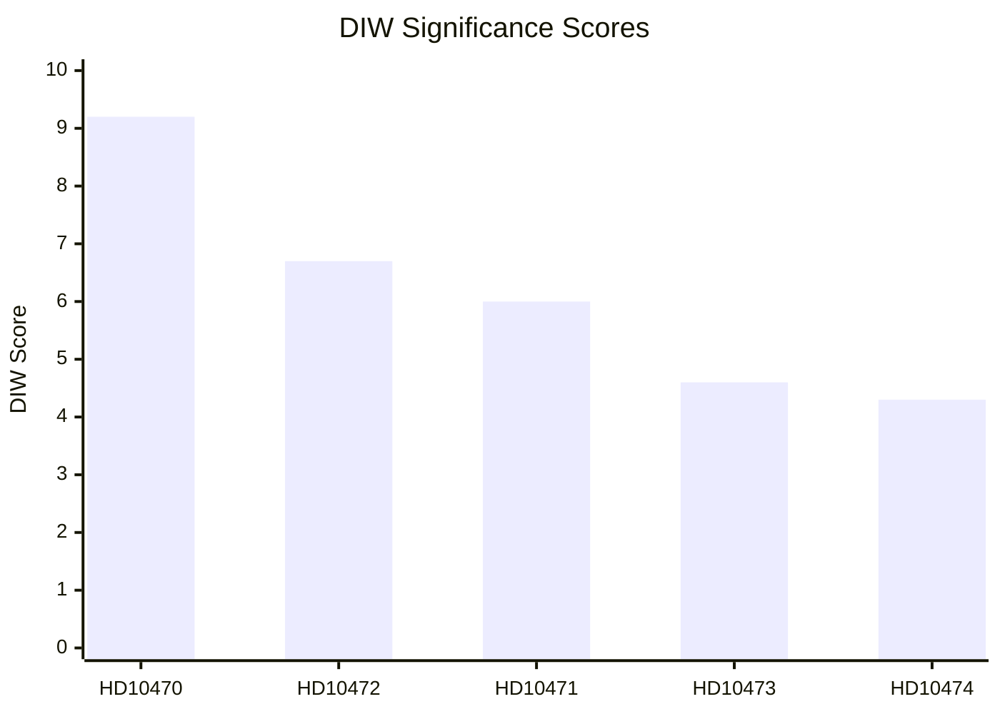

# Significance Scoring — Interpellation Debates, 2026-05-06

**Classification**: PUBLIC | **Confidence**: B2 [Admiralty] | **Generated**: 2026-05-06T20:44:00Z

---

## DIW scoring methodology

Documents are scored on three axes (D = Decisional impact, I = Intelligence value, W = Wider significance), each 0–10, averaged with weights D:0.4 + I:0.3 + W:0.3.

| dok_id | Title (brief) | D | I | W | DIW Score | Tier |
|--------|---------------|---|---|---|-----------|------|
| HD10470 | Israels angrepp på flottiljen Global Sumud | 9 | 9 | 10 | **9.2** | L3 Intelligence-grade |
| HD10472 | Regeringens brottsofferpolitik | 7 | 6 | 7 | **6.7** | L2 Strategic |
| HD10471 | Höga kostnader och bristande tillgänglighet till Arlanda | 6 | 5 | 7 | **6.0** | L2 Strategic |
| HD10473 | Parkerings- och uppställningsplatser för tunga fordon | 5 | 4 | 5 | **4.6** | L1 Surface |
| HD10474 | Obehöriga i spårområdet | 4 | 4 | 5 | **4.3** | L1 Surface |

---

## Scoring rationale

**HD10470 — D:9, I:9, W:10**  
Decisional: Immediate diplomatic decisions required on Swedish citizens detained; direct link to Foreign Minister's accountability. Intelligence: Real-time international law incident with verified SOLAS and UNCLOS violations alleged by Greenpeace/Arctic Sunrise witness testimony. Wider: International significance (flotilla attacked in international waters; European diplomatic reactions; UN implications) and domestic political significance (cross-partisan opposition demand; election-year optics).

**HD10472 — D:7, I:6, W:7**  
Decisional: Resource allocation for women's shelters; brottsofferpolitik review. Intelligence: Documents structural decline in shelter system capacity; provides accountability evidence. Wider: Women's rights, social protection, election-year political vulnerability for Tidö coalition.

**HD10471 — D:6, I:5, W:7**  
Decisional: Government decision needed on Arlandabanan investment/reform. Intelligence: Government's own investigator has flagged reform need. Wider: Stockholm-region economic competitiveness and labor-market accessibility.

**HD10473 — D:5, I:4, W:5**  
Decisional: Regulatory/infrastructure changes needed; government review ongoing to 2029. Intelligence: Documents an acute operational problem in transport sector. Wider: EU working-time regulations compliance for truck drivers; traffic safety.

**HD10474 — D:4, I:4, W:5**  
Decisional: Regulatory clarification needed for railway staff authority. Intelligence: Documents protocol inefficiency. Wider: Public transport reliability; SJ/Trafikverket operational efficiency.

---

## Sensitivity analysis

If the Swedish citizens on the Global Sumud are **not repatriated within 72h**, the diplomatic/consular stakes of HD10470 escalate its D-score to 10, raising the overall DIW to 9.7. This would push the item from "L3 Intelligence-grade" to an acute crisis requiring near-real-time monitoring.

