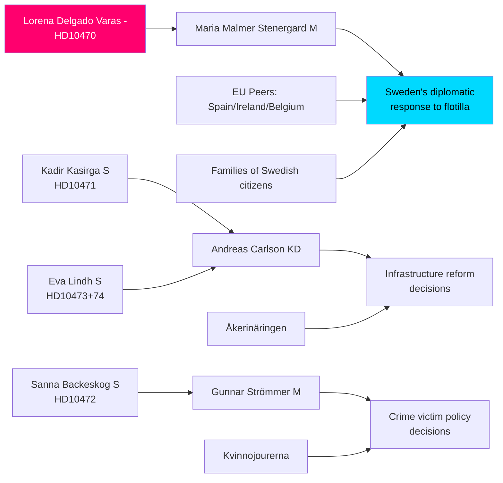

# Stakeholder Perspectives — Interpellation Debates, 2026-05-06

**Classification**: PUBLIC | **Confidence**: B2 [Admiralty] | **Generated**: 2026-05-06T20:48:00Z

---

## 6-lens stakeholder matrix

### Lens 1: Interpellants (opposition MPs)

| Actor | Party | Interpellation | Position | Demand |
|-------|-------|----------------|----------|--------|
| Lorena Delgado Varas | - (independent) | HD10470 | Strongly critical of passive Swedish response to flotilla attack | Immediate diplomatic condemnation; consular action; EU/UN engagement; support for Swedish citizens |
| Kadir Kasirga | S | HD10471 | Critical of Arlanda Express costs and capacity | Government action to reform rail connectivity and reduce costs |
| Sanna Backeskog | S | HD10472 | Critical of declining crime victim support | Reversal of shelter capacity decline; policy review |
| Eva Lindh | S | HD10473, HD10474 | Critical of infrastructure management | Acute action on truck parking + railway regulatory reform |

### Lens 2: Ministers (government respondents)

| Actor | Party | Portfolio | Expected position |
|-------|-------|-----------|-------------------|
| Maria Malmer Stenergard | M | Utrikesminister | Likely to say Sweden is "monitoring" + working through diplomatic channels; may note bilateral dialogue with Israel; will avoid direct condemnation |
| Andreas Carlson | KD | Infrastruktur- och bostadsminister | Likely to point to ongoing reviews; express sympathy but no firm commitments |
| Gunnar Strömmer | M | Justitieminister | Likely to defend brottsofferpolitik by citing new legislation; may dispute shelter placement figures |

### Lens 3: Civil society / affected communities

| Actor | Relevance | Expected stance |
|-------|-----------|-----------------|
| Families of Swedish citizens on Global Sumud | HD10470 | Demand immediate government action; public visibility amplifies pressure |
| Kvinnojourerna (women's shelters) | HD10472 | Critical of government; 50 years of operational capacity threatened |
| Åkerinäringen (trucking industry associations) | HD10473 | Critical of safety at rest areas; demand accelerated infrastructure investment |
| SJ / Trafikverket | HD10474 | Mixed: support streamlined protocols but concerned about regulatory scope |

### Lens 4: International actors

| Actor | Relevance | Expected stance |
|-------|-----------|-----------------|
| Israel / IDF | HD10470 | Will frame attack as security operation against "activists" violating blockade |
| Spain, Ireland, Belgium | HD10470 | Already escalated diplomatically — create normative pressure on Sweden |
| Greenpeace (Arctic Sunrise crew/witnesses) | HD10470 | Providing eyewitness testimony of SOLAS violations; visible advocacy actor |
| European Commission | HD10473 | EU Working Time Directive enforcement — potential infringement proceeding |

### Lens 5: Media/public opinion

| Dimension | Signal |
|-----------|--------|
| Flotilla crisis salience | High — Swedish citizens detained abroad is a domestic news priority |
| Crime victims | Medium — women's shelter crisis resonates with female electorate |
| Infrastructure | Low-medium — wonkish but affects commuters |
| Framing risk | Government at risk of "passive on human rights" narrative (HD10470) |

### Lens 6: Electoral constituencies

| Constituency | Relevance | 2026 impact |
|--------------|-----------|-------------|
| Voters who prioritise international law / human rights | HD10470 | Moderate-to-large; includes C, MP, V + some S voters |
| Women affected by domestic violence | HD10472 | S stronghold + female voter bloc in all parties |
| Stockholm-region commuters | HD10471 | Stockholm, Uppsala, Arlanda corridor; economically active voters |
| Trucking industry + rural Sweden | HD10473 | Regional — SD, C, M constituencies; practical impact on livelihoods |

---

## Influence network diagram

