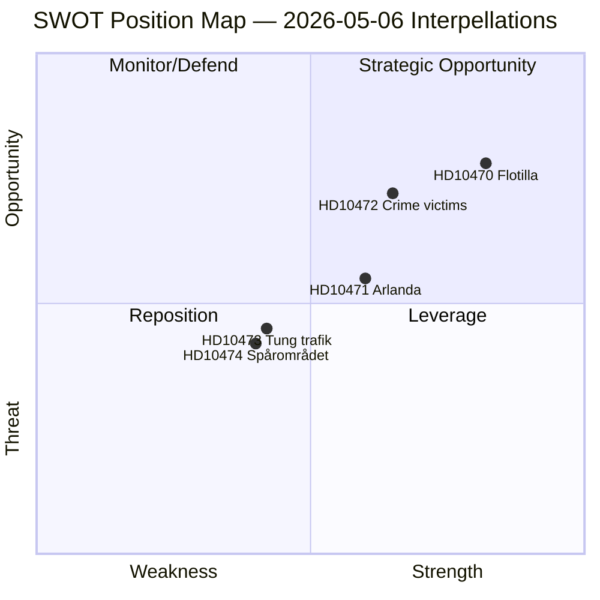

# SWOT Analysis — Interpellation Debates, 2026-05-06

**Classification**: PUBLIC | **Confidence**: B2 [Admiralty] | **Generated**: 2026-05-06T20:45:00Z

---

## SWOT Matrix (opposition position)

### Strengths
| # | Strength | Evidence | Admiralty |
|---|----------|----------|-----------|
| S1 | Broad interpellation portfolio covering foreign policy, justice, and infrastructure — hard to dismiss as partisan | 5 interpellations from 3 different MPs, 2 separate policy domains | B2 |
| S2 | HD10470 filed by independent (-), not S — neutralises "partisan attack" framing by government | dok_id HD10470, Lorena Delgado Varas, registered as "-" party | A1 |
| S3 | Government's own investigator has flagged Arlanda reforms needed (HD10471) — creates accountability | Cited in interpellation HD10471 | B2 |
| S4 | Concrete legal framework (UNCLOS, SOLAS) cited in HD10470 — hard for government to dismiss as political | Article references in HD10470 full text | A1 |

### Weaknesses
| # | Weakness | Evidence | Admiralty |
|---|----------|----------|-----------|
| W1 | Interpellations alone cannot force policy change without majority support in chamber | Constitutional rule: Swedish government does not require confidence vote on interpellations | A1 |
| W2 | Eva Lindh doubles up with two similar transport interpellations (HD10473, HD10474) to same minister — risks dilution | Filed same day to same minister | A1 |
| W3 | No clear parliamentary vote mechanism attached to any of today's interpellations | Standard interpellation procedure: debate only | A1 |

### Opportunities
| # | Opportunity | Evidence | Admiralty |
|---|----------|----------|-----------|
| O1 | Global Sumud crisis may force EU Foreign Affairs Council action — Sweden can lead or follow | Spain/Ireland/Belgium have already escalated per HD10470 text | B2 |
| O2 | Election 2026: domestic violence and crime victims policy historically an electoral battleground | Social Democrats strong historical position on brottsofferpolitik | B2 |
| O3 | Arlanda Express cost reform has cross-partisan appeal (business community, commuters, international travelers) | Government investigator report cited in HD10471 | B2 |

### Threats
| # | Threat | Evidence | Admiralty |
|---|--------|----------|-----------|
| T1 | Government may use "Israel is a democracy under security threat" framing to deflect diplomatic pressure on HD10470 | Pattern from prior government statements on Gaza | C3 |
| T2 | Infrastructure minister can point to the ongoing government review (to 2029) as ongoing response to HD10473/HD10474 | Review cited in HD10473 text | A1 |
| T3 | Crime victim data may not be officially published in time for debate (BRÅ statistics lag) | Standard BRÅ publication cycle | C3 |

---

## TOWS Matrix (strategic implications)

| | **Opportunities** | **Threats** |
|---|---|---|
| **Strengths** | S2+O1: Independent interppellant + EU consensus opportunity allows opposition to build an internationally credible case for Swedish diplomatic action (HD10470) | S4+T1: Legal framework citation (UNCLOS/SOLAS) makes it harder to use "democratic Israel" deflection — opposition should emphasise international law, not geopolitics |
| **Weaknesses** | W1+O2: Use crime victim interpellation (HD10472) as electoral weapon even without votes — press conferences, social media, women's organisations | W1+T2: Transport interpellations may be absorbed by "ongoing review" deflection — opposition needs external stakeholder pressure (transport industry associations) |

