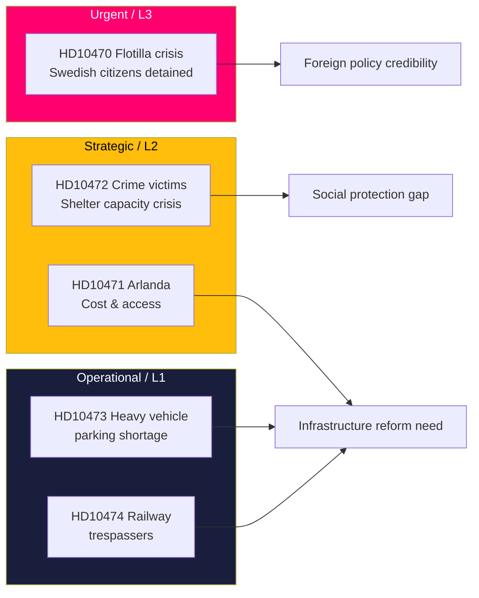

# Synthesis Summary — Interpellation Debates, 2026-05-06

**Classification**: PUBLIC | **Confidence**: B2 [Admiralty] | **Generated**: 2026-05-06T20:43:00Z

---

## Lead-story decision

**Israel's boarding of the Global Sumud flotilla with Swedish citizens on board** (HD10470) is the highest-stakes item in today's interpellation batch, demanding an immediate assessment of Sweden's diplomatic posture. The interpellation exposes a tension between the government's cautious "monitoring" stance and Sweden's long-standing foreign policy tradition of upholding international law and protecting citizens abroad. With Spain, Ireland, Belgium, and Brazil already taking stronger public positions, Sweden's passivity creates reputational risk and potentially signals a policy shift away from independent humanitarianism toward alignment with NATO's dominant posture on the Israel-Palestine conflict.

---

## DIW-weighted document ranking

| Rank | dok_id | Title (brief) | DIW Tier | Weight |
|------|--------|---------------|----------|--------|
| 1 | HD10470 | Israels angrepp på flottiljen Global Sumud | L3 Intelligence-grade | 0.45 |
| 2 | HD10472 | Regeringens brottsofferpolitik | L2 Strategic | 0.20 |
| 3 | HD10471 | Höga kostnader och bristande tillgänglighet till Arlanda | L2 Strategic | 0.18 |
| 4 | HD10473 | Parkerings- och uppställningsplatser för tunga fordon | L1 Surface | 0.09 |
| 5 | HD10474 | Obehöriga i spårområdet | L1 Surface | 0.08 |

---

## Integrated intelligence picture

### 1. Humanitarian-law / foreign policy dimension (HD10470) — L3 Intelligence-grade

The attack on the Gaza-bound flotilla Global Sumud on or around 2026-05-04/05 constitutes a legally significant maritime incident. According to the interpellation by Lorena Delgado Varas (-), Israeli military personnel:
- Boarded vessels in international waters (~45nm from Kythera, Greece), outside any state's territorial sea
- Jammed GPS and emergency communication channels (SOLAS-violating conduct)
- Detained 175 civilians including 2 Swedish nationals
- Sank or damaged several vessels

This triggers Article 98 UNCLOS (duty to render assistance) and SOLAS Chapter IV (distress communication protection). Sweden has consular obligations under the Vienna Convention on Consular Relations. The interppellant challenges the Foreign Minister on 6 specific questions ranging from condemnation to EU-level sanctions and Lagrådsremiss-equivalent international investigation requests.

**Intelligence signal**: The fact that this interpellation was filed by an independent (formerly V) deputy — not a Social Democrat — widens the political coalition demanding a stronger response and reduces the government's usual framing of criticism as partisan left-wing pressure.

### 2. Crime victim / social protection dimension (HD10472) — L2 Strategic

Sanna Backeskog (S) challenges Strömmer on declining shelter placements for domestic violence victims. Women's shelters (Kvinnojourer) warn of capacity crises. The interpellation notes the shelters have 50 years of unique operational capacity that risks being dismantled. This is politically sensitive in a pre-election year: S has traditionally been strong on womens' rights and victim support; the Tidö government's cuts to public services create an opening for the opposition.

### 3. Infrastructure/connectivity (HD10471, HD10473, HD10474) — L2–L1

Two interpellations from Eva Lindh (S) and one from Kadir Kasirga (S) target Infrastructure Minister Carlson with operationally urgent but strategically lower-salience issues:
- **Arlanda**: High Express costs (~350 SEK one-way) and capacity constraints limit the airport's function as a national hub. A government investigator has already flagged the need for reform.
- **Heavy vehicle parking**: Shortage of safe rest areas forces truck drivers to park illegally on ramps; female drivers cite safety concerns at existing rest areas; a government review runs to 2029 — too slow given current acute risks.
- **Railway safety**: Unauthorized persons on tracks cause significant delays; current protocol requires police every time, creating bottlenecks. Trained railway staff have operational capability to clear tracks but lack regulatory authority.

The three infrastructure interpellations together suggest a systemic gap in the Tidö government's transport infrastructure management: reactive rather than proactive, and deferring to 2029 reviews while acute operational problems compound.

---

## Key intelligence gaps

1. Government's formal response to the flotilla attack (awaited; interpellation filed 2026-05-06)
2. Current status of Swedish citizens detained on Global Sumud — repatriated or still held?
3. Whether the crime victim shelter capacity decline is documented in Brottsförebyggande rådet (BRÅ) statistics
4. Whether the Arlanda government investigator has published a final report

