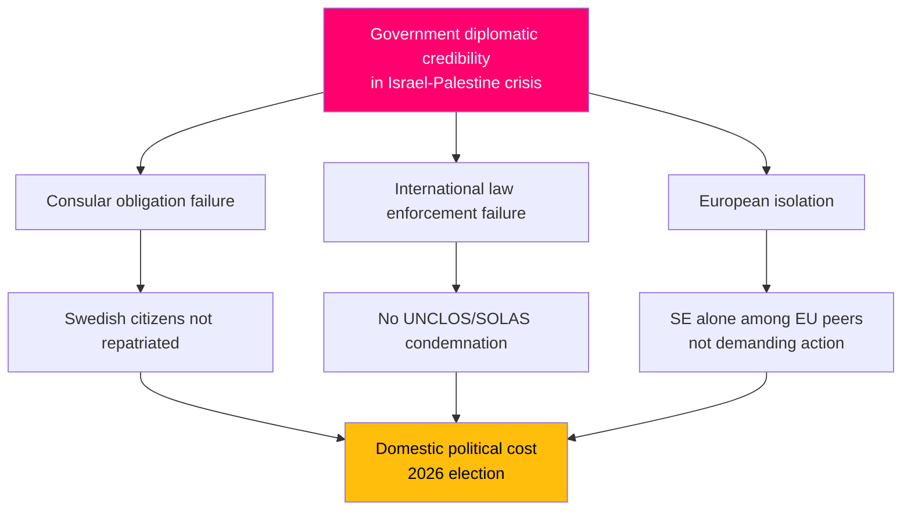

# Threat Analysis — Interpellation Debates, 2026-05-06

**Classification**: PUBLIC | **Confidence**: B2 [Admiralty] | **Generated**: 2026-05-06T20:47:00Z

---

## Political Threat Taxonomy

### Tier 1 — Existential threats to policy positions

| ID | Threat | Actor | Target | TTP |
|----|--------|-------|--------|-----|
| T1.1 | Framing Sweden as internationally isolated/passive on human rights | Opposition + civil society | Government foreign policy credibility | Interpellation HD10470 + media amplification |
| T1.2 | "Brottsofferpolitik failure" narrative before 2026 election | S + women's organisations | Government crime victim credentials | Interpellation HD10472 + BRÅ/organisational evidence |

### Tier 2 — Strategic threats to government implementation

| ID | Threat | Actor | Target | TTP |
|----|--------|-------|--------|-----|
| T2.1 | Arlanda reform delay exposes investment gap | S + business community | Tidö transport policy | Interpellation HD10471 + investigator report |
| T2.2 | EU enforcement action on drivers' hours compliance | EU Commission | Sweden regulatory compliance | HD10473 non-compliance with EU Working Time Directive |

### Tier 3 — Operational threats

| ID | Threat | Actor | Target | TTP |
|----|--------|-------|--------|-----|
| T3.1 | Railway delay crisis worsens without statutory fix | Passengers/industry | Trafikverket credibility | HD10474 |
| T3.2 | Truck driver safety incidents at unsafe rest areas | Industry/workers | Infrastruktur minister credibility | HD10473 |

---

## Attack tree: HD10470 Diplomatic crisis

---

## Narrative attack chain: "Brottsofferpolitik failure" (HD10472)

1. Evidence gathering: S opposition tracks shelter placement statistics from Länsstyrelserna + Socialstyrelsen
2. Weaponization: Interpellation filed with specific data — "allt färre women and children placed despite unchanged threat" (HD10472)
3. Delivery: Riksdag debate, media coverage, women's organisations
4. Exploitation: S election campaign on social protection deficit
5. Installation: Perception that Tidö government is systematically weakening safety net for most vulnerable
6. Impact: Election 2026 campaign messaging

---

## MITRE-style TTP mapping (political)

| TTP | Technique | Observable |
|-----|-----------|------------|
| T0001 | Create urgency — Swedish citizens held abroad (HD10470) | Cross-party interpellation from independent MP |
| T0002 | Exploit comparative weakness — SE vs. Spain/Ireland/Belgium (HD10470) | Named European peers as benchmarks |
| T0003 | Use government's own evidence — investigator report (HD10471) | "Ministerns egen utredare pekar på" |
| T0004 | Cluster related interpellations — dual filing by Eva Lindh (HD10473, HD10474) | Both filed same day to same minister |

