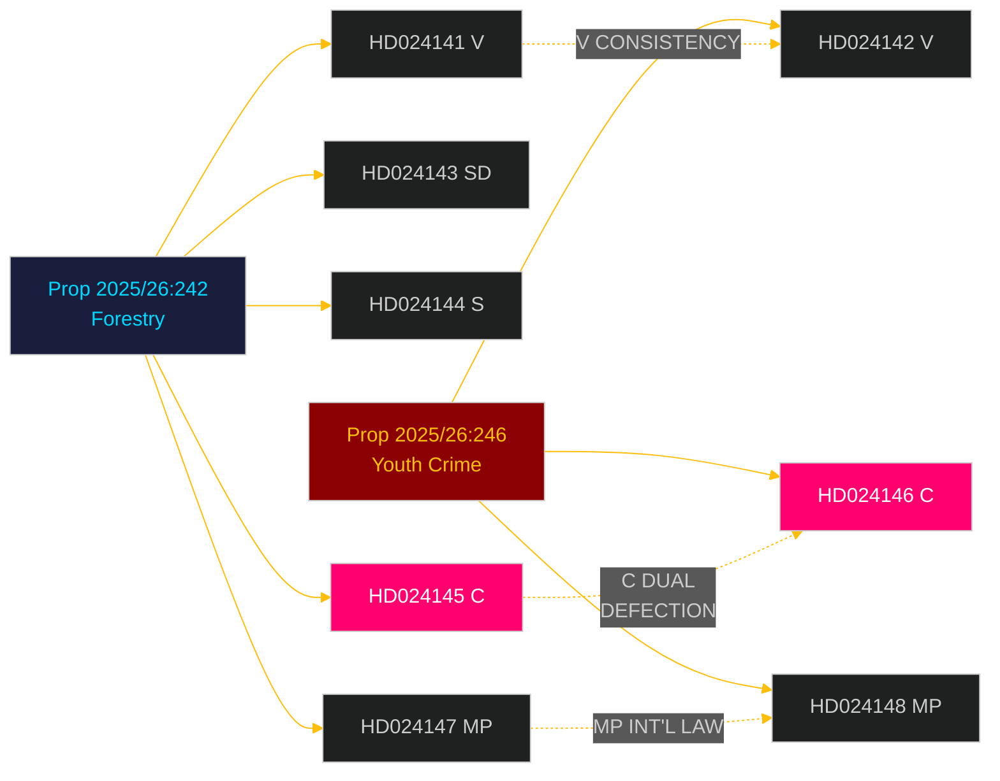

# Cross-Reference Map: Opposition Motions 2026-05-06

**Author**: James Pether Sörling | **Date**: 2026-05-06

## Legislative Chain Map

### Cluster A: Forestry / Miljö- och jordbruksutskottet (MJU)

```
Proposition 2025/26:242
  ├── HD024141 [V] — Complete rejection, EU treaty compatibility
  ├── HD024143 [SD] — Support + further deregulation demand
  ├── HD024144 [S] — Conditional support pending impact analysis
  ├── HD024145 [C] — Support + production package demand
  └── HD024147 [MP] — Rejection, climate primacy, Sami rights, EU obligations

Legal chain:
  EU NRL 2024/1991 → Habitats Directive Art. 6 → Swedish MB (Miljöbalken)
  → prop. 2025/26:242 → MJU betänkande → Riksdag vote
  → Post-passage: Naturvårdsverket compliance opinion → EC assessment 2027
```

### Cluster B: Youth Crime / Justitieutskottet (JuU)

```
Proposition 2025/26:246
  ├── HD024142 [V] — CRC/ECHR rejection, Art. 40(3)(a)
  ├── HD024146 [C] — CRC-based rejection (age-cut provision only)
  └── HD024148 [MP] — International standards rejection

Legal chain:
  CRC Art. 40(3)(a) [lag 2018:1197] → ECHR Art. 5 → BrB (Brottsbalken)
  → prop. 2025/26:246 → Lagrådet yttrande (pending) → JuU betänkande
  → Riksdag vote → Post-passage: Barnombudsmannen statement → UN CRC complaint
```

## Cross-Cluster Connections

| Connection Type | Cluster A ↔ Cluster B | Relevance |
|----------------|----------------------|-----------|
| Party alignment | C defects on both | C dual positioning is the key strategic signal |
| V alignment | V rejects both completely | V consistent opposition strategy |
| MP alignment | MP rejects both on international law grounds | Coordinated international-law framing |
| S position | Procedural caution on A, silence on B | S wants optionality on both |
| International law | EU treaties (A) ↔ UN CRC (B) | Both face external binding law challenge |

## Prior Document Links

- **Prior day synthesis**: `analysis/daily/2026-05-05/motions/synthesis-summary.md` — same 8 dok_ids
- **PIR status**: `analysis/daily/2026-05-05/motions/pir-status.json` — 4 open PIRs carried forward
- **Data download manifest**: `data-download-manifest.md` — full document catalog

## Related Riksdag Documents (by organ)

| Organ | Expected output | Timeline |
|-------|----------------|---------|
| MJU | Betänkande on prop. 2025/26:242 | 2026-06 (est.) |
| JuU | Betänkande on prop. 2025/26:246 | 2026-06 (est.) |
| Lagrådet | Yttrande on prop. 2025/26:246 | 2026-06 (est.) |
| Riksdag plenum | Final vote | 2026-06-15 (est.) |

