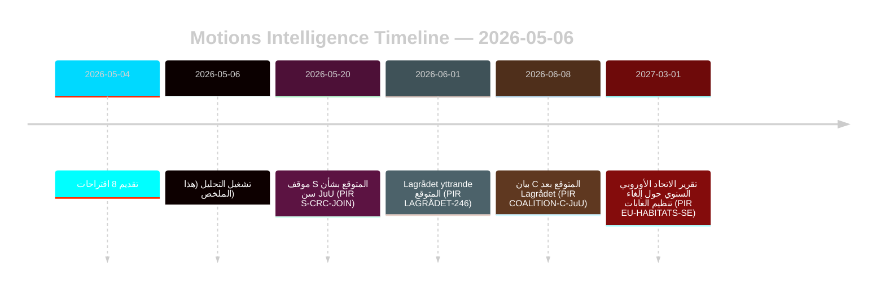

# اقتراحات المعارضة تتحدى إصلاحات الغابات وقضاء الأحداث

**المؤلف**: James Pether Sörling | **التاريخ**: 2026-05-06 | **الثقة**: عالية [B2]
**التصنيف**: عام | **اللائحة العامة لحماية البيانات**: المادة 9(2)(هـ،ز) — مواقف سياسية معلنة علنياً

## الملخص التنفيذي

قدّمت ثمانية اقتراحات للمعارضة في 2026-05-04 تحديات قانونية-استراتيجية منسّقة ضد اقتراحين حكوميين: إلغاء تنظيم قطاع الغابات (prop. 2025/26:242, HD024141–145/147) وإصلاح قضاء الأحداث (prop. 2025/26:246, HD024142/146/148). سيُقرّ الأغلبية الحكومية (175 مقعداً) كلا الإجراءين، غير أن الانسحاب المزدوج لـ Centerpartiet — معارضة الدعم الإنتاجي غير الكافي لقطاع الغابات مع التصدي في الوقت ذاته لخفض سن المسؤولية الجنائية استناداً إلى اتفاقية الأمم المتحدة لحقوق الطفل — يمثّل الإشارة الاستخباراتية المحورية لإعادة التوازن الانتخابي عام 2026.

## القرارات التي يدعم هذا الملخص اتخاذها

1. **رصد التحالف**: متابعة ما إذا كان حزب S (94 مقعداً) يُصادق صراحةً على الاعتراض المستند إلى اتفاقية حقوق الطفل ضد prop. 2025/26:246 — وفي هذه الحالة، ستتقلّص الأغلبية الحكومية إلى 175–163 في إجراء مُعرَّض دستورياً.
2. **رصد الامتثال الأوروبي**: تقييم ما إذا كانت Naturvårdsverket ستُقدّم مخاوف امتثال بشأن prop. 2025/26:242 فيما يتعلق بالمادة 6 من توجيه الموائل الأوروبي ولائحة NRL 2024/1991.
3. **مراقبة Lagrådet**: يُعدّ Lagrådet yttrande بشأن prop. 2025/26:246 بوابة القرار الحاسمة — فالنتيجة السلبية ترفع احتمالية تراجع الحكومة من 15٪ إلى 30–40٪ بشأن مادة تحديد السن.
4. **إعادة تموضع C**: تحليل ما إذا كان الانسحاب المزدوج لـ C في مايو 2026 تكتيكاً انتخابياً مسبقاً أم تحولاً سياسياً هيكلياً يؤثر على حسابات التحالف بعد 2026.

## النقاط الجوهرية في 60 ثانية

- **8 اقتراحات، مقترحان حكوميان**: يواجه قطاع الغابات (MJU، 5 أحزاب) وجرائم الأحداث (JuU، 3 أحزاب) معارضةً منسّقة بمطالب متعارضة.
- **محور C**: ينسحب Centerpartiet من المسألتين بزوايا مختلفة — يطالب بمزيد من دعم إنتاج الغابات (HD024145) ويُعارض خفض سن المسؤولية الجنائية (HD024146، أساس اتفاقية حقوق الطفل). الأثر الصافي: C يُعظّم مرونته قبيل الانتخابات.
- **التعرّض القانوني**: يواجه كلا المقترحين ثغرات في القانون الدولي تعمل باستقلالية عن الأغلبية البرلمانية — انتهاك الاتحاد الأوروبي (الغابات) وتحدّي اتفاقية حقوق الطفل/الاتفاقية الأوروبية لحقوق الإنسان (قضاء الأحداث).
- **موقف S لا يزال معلّقاً**: لم يلتزم الاشتراكيون الديمقراطيون بخفض سن المسؤولية الجنائية. مقاعدهم الـ94 ستحسم ما إذا كان التصويت متقارباً (175–163) أم بأغلبية مريحة.
- **Lagrådet المسار الحرج**: من المتوقع أن يكون Lagrådet yttrande المنتظر بشأن prop. 2025/26:246 أقرب حدث ضاغط محتمل (PIR LAGRÅDET-246).
- **لا خطر على الأغلبية في أيٍّ من المقترحين**: تمرّر الحكومة كلا الإجراءين ما لم يحدث انسحاب دراماتيكي من التحالف — انتخابات 2026، لا هذه الدورة البرلمانية، هي ما ستتجلّى فيه التداعيات السياسية.

## المحرّك الأمامي الرئيسي

**PIR LAGRÅDET-246** — Lagrådet yttrande بشأن prop. 2025/26:246 (خفض سن المسؤولية الجنائية إلى 13 عاماً). متوقع في غضون أسابيع. ستُطلق نتيجة سلبية فوراً نقاشاً حول توافق اتفاقية حقوق الطفل في اللجنة، وبياناً رسمياً من Barnombudsmannen، واقتراحاً حكومياً للتعديل على الأرجح.

## تقييم مستوى الثقة

بشكل عام عالية [B2] — جميع الاقتراحات الثمانية وثائق أولية من data.riksdagen.se؛ تم التحقق من مواقف الأحزاب، وdok_id، والإحالة إلى اللجنة. السياق الاقتصادي متدهور بحسب صندوق النقد الدولي؛ فشلت استعلامات SDMX. تم الاستشهاد ببيانات WEO/FM المالية حيثما انطبق مع ختم التحقق من الصلاحية.

<!-- source-sha: 83ab95c995e928d2f484c02aef7ab0bee0f03535 -->
