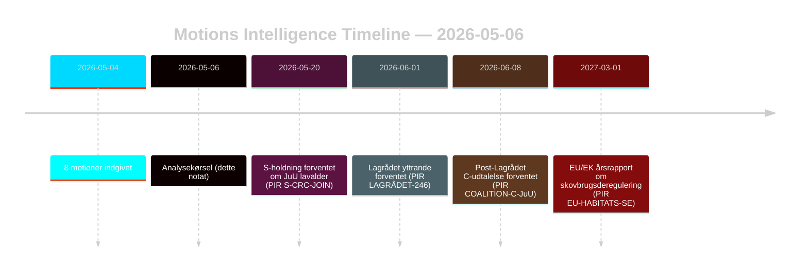

# Oppositionsmotioner udfordrer skovbrugs- og ungdomsretlige reformer

**Forfatter**: James Pether Sörling | **Dato**: 2026-05-06 | **Fortrolighed**: HØJ [B2]
**Klassificering**: OFFENTLIG | **GDPR**: Art. 9(2)(e,g) — offentliggjorte politiske holdninger

## BLUF

Otte oppositionsmotioner indgivet 2026-05-04 retter koordinerede juridisk-strategiske udfordringer mod to regeringspropositioner: skovbrugsdereguleringen (prop. 2025/26:242, HD024141–145/147) og ungdomsstrafferetlige reform (prop. 2025/26:246, HD024142/146/148). Regeringsflertallet (175 mandater) vil vedtage begge foranstaltninger, men Centerpartiets dobbelte frafald — opposition mod utilstrækkeligt produktionsstøtte til skovbrug og samtidig blokering af sænkning af den kriminelle lavalder på grundlag af FN's Børnekonvention — er det afgørende efterretningssignal for valgomstillingen i 2026.

## Beslutninger dette notat understøtter

1. **Koalitionsovervågning**: Følg om S (94 mandater) eksplicit støtter Børnekonventions-indsigelsen mod prop. 2025/26:246 — i så fald indsnævres regeringsflertallet til 175–163 på en konstitutionelt eksponeret foranstaltning.
2. **EU-efterlevelsesovervågning**: Vurder om Naturvårdsverket indgiver en efterlevelseskontrol vedrørende prop. 2025/26:242 om EU-habitatdirektivets art. 6 og NRL-forordning 2024/1991.
3. **Lagrådet-bevågenhed**: Lagrådets yttrande om prop. 2025/26:246 er den kritiske beslutningsport — et negativt resultat øger sandsynligheden for regeringens tilbagetog fra 15 % til 30–40 % vedrørende aldersgrænsebestemmelsen.
4. **C-repositionering**: Analyser om C's dobbelte frafald i maj 2026 er et taktisk prævalg-træk eller et strukturelt politikskifte, der påvirker koalitionsmatematikken efter 2026.

## 60-sekunders punkter

- **8 motioner, 2 propositioner**: Skovbrug (MJU, 5 partier) og ungdomskriminalitet (JuU, 3 partier) møder koordineret opposition med uforenelige krav.
- **C-pivot**: Centerpartiet falder fra på begge spørgsmål fra forskellige vinkler — kræver mere produktionsstøtte til skovbrug (HD024145) OG modsætter sig sænkning af den kriminelle lavalder (HD024146, Børnekonventions-grundlag). Nettoeffekt: C maksimerer fleksibilitet inden valget.
- **Juridisk eksponering**: Begge propositioner møder internationale retlige sårbarheder, der fungerer uafhængigt af parlamentarisk flertal — EU-overtrædelse (skovbrug) og Børnekonvention/EMRK-udfordring (ungdomsstrafferet).
- **S-holdning udestående**: Socialdemokraterne har ikke taget stilling til sænkning af den kriminelle lavalder. Deres 94 mandater er afgørende for om dette bliver en tæt afstemning (175–163) eller et komfortabelt flertal.
- **Lagrådet kritisk vej**: Ventede Lagrådet-yttrande om prop. 2025/26:246 er den højest-sandsynlige nærliggende forcerende hændelse (PIR LAGRÅDET-246).
- **Ingen flertalsrisiko på nogen af propositionerne**: Regeringen vedtager begge foranstaltninger medmindre et dramatisk koalitionsfrafald sker — det er valget i 2026, ikke denne Riksdag-periode, hvor de politiske konsekvenser lander.

## Ledende fremadrettet trigger

**PIR LAGRÅDET-246** — Lagrådets yttrande om prop. 2025/26:246 (sænkning af den kriminelle lavalder til 13 år). Forventes inden for uger. Et negativt resultat udløser øjeblikkelig debat om Børnekonventionsforenelighed i udvalget, Barnombudsmannens formelle udtalelse og sandsynlig regeringsændring.

## Konfidensvurdering

Samlet HØJ [B2] — alle otte motioner er primærdokumenter fra data.riksdagen.se; partipositioner, dok_id og udvalgshenvisning bekræftet. Økonomisk kontekst IMF-degraderet; SDMX-prober mislykkedes. WEO/FM-finansdata citeret, hvor det er relevant, med vintage-stempel.

<!-- source-sha: 83ab95c995e928d2f484c02aef7ab0bee0f03535 -->
