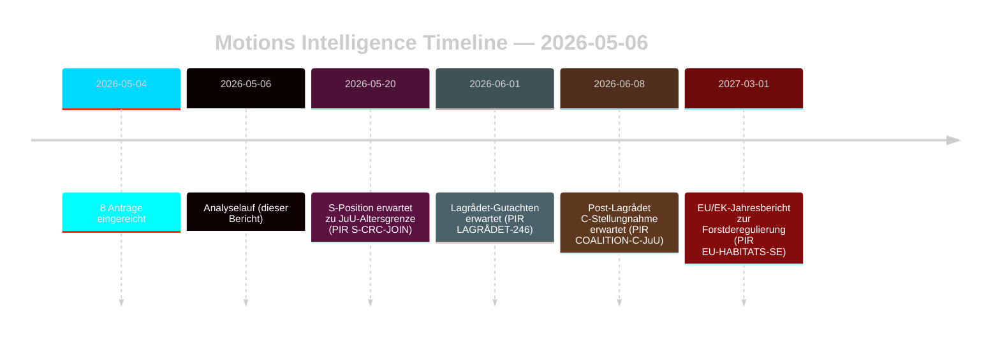

# Oppositionsanträge fordern Forst- und Jugendstrafrechtsreformen heraus

**Autor**: James Pether Sörling | **Datum**: 2026-05-06 | **Vertraulichkeit**: HOCH [B2]
**Klassifizierung**: ÖFFENTLICH | **DSGVO**: Art. 9(2)(e,g) — öffentlich gemachte politische Positionen

## BLUF

Acht am 2026-05-04 eingereichte Oppositionsanträge richten koordinierte rechtlich-strategische Herausforderungen gegen zwei Regierungspropositioner: die Forstderegulierung (prop. 2025/26:242, HD024141–145/147) und die Jugendstrafrechtsreform (prop. 2025/26:246, HD024142/146/148). Die Regierungsmehrheit (175 Mandate) wird beide Maßnahmen verabschieden, doch Centerpartiets doppelter Abfall — Opposition gegen unzureichende Produktionsunterstützung für die Forstwirtschaft bei gleichzeitiger Blockierung der Absenkung des Strafmündigkeitsalters auf Grundlage der UN-Kinderrechtskonvention — ist das entscheidende Geheimdienstsignal für die Wahlneuausrichtung 2026.

## Von diesem Lagebericht unterstützte Entscheidungen

1. **Koalitionsüberwachung**: Verfolgen Sie, ob S (94 Mandate) ausdrücklich den Einwand der Kinderrechtskonvention gegen prop. 2025/26:246 unterstützt — in diesem Fall schrumpft die Regierungsmehrheit auf 175–163 bei einer verfassungsrechtlich exponierten Maßnahme.
2. **EU-Compliance-Überwachung**: Beurteilen Sie, ob Naturvårdsverket eine Compliance-Überprüfung zu prop. 2025/26:242 hinsichtlich Art. 6 der EU-Habitatrichtlinie und der NRL-Verordnung 2024/1991 einreicht.
3. **Lagrådet-Beobachtung**: Das Lagrådet-Gutachten zu prop. 2025/26:246 ist das kritische Entscheidungstor — ein negatives Ergebnis erhöht die Wahrscheinlichkeit eines Regierungsrückzugs von 15 % auf 30–40 % bezüglich der Altersgrenzbestimmung.
4. **C-Neupositionierung**: Analysieren Sie, ob Cs doppelter Abfall im Mai 2026 ein taktischer Vorwahlzug oder eine strukturelle Politikverschiebung ist, die die Koalitionsmathematik nach 2026 beeinflusst.

## 60-Sekunden-Punkte

- **8 Anträge, 2 Propositioner**: Forstwirtschaft (MJU, 5 Parteien) und Jugendkriminalität (JuU, 3 Parteien) sehen sich koordinierter Opposition mit unvereinbaren Forderungen gegenüber.
- **C-Pivot**: Centerpartiet fällt bei beiden Fragen aus verschiedenen Richtungen ab — fordert mehr Produktionsunterstützung für die Forstwirtschaft (HD024145) UND widersetzt sich der Absenkung des Strafmündigkeitsalters (HD024146, Kinderrechtskonventions-Grundlage). Nettoeffekt: C maximiert die Flexibilität vor der Wahl.
- **Rechtliche Exponierung**: Beide Propositioner weisen internationale Rechtsschwachstellen auf, die unabhängig von der parlamentarischen Mehrheit wirken — EU-Verstoß (Forstwirtschaft) und Kinderrechtskonvention/EMRK-Herausforderung (Jugendstrafrecht).
- **S-Position ausstehend**: Die Sozialdemokraten haben sich zur Absenkung des Strafmündigkeitsalters nicht geäußert. Ihre 94 Mandate entscheiden darüber, ob dies eine knappe Abstimmung (175–163) oder eine bequeme Mehrheit wird.
- **Lagrådet kritischer Pfad**: Das erwartete Lagrådet-Gutachten zu prop. 2025/26:246 ist das wahrscheinlichste bevorstehende Druckereignis (PIR LAGRÅDET-246).
- **Kein Mehrheitsrisiko bei keiner der Propositioner**: Die Regierung verabschiedet beide Maßnahmen, sofern kein dramatischer Koalitionsabfall eintritt — die Wahl 2026, nicht diese Riksdag-Legislaturperiode, ist der Zeitpunkt, an dem die Politikfolgen landen.

## Führender Vorwärtsauslöser

**PIR LAGRÅDET-246** — Lagrådet-Gutachten zu prop. 2025/26:246 (Absenkung des Strafmündigkeitsalters auf 13 Jahre). Wird innerhalb von Wochen erwartet. Ein negatives Ergebnis löst sofortige Debatte über die Vereinbarkeit mit der Kinderrechtskonvention im Ausschuss, eine formelle Stellungnahme des Barnombudsmannen und einen wahrscheinlichen Regierungsänderungsantrag aus.

## Vertrauensbewertung

Insgesamt HOCH [B2] — alle acht Anträge sind Primärdokumente von data.riksdagen.se; Parteipositionen, dok_id und Ausschusszuweisung bestätigt. Wirtschaftlicher Kontext IMF-degradiert; SDMX-Abfragen fehlgeschlagen. WEO/FM-Finanzdaten wo zutreffend mit Vintage-Stempel zitiert.

<!-- source-sha: 83ab95c995e928d2f484c02aef7ab0bee0f03535 -->
