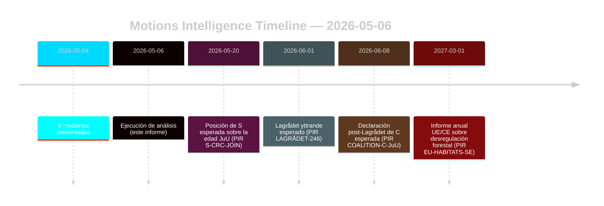

# Las mociones de la oposición desafían las reformas forestales y de justicia juvenil

**Autor**: James Pether Sörling | **Fecha**: 2026-05-06 | **Confidencialidad**: ALTA [B2]
**Clasificación**: PÚBLICO | **RGPD**: Art. 9(2)(e,g) — posiciones políticas hechas públicas

## BLUF

Ocho mociones de la oposición presentadas el 2026-05-04 plantean desafíos jurídico-estratégicos coordinados contra dos proposiciones gubernamentales: la desregulación forestal (prop. 2025/26:242, HD024141–145/147) y la reforma de justicia penal juvenil (prop. 2025/26:246, HD024142/146/148). La mayoría gubernamental (175 escaños) aprobará ambas medidas, pero la doble deserción del Centerpartiet — oposición al insuficiente apoyo a la producción forestal y bloqueo simultáneo de la reducción de la edad de responsabilidad penal sobre la base de la Convención de la ONU sobre los Derechos del Niño — es la señal de inteligencia decisiva para el realineamiento electoral de 2026.

## Decisiones que apoya este informe

1. **Seguimiento de la coalición**: Rastrear si S (94 escaños) respalda explícitamente la objeción basada en la Convención sobre los Derechos del Niño a la prop. 2025/26:246 — en ese caso, la mayoría gubernamental se reduce a 175–163 en una medida constitucionalmente expuesta.
2. **Seguimiento del cumplimiento de la UE**: Evaluar si Naturvårdsverket presenta una revisión de cumplimiento sobre la prop. 2025/26:242 respecto al art. 6 de la Directiva Hábitat de la UE y el Reglamento NRL 2024/1991.
3. **Vigilancia del Lagrådet**: El Lagrådet yttrande sobre la prop. 2025/26:246 es el umbral de decisión crítico — un dictamen negativo eleva la probabilidad de retirada gubernamental del 15 % al 30–40 % en la disposición sobre el límite de edad.
4. **Reposicionamiento de C**: Analizar si la doble deserción de C en mayo de 2026 es un movimiento táctico preelectoral o un cambio estructural de política que afecta a la matemática de coaliciones después de 2026.

## Puntos de 60 segundos

- **8 mociones, 2 proposiciones**: Silvicultura (MJU, 5 partidos) y delincuencia juvenil (JuU, 3 partidos) se enfrentan a una oposición coordinada con demandas incompatibles.
- **Pivote de C**: El Centerpartiet deserta en ambas cuestiones desde ángulos diferentes — exige más apoyo a la producción forestal (HD024145) Y se opone a la reducción de la edad de responsabilidad penal (HD024146, base Convención sobre Derechos del Niño). Efecto neto: C maximiza su flexibilidad antes de las elecciones.
- **Exposición jurídica**: Ambas proposiciones enfrentan vulnerabilidades de derecho internacional que operan independientemente de la mayoría parlamentaria — infracción de la UE (silvicultura) y desafío Convención sobre Derechos del Niño/CEDH (justicia juvenil).
- **Posición de S pendiente**: Los socialdemócratas no se han comprometido con la reducción de la edad de responsabilidad penal. Sus 94 escaños determinarán si esto se convierte en una votación ajustada (175–163) o una mayoría cómoda.
- **Lagrådet camino crítico**: El Lagrådet yttrande esperado sobre la prop. 2025/26:246 es el evento detonante más probable a corto plazo (PIR LAGRÅDET-246).
- **Sin riesgo para la mayoría en ninguna de las proposiciones**: El gobierno aprueba ambas medidas a menos que se produzca una deserción dramática de la coalición — las elecciones de 2026, no esta legislatura del Riksdag, es donde aterrizarán las consecuencias políticas.

## Principal detonante prospectivo

**PIR LAGRÅDET-246** — Lagrådet yttrande sobre la prop. 2025/26:246 (reducción de la edad de responsabilidad penal a 13 años). Esperado en semanas. Un dictamen negativo desencadena un debate inmediato sobre la compatibilidad con la Convención sobre los Derechos del Niño en comisión, una declaración formal del Barnombudsmannen y una probable propuesta de enmienda gubernamental.

## Evaluación de confianza

En general ALTA [B2] — las ocho mociones son documentos primarios de data.riksdagen.se; posiciones de los partidos, dok_id y remisión a comisión confirmados. Contexto económico degradado por el FMI; las consultas SDMX fallaron. Datos financieros WEO/FM citados cuando corresponde con sello de vigencia.

<!-- source-sha: 83ab95c995e928d2f484c02aef7ab0bee0f03535 -->
