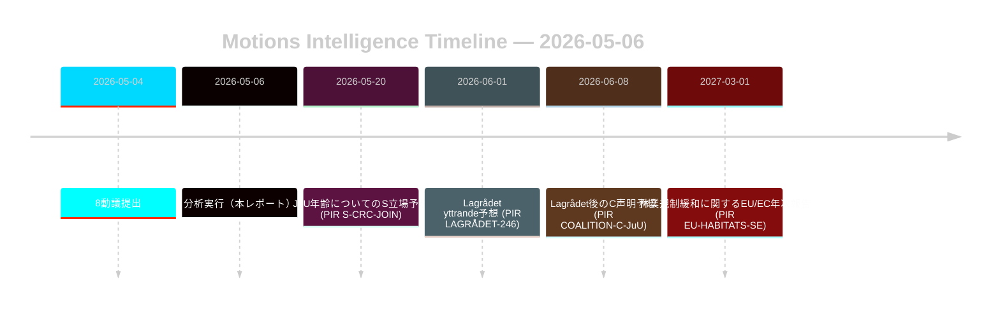

# 野党動議が森林業・少年刑事司法改革に挑む

**著者**: James Pether Sörling | **日付**: 2026-05-06 | **信頼度**: 高 [B2]
**分類**: 公開 | **GDPR**: 第9条(2)(e,g) — 公開された政治的立場

## 要旨

2026-05-04に提出された8件の野党動議が、2つの政府提案に対して協調した法的・戦略的挑戦を行っている：林業規制緩和（prop. 2025/26:242, HD024141–145/147）と少年刑事司法改革（prop. 2025/26:246, HD024142/146/148）。政府多数派（175議席）は両措置を可決するが、Centerpartietの二重離反—不十分な林業生産支援への反対と、国連子どもの権利条約を根拠とした刑事責任年齢引き下げへの同時阻止—は、2026年選挙再編に向けた決定的な情報信号である。

## このレポートが支援する意思決定

1. **連立監視**: S（94議席）がprop. 2025/26:246に対する子どもの権利条約異議を明示的に支持するか追跡—その場合、政府多数派は憲法上露出した措置で175–163に縮小する。
2. **EU適合性監視**: Naturvårdsverketがprop. 2025/26:242に関してEU生息地指令第6条およびNRL規則2024/1991義務についての適合性懸念を提出するか評価する。
3. **Lagrådet監視**: prop. 2025/26:246に対するLagrådet yttrande（意見書）が重要な決定関門—否定的な所見は政府後退確率を年齢制限条項について15%から30–40%に引き上げる。
4. **C再配置**: Cの2026年5月の二重離反が選挙前の戦術的動きか、2026年後の連立計算に影響する構造的政策転換かを分析する。

## 60秒要点

- **8動議、2提案**: 林業（MJU、5党）と少年犯罪（JuU、3党）が両立しない要求を持つ協調した野党に直面している。
- **Cの転換**: Centerpartietは両問題で異なる角度から離反—林業生産支援増加を要求（HD024145）し、かつ刑事責任年齢引き下げに反対（HD024146、子どもの権利条約根拠）。正味効果：Cは選挙前の柔軟性を最大化する。
- **法的露出**: 両提案は議会多数派から独立して機能する国際法上の脆弱性に直面—EU違反（林業）と子どもの権利条約/ECHR挑戦（少年司法）。
- **Sの立場未定**: 社会民主党は刑事責任年齢引き下げについてコミットしていない。その94議席が僅差の採決（175–163）になるか安定多数になるかを決定する。
- **Lagrådet重要経路**: prop. 2025/26:246に対する待機中のLagrådet yttrande（意見書）が最も確率の高い近接する強制イベント（PIR LAGRÅDET-246）。
- **両提案とも多数派リスクなし**: 劇的な連立離反が起きない限り政府は両措置を可決—政策的帰結が生じるのはこの議会任期ではなく2026年選挙である。

## 主要フォワードトリガー

**PIR LAGRÅDET-246** — prop. 2025/26:246（刑事責任年齢の13歳への引き下げ）に対するLagrådet yttrande（意見書）。数週間以内に期待される。否定的な所見は委員会での子どもの権利条約適合性議論、Barnombudsmannenの正式声明、および政府修正案の可能性を即座に引き起こす。

## 信頼度評価

総合高 [B2] — 8件の動議はすべてdata.riksdagen.seの一次文書；党の立場、dok_id、委員会付託を確認済み。経済的文脈はIMF劣化；SDMXプローブは失敗。WEO/FM財政データは該当箇所にビンテージスタンプ付きで引用。

<!-- source-sha: 83ab95c995e928d2f484c02aef7ab0bee0f03535 -->
