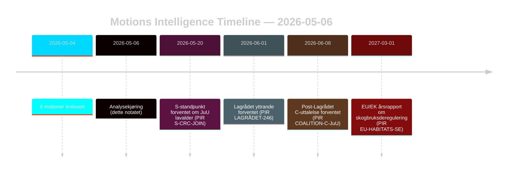

# Opposisjonsmotioner utfordrer skogbruks- og ungdomsstrafferettsreformer

**Forfatter**: James Pether Sörling | **Dato**: 2026-05-06 | **Konfidensialitet**: HØY [B2]
**Klassifisering**: OFFENTLIG | **GDPR**: Art. 9(2)(e,g) — offentliggjorte politiske standpunkter

## BLUF

Åtte opposisjonsmotioner innlevert 2026-05-04 retter koordinerte juridisk-strategiske utfordringer mot to regjeringsproposisjoner: skogbruksdereguleringen (prop. 2025/26:242, HD024141–145/147) og ungdomsstrafferettsreformen (prop. 2025/26:246, HD024142/146/148). Regjeringsflertallet (175 mandater) vil vedta begge tiltakene, men Centerpartiets doble frafall — opposisjon mot utilstrekkelig produksjonsstøtte til skogbruk og samtidig blokkering av senking av den kriminelle lavalder på grunnlag av FNs Barnekonvensjon — er det avgjørende etterretningssignalet for valgomstillingen i 2026.

## Beslutninger dette notatet støtter

1. **Koalisjonsovervåking**: Følg om S (94 mandater) eksplisitt støtter Barnekonvensjons-innsigelsen mot prop. 2025/26:246 — i så fall innsnevres regjeringsflertallet til 175–163 på et konstitusjonelt eksponert tiltak.
2. **EU-etterlevelsesovervåking**: Vurder om Naturvårdsverket sender inn en etterlevelseskontroll vedrørende prop. 2025/26:242 om EU-habitatdirektivets art. 6 og NRL-forordning 2024/1991.
3. **Lagrådet-bevåkenhet**: Lagrådets yttrande om prop. 2025/26:246 er den kritiske beslutningsporten — et negativt resultat øker sannsynligheten for regjeringens tilbaketog fra 15 % til 30–40 % vedrørende aldersgrensebestemmelsen.
4. **C-reposisjonering**: Analyser om Cs doble frafall i mai 2026 er et taktisk prevalg-trekk eller et strukturelt politikkskifte som påvirker koalisjonsmatematikken etter 2026.

## 60-sekunders punkter

- **8 motioner, 2 proposisjoner**: Skogbruk (MJU, 5 partier) og ungdomskriminalitet (JuU, 3 partier) møter koordinert opposisjon med uforenlige krav.
- **C-pivot**: Centerpartiet faller fra på begge spørsmål fra ulike vinkler — krever mer produksjonsstøtte til skogbruk (HD024145) OG motsetter seg senking av den kriminelle lavalder (HD024146, Barnekonvensjons-grunnlag). Nettoeffekt: C maksimerer fleksibilitet før valget.
- **Rettslig eksponering**: Begge proposisjonene møter internasjonale rettslige sårbarheter som opererer uavhengig av parlamentarisk flertall — EU-brudd (skogbruk) og Barnekonvensjon/EMK-utfordring (ungdomsstrafferet).
- **S-standpunkt utestående**: Sosialdemokratene har ikke tatt stilling til senking av den kriminelle lavalder. Deres 94 mandater er avgjørende for om dette blir en knapp avstemning (175–163) eller et komfortabelt flertall.
- **Lagrådet kritisk vei**: Ventede Lagrådet-yttrande om prop. 2025/26:246 er den høyst sannsynlige nærliggende forcerende hendelsen (PIR LAGRÅDET-246).
- **Ingen flertallsrisiko på noen av proposisjonene**: Regjeringen vedtar begge tiltakene med mindre et dramatisk koalisjonsfrafall oppstår — det er valget i 2026, ikke denne Riksdag-perioden, der de politiske konsekvensene lander.

## Ledende fremtidsutløser

**PIR LAGRÅDET-246** — Lagrådets yttrande om prop. 2025/26:246 (senking av den kriminelle lavalder til 13 år). Forventes innen uker. Et negativt resultat utløser umiddelbar debatt om Barnekonvensjons-forenlighet i utvalget, Barnombudsmannens formelle uttalelse og sannsynlig regjeringsendring.

## Konfidensvurdering

Totalt HØY [B2] — alle åtte motioner er primærdokumenter fra data.riksdagen.se; partiposisjoner, dok_id og utvalgshenvisning bekreftet. Økonomisk kontekst IMF-degradert; SDMX-prober mislyktes. WEO/FM-finansdata sitert der det er relevant med vintage-stempel.

<!-- source-sha: 83ab95c995e928d2f484c02aef7ab0bee0f03535 -->
