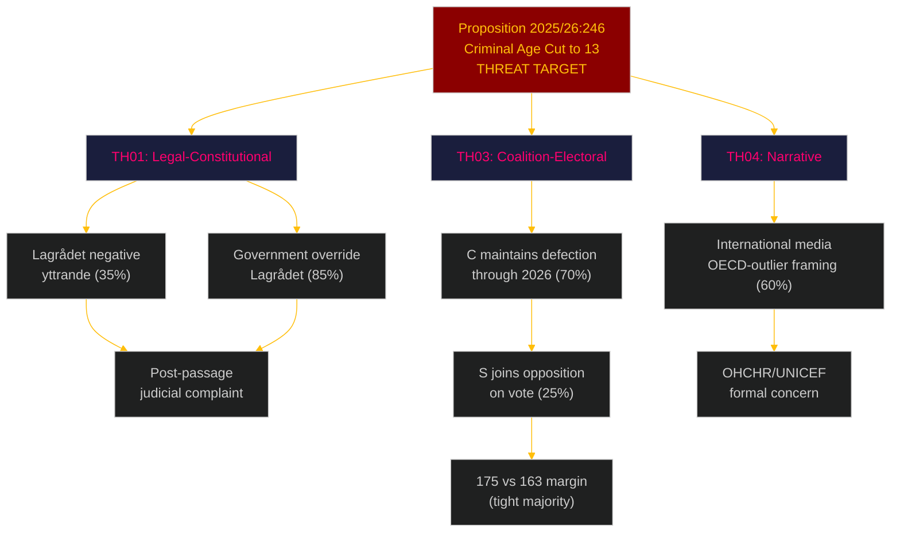

# Threat Analysis: Opposition Motions 2026-05-06

**Author**: James Pether Sörling | **Date**: 2026-05-06
**Framework**: Political Threat Taxonomy (PTT) v2.1 — legal, coalition, electoral, international dimensions

## Threat Taxonomy

### TH01 — Legal-Constitutional Threat (HIGH)
**Source**: CRC/ECHR incompatibility argument in HD024142 (V) and HD024146 (C)
**Attack surface**: Proposition 2025/26:246, criminal age cut to 13
**Mechanism**: Lagrådet yttrande → committee debate → potential government retreat on specific provision
**Probability**: 35% that Lagrådet recommends amendment; 15% that government accepts
**Consequence**: If government overrides Lagrådet (likely), post-passage judicial complaint remains open
**Attribution**: V and C legal teams working from CRC Art. 40(3)(a) [lag 2018:1197] text

### TH02 — EU Regulatory Threat (MEDIUM)
**Source**: Habitats Directive Art. 6, NRL 2024/1991 obligations raised in HD024141 (V) and HD024147 (MP)
**Attack surface**: Proposition 2025/26:242, forestry exemption from biotope protection
**Mechanism**: EC annual NRL compliance assessment 2027 → formal notice → infringement proceedings
**Probability**: 25% formal notice by 2027; 10% full infringement proceedings by 2028
**Consequence**: Financial penalties; mandatory legislative amendment
**Attribution**: MP's EU framing is strategically the most durable threat vector — external, scheduled

### TH03 — Coalition-Electoral Threat (HIGH)
**Source**: C dual defection (HD024145 + HD024146)
**Attack surface**: Government's claim of parliamentary majority legitimacy on sensitive issues
**Mechanism**: C signals independence from government bloc 12 months before election; rural voters and civil-liberties voters may reward; creates ambiguity about C's post-election coalition preference
**Probability**: 70% that C maintains dual defection stance through election; 35% C becomes "kingmaker" post-September 2026
**Consequence**: Coalition instability post-election; potential Tidö-2 without C anchor, or S-led alternative with C support
**Attribution**: C leadership strategic decision — coordinated dual filing suggests deliberate positioning

### TH04 — Narrative Threat (MEDIUM)
**Source**: International media framing of criminal age cut as outlier policy
**Attack surface**: Sweden's international reputation as child rights leader
**Mechanism**: "Sweden cuts criminal age to 13 — lowest in OECD" headline; amplified by UNICEF/Save the Children statements
**Probability**: 60% that significant international coverage occurs if law passes
**Consequence**: Diplomatic soft-power cost; OHCHR formal concern; domestic opinion shift especially in urban-educated demographic
**Attribution**: MP's HD024148 references international standards explicitly — designed to trigger this mechanism

## Attack Tree: Proposition 2025/26:246 Vulnerability

