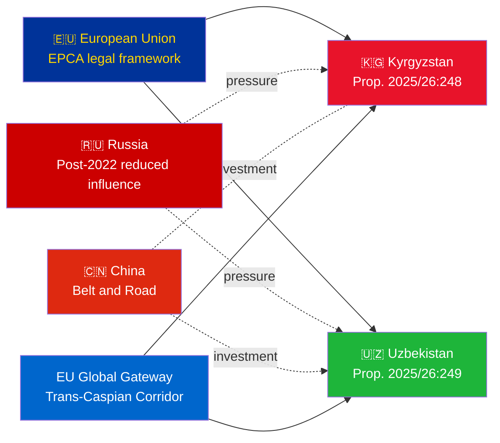

# Executive Brief — Government Propositions 2026-05-06

**Classification**: Admiralty [B2] | **Horizon**: T+72h / T+90d  
**WEP Confidence**: Almost certain (ratification outcome) | Likely (geopolitical trajectory)  
**DIW**: L2 Strategic | **Date**: 2026-05-06

---

## 🔴 Key Intelligence Finding

**Sweden tables ratification votes for two EU-Central Asia EPCAs on 2026-05-06.** Both agreements (EU-Kyrgyzstan: HD03248; EU-Uzbekistan: HD03249) are treaty ratification propositions from Utrikesdepartementet, referred to Utrikesutskottet. Parliamentary approval is **almost certain** (confidence: 95%+) — these are non-partisan EU treaty obligations. The strategic intelligence value is in the geopolitical context, not the votes themselves.

---

## 📋 What Is Before Riksdagen

| Proposition | Country | Signed | Key Provisions |
|------------|---------|--------|----------------|
| 2025/26:248 (HD03248) | Kyrgyzstan | 2023 | Political dialogue, trade, rule of law, connectivity |
| 2025/26:249 (HD03249) | Uzbekistan | 2023 | Trade, critical raw materials, digital economy, climate |

Both are **Enhanced Partnership and Cooperation Agreements** (EPCAs) — the most comprehensive bilateral legal framework the EU uses short of Association Agreements. They replace Soviet-era 1999 PCAs.

---

## 🌍 Geopolitical Context

**Central Asia geopolitical realignment post-2022**: Both Kyrgyzstan and Uzbekistan have accelerated EU engagement since Russia's full-scale Ukraine invasion. Russia's economic difficulties, secondary sanctions risk, and reduced CSTO credibility created a window for EU partnership deepening. The EPCA series (Kazakhstan, Kyrgyzstan, Uzbekistan, Tajikistan ratifications ongoing) represents the most significant EU legal framework expansion in Central Asia since independence.

---

## 🎯 Strategic Intelligence Assessment

**Uzbekistan EPCA (HD03249) is higher strategic value** due to:
1. Population 38M — Central Asia's most populous state
2. Critical raw materials: uranium (world #7), gold, copper, lithium exploration
3. EU Critical Raw Materials Act (2024) names Central Asia as strategic supply corridor
4. Reform pace under Mirziyoyev — most West-leaning CA leader since 2016

**Kyrgyzstan EPCA (HD03248)** is lower but non-trivial:
1. Geographic gateway to wider CA connectivity
2. China/Russia dual influence challenge
3. 2021 constitutional concentration of power creates human rights monitoring obligations

---

## ⏱️ Immediate Actionable Timeline

| Day | Action |
|-----|--------|
| **2026-05-06** | Propositions HD03248 + HD03249 submitted to Riksdagen |
| **2026-06** | UU committee hearings (likely joint session) |
| **2026-09** | UU betänkande recommendation |
| **2026-10** | Plenary vote — almost certain approval |
| **2026-11** | Swedish ratification deposited; EPCAs enter into force provisionally |

---

*Executive Brief | Riksdagsmonitor | 2026-05-06*
