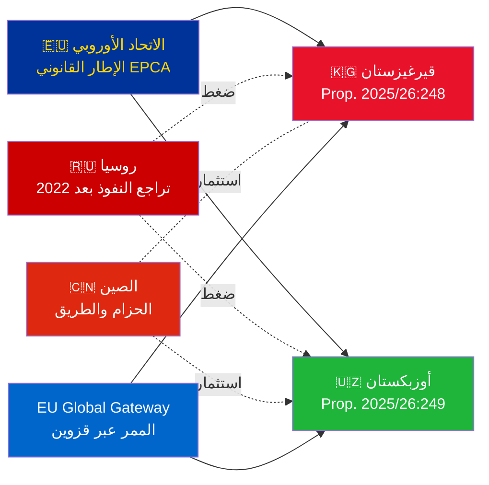

# الملخص التنفيذي — مقترحات حكومية 2026-05-06

**التصنيف**: Admiralty [B2] | **الأفق الزمني**: T+72h / T+90d
**ثقة WEP**: شبه مؤكدة (نتيجة التصديق) | محتملة (المسار الجيوسياسي)
**DIW**: L2 استراتيجي | **التاريخ**: 2026-05-06

---

## 🔴 النتيجة الاستخباراتية الرئيسية

**تقدّم السويد تصويتات التصديق على اتفاقيتَي EPCA بين الاتحاد الأوروبي وآسيا الوسطى في 2026-05-06.** كلا الاتفاقيتين (الاتحاد الأوروبي–قيرغيزستان: HD03248؛ الاتحاد الأوروبي–أوزبكستان: HD03249) هما مقترحا تصديق على معاهدات صادران عن Utrikesdepartementet، وأُحيلا إلى Utrikesutskottet. الموافقة البرلمانية **شبه مؤكدة** (ثقة: 95%+) — فهي التزامات معاهدة أوروبية غير حزبية. القيمة الاستخباراتية الاستراتيجية تكمن في السياق الجيوسياسي، لا في التصويتات ذاتها.

---

## 📋 ما يُناقَش في Riksdag

| الاقتراح | الدولة | تاريخ التوقيع | الأحكام الرئيسية |
|----------|--------|--------------|-----------------|
| 2025/26:248 (HD03248) | قيرغيزستان | 2023 | الحوار السياسي، التجارة، سيادة القانون، الترابط |
| 2025/26:249 (HD03249) | أوزبكستان | 2023 | التجارة، المواد الخام الحيوية، الاقتصاد الرقمي، المناخ |

كلتاهما **EPCA (اتفاقيات شراكة وتعاون معززة)** — أشمل إطار قانوني ثنائي تستخدمه الاتحاد الأوروبي بعيداً عن اتفاقيات الشراكة. تحلّان محل اتفاقيات الشراكة والتعاون من الحقبة السوفيتية عام 1999.

---

## 🌍 السياق الجيوسياسي

**إعادة التوجه الجيوسياسي لآسيا الوسطى بعد 2022**: سرّعت كلٌّ من قيرغيزستان وأوزبكستان تعاملهما مع الاتحاد الأوروبي منذ الغزو الروسي الشامل لأوكرانيا. الصعوبات الاقتصادية الروسية، وخطر العقوبات الثانوية، وتراجع مصداقية منظمة معاهدة الأمن الجماعي، فتحت نافذة لتعميق الشراكة مع الاتحاد الأوروبي. سلسلة EPCA (التصديقات الجارية لكازاخستان وقيرغيزستان وأوزبكستان وطاجيكستان) تمثّل أوسع توسّع في الإطار القانوني للاتحاد الأوروبي في آسيا الوسطى منذ الاستقلال.

---

## 🎯 التقييم الاستراتيجي الاستخباراتي

**EPCA أوزبكستان (HD03249) ذو قيمة استراتيجية أعلى** بسبب:
1. عدد السكان 38 مليون — الدولة الأكثر اكتظاظاً في آسيا الوسطى
2. المواد الخام الحيوية: اليورانيوم (السابع عالمياً)، الذهب، النحاس، استكشاف الليثيوم
3. قانون المواد الخام الحيوية للاتحاد الأوروبي (2024) يُحدّد آسيا الوسطى ممراً استراتيجياً للتوريد
4. وتيرة الإصلاح في عهد ميرزيوييف — أكثر قادة آسيا الوسطى انفتاحاً على الغرب منذ 2016

**EPCA قيرغيزستان (HD03248)** أقل حجماً لكن غير هامشي:
1. بوابة جغرافية نحو ترابط أوسع في آسيا الوسطى
2. تحدي النفوذ الصيني–الروسي المزدوج
3. تمركز السلطة الدستوري في 2021 يُفرز التزامات متابعة حقوق الإنسان

---

## ⏱️ الجدول الزمني للإجراءات الفورية

| اليوم | الإجراء |
|-------|---------|
| **2026-05-06** | تقديم Propositioner HD03248 + HD03249 إلى Riksdag |
| **2026-06** | جلسات استماع لجنة UU (على الأرجح جلسة مشتركة) |
| **2026-09** | UU betänkande (توصية) |
| **2026-10** | التصويت في الجلسة العامة — موافقة شبه مؤكدة |
| **2026-11** | إيداع التصديق السويدي؛ دخول EPCA حيّز التنفيذ مبدئياً |

---

*الملخص التنفيذي | Riksdagsmonitor | 2026-05-06*

<!-- source-sha: 83ab95c995e928d2f484c02aef7ab0bee0f03535 -->
