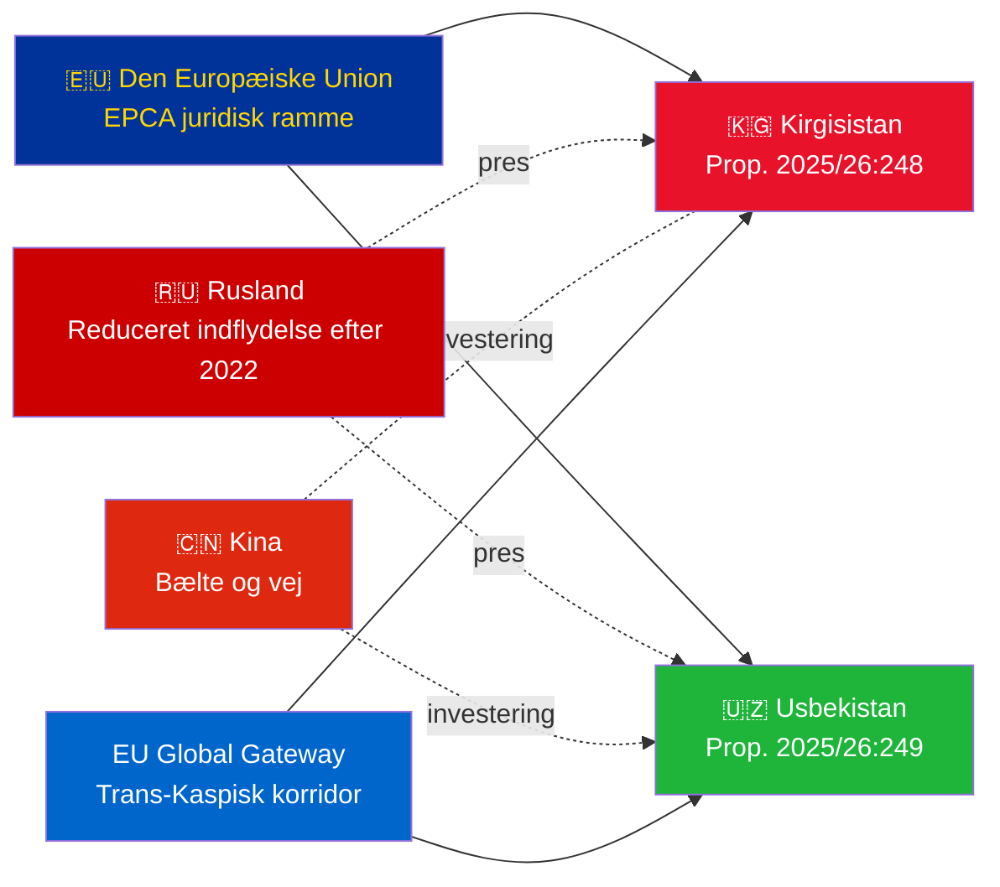

# Eksekutivt resumé — Regeringens propositioner 2026-05-06

**Klassificering**: Admiralty [B2] | **Horisont**: T+72h / T+90d
**WEP-fortrolighed**: Næsten sikker (ratificeringsresultat) | Sandsynlig (geopolitisk bane)
**DIW**: L2 Strategisk | **Dato**: 2026-05-06

---

## 🔴 Vigtigste efterretningsfund

**Sverige fremlægger ratificeringsafstemninger for to EU–Centralasien-EPCA'er den 2026-05-06.** Begge aftaler (EU–Kirgisistan: HD03248; EU–Usbekistan: HD03249) er traktatratificeringspropositioner fra Utrikesdepartementet, henvist til Utrikesutskottet. Parlamentarisk godkendelse er **næsten sikker** (fortrolighed: 95%+) — disse er ikke-partipolitiske EU-traktatforpligtelser. Den strategiske efterretningsværdi ligger i den geopolitiske kontekst, ikke i selve afstemningerne.

---

## 📋 Hvad der behandles i Riksdagen

| Proposition | Land | Underskrevet | Nøglebestemmelser |
|------------|------|------------|------------------|
| 2025/26:248 (HD03248) | Kirgisistan | 2023 | Politisk dialog, handel, retsstatsprincip, konnektivitet |
| 2025/26:249 (HD03249) | Usbekistan | 2023 | Handel, kritiske råmaterialer, digital økonomi, klima |

Begge er **EPCA'er (Enhanced Partnership and Cooperation Agreements)** — den mest omfattende bilaterale juridiske ramme EU anvender ud over associeringsaftaler. De erstatter Sovjettidens partnerskabs- og samarbejdsaftaler fra 1999.

---

## 🌍 Geopolitisk kontekst

**Centralasiatisk geopolitisk nyorientering efter 2022**: Både Kirgisistan og Usbekistan har accelereret EU-engagementet siden Ruslands fuldskala invasion af Ukraine. Ruslands økonomiske vanskeligheder, risiko for sekundære sanktioner og reduceret CSTO-troværdighed skabte et vindue for dybere EU-partnerskab. EPCA-serien (ratificeringer i gang for Kasakhstan, Kirgisistan, Usbekistan, Tadsjikistan) repræsenterer den mest betydelige udvidelse af EU's juridiske ramme i Centralasien siden uafhængighed.

---

## 🎯 Strategisk efterretningsvurdering

**Usbekistan-EPCA (HD03249) har højere strategisk værdi** på grund af:
1. Befolkning 38M — Centralasiens mest befolkede stat
2. Kritiske råmaterialer: uran (verden nr. 7), guld, kobber, litiumprospektering
3. EU's Critical Raw Materials Act (2024) nævner Centralasien som strategisk forsyningskorridor
4. Reformtempo under Mirziyoyev — den mest vestvendte CA-leder siden 2016

**Kirgisistan-EPCA (HD03248)** er lavere men ikke uvæsentlig:
1. Geografisk adgang til bredere CA-konnektivitet
2. Kinesisk/russisk dobbelt indflydelsesudfordring
3. 2021 konstitutionel magtkoncentration skaber forpligtelser til overvågning af menneskerettigheder

---

## ⏱️ Umiddelbar handlingstidslinje

| Dag | Handling |
|-----|---------|
| **2026-05-06** | Propositioner HD03248 + HD03249 fremsendt til Riksdagen |
| **2026-06** | UU-udvalgets høringer (sandsynligvis fælles session) |
| **2026-09** | UU betänkande (anbefaling) |
| **2026-10** | Plenumstafstemning — næsten sikker godkendelse |
| **2026-11** | Svensk ratificering deponeret; EPCA'er træder foreløbigt i kraft |

---

*Eksekutivt resumé | Riksdagsmonitor | 2026-05-06*

<!-- source-sha: 83ab95c995e928d2f484c02aef7ab0bee0f03535 -->
