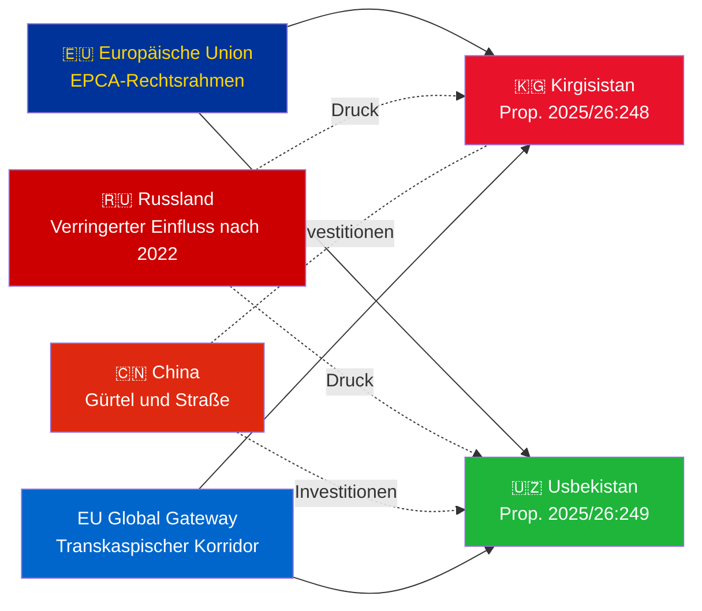

# Exekutivzusammenfassung — Regierungspropositioner 2026-05-06

**Klassifizierung**: Admiralty [B2] | **Horizont**: T+72h / T+90d
**WEP-Vertraulichkeit**: Nahezu sicher (Ratifizierungsergebnis) | Wahrscheinlich (geopolitische Trajektorie)
**DIW**: L2 Strategisch | **Datum**: 2026-05-06

---

## 🔴 Wichtigste Erkenntnisse

**Schweden legt am 2026-05-06 Ratifizierungsabstimmungen für zwei EU–Zentralasien-EPCAs vor.** Beide Abkommen (EU–Kirgisistan: HD03248; EU–Usbekistan: HD03249) sind Vertragsratifizierungspropositioner des Utrikesdepartementet, an den Utrikesutskottet verwiesen. Eine parlamentarische Genehmigung ist **nahezu sicher** (Vertraulichkeit: 95%+) — dies sind parteiübergreifende EU-Vertragsverbindlichkeiten. Der strategische Nachrichtendienstwert liegt im geopolitischen Kontext, nicht in den Abstimmungen selbst.

---

## 📋 Was im Riksdag behandelt wird

| Proposition | Land | Unterzeichnet | Wesentliche Bestimmungen |
|------------|------|-------------|------------------------|
| 2025/26:248 (HD03248) | Kirgisistan | 2023 | Politischer Dialog, Handel, Rechtsstaatlichkeit, Konnektivität |
| 2025/26:249 (HD03249) | Usbekistan | 2023 | Handel, kritische Rohstoffe, digitale Wirtschaft, Klima |

Beide sind **EPCAs (Enhanced Partnership and Cooperation Agreements)** — das umfassendste bilaterale Rechtsrahmenwerk, das die EU neben Assoziierungsabkommen einsetzt. Sie ersetzen die Partnerschafts- und Kooperationsabkommen aus der Sowjetära von 1999.

---

## 🌍 Geopolitischer Kontext

**Geopolitische Neuausrichtung Zentralasiens nach 2022**: Sowohl Kirgisistan als auch Usbekistan haben das EU-Engagement seit Russlands vollumfänglicher Invasion in der Ukraine beschleunigt. Russlands wirtschaftliche Schwierigkeiten, das Risiko sekundärer Sanktionen und die reduzierte OVKS-Glaubwürdigkeit schufen ein Fenster für eine vertiefte EU-Partnerschaft. Die EPCA-Serie (Ratifizierungen für Kasachstan, Kirgisistan, Usbekistan, Tadschikistan laufen) stellt die bedeutendste Erweiterung des EU-Rechtsrahmens in Zentralasien seit der Unabhängigkeit dar.

---

## 🎯 Strategische Nachrichtendienstbewertung

**Usbekistan-EPCA (HD03249) hat höheren strategischen Wert** aufgrund:
1. Bevölkerung 38 Mio. — bevölkerungsreichster Staat Zentralasiens
2. Kritische Rohstoffe: Uran (weltweit Nr. 7), Gold, Kupfer, Lithiumprospektion
3. EU-Gesetz über kritische Rohstoffe (2024) nennt Zentralasien als strategischen Versorgungskorridor
4. Reformtempo unter Mirzijojew — westlichster ZA-Führer seit 2016

**Kirgisistan-EPCA (HD03248)** ist niedriger, aber nicht unbedeutend:
1. Geografisches Gateway für breitere ZA-Konnektivität
2. Chinesisch/russische Doppeleinflussherausforderung
3. Konstitutionelle Machtkonzentration von 2021 schafft Überwachungspflichten für Menschenrechte

---

## ⏱️ Sofortige Aktionszeitlinie

| Tag | Maßnahme |
|-----|---------|
| **2026-05-06** | Propositioner HD03248 + HD03249 dem Riksdag eingereicht |
| **2026-06** | UU-Ausschuss-Anhörungen (wahrscheinlich gemeinsame Sitzung) |
| **2026-09** | UU betänkande (Empfehlung) |
| **2026-10** | Plenumabstimmung — nahezu sichere Genehmigung |
| **2026-11** | Schwedische Ratifizierung hinterlegt; EPCAs treten vorläufig in Kraft |

---

*Exekutivzusammenfassung | Riksdagsmonitor | 2026-05-06*

<!-- source-sha: 83ab95c995e928d2f484c02aef7ab0bee0f03535 -->
