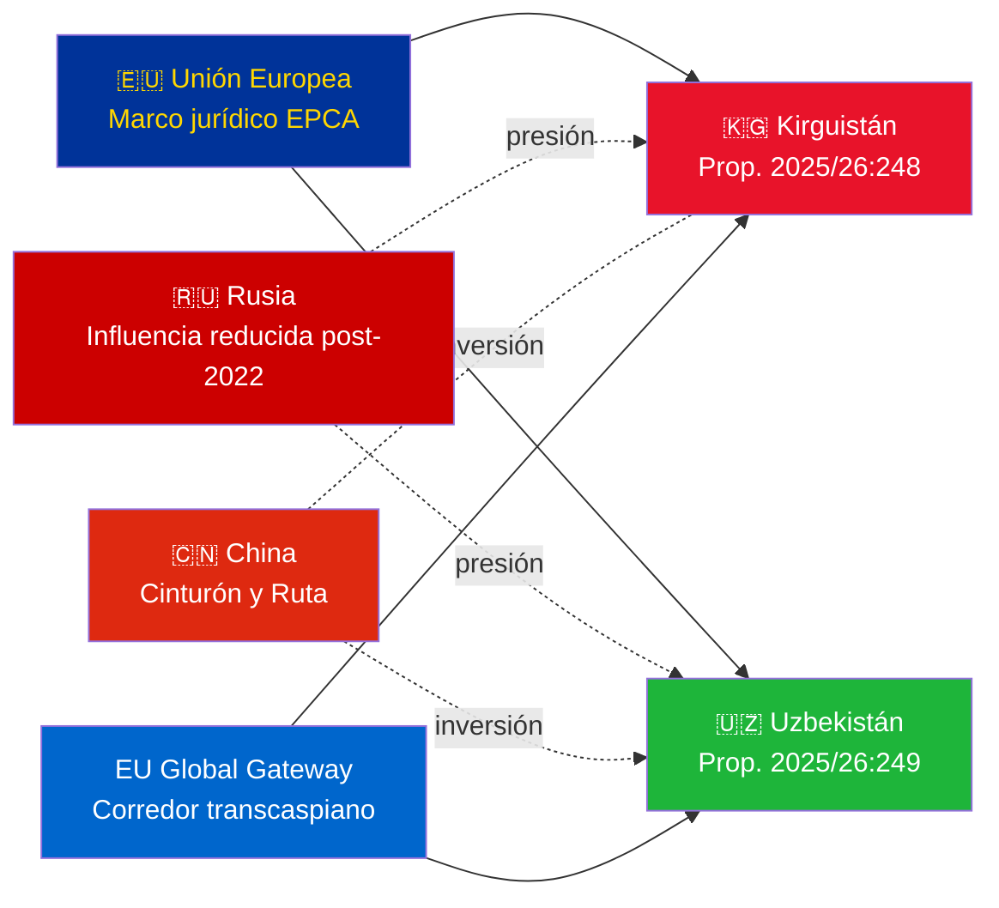

# Resumen ejecutivo — Proposiciones gubernamentales 2026-05-06

**Clasificación**: Admiralty [B2] | **Horizonte**: T+72h / T+90d
**Confianza WEP**: Casi cierta (resultado de ratificación) | Probable (trayectoria geopolítica)
**DIW**: L2 Estratégico | **Fecha**: 2026-05-06

---

## 🔴 Principal hallazgo de inteligencia

**Suecia presenta votos de ratificación para dos EPCA UE–Asia Central el 2026-05-06.** Ambos acuerdos (UE–Kirguistán: HD03248; UE–Uzbekistán: HD03249) son proposiciones de ratificación de tratados del Utrikesdepartementet, remitidas al Utrikesutskottet. La aprobación parlamentaria es **casi cierta** (confianza: 95%+) — estas son obligaciones convencionales no partidistas de la UE. El valor estratégico de inteligencia reside en el contexto geopolítico, no en las votaciones en sí.

---

## 📋 Lo que se debate en el Riksdag

| Proposición | País | Firmada | Disposiciones clave |
|------------|------|---------|-------------------|
| 2025/26:248 (HD03248) | Kirguistán | 2023 | Diálogo político, comercio, estado de derecho, conectividad |
| 2025/26:249 (HD03249) | Uzbekistán | 2023 | Comercio, materias primas críticas, economía digital, clima |

Ambas son **EPCA (Enhanced Partnership and Cooperation Agreements)** — el marco jurídico bilateral más completo que utiliza la UE aparte de los acuerdos de asociación. Reemplazan los acuerdos de asociación y cooperación de la era soviética de 1999.

---

## 🌍 Contexto geopolítico

**Reorientación geopolítica de Asia Central post-2022**: Tanto Kirguistán como Uzbekistán han acelerado su compromiso con la UE desde la invasión a gran escala de Ucrania por parte de Rusia. Las dificultades económicas de Rusia, el riesgo de sanciones secundarias y la reducida credibilidad de la OTSC crearon una ventana para profundizar la asociación con la UE. La serie de EPCA (ratificaciones en curso para Kazajistán, Kirguistán, Uzbekistán, Tayikistán) representa la expansión más significativa del marco jurídico de la UE en Asia Central desde la independencia.

---

## 🎯 Evaluación estratégica de inteligencia

**El EPCA Uzbekistán (HD03249) tiene mayor valor estratégico** debido a:
1. Población 38M — Estado más poblado de Asia Central
2. Materias primas críticas: uranio (7.° mundial), oro, cobre, exploración de litio
3. La Ley de Materias Primas Críticas de la UE (2024) identifica Asia Central como corredor de suministro estratégico
4. Ritmo de reformas bajo Mirziyoyev — el líder de AC más pro-occidental desde 2016

**El EPCA Kirguistán (HD03248)** es menor pero no trivial:
1. Puerta de entrada geográfica a una mayor conectividad en AC
2. Doble desafío de influencia china/rusa
3. Concentración constitucional de poder en 2021 crea obligaciones de seguimiento de derechos humanos

---

## ⏱️ Calendario de acción inmediata

| Día | Acción |
|-----|--------|
| **2026-05-06** | Proposiciones HD03248 + HD03249 enviadas al Riksdag |
| **2026-06** | Audiencias del comité UU (probablemente sesión conjunta) |
| **2026-09** | UU betänkande (recomendación) |
| **2026-10** | Votación plenaria — aprobación casi cierta |
| **2026-11** | Ratificación sueca depositada; EPCA entran en vigor provisionalmente |

---

*Resumen ejecutivo | Riksdagsmonitor | 2026-05-06*

<!-- source-sha: 83ab95c995e928d2f484c02aef7ab0bee0f03535 -->
