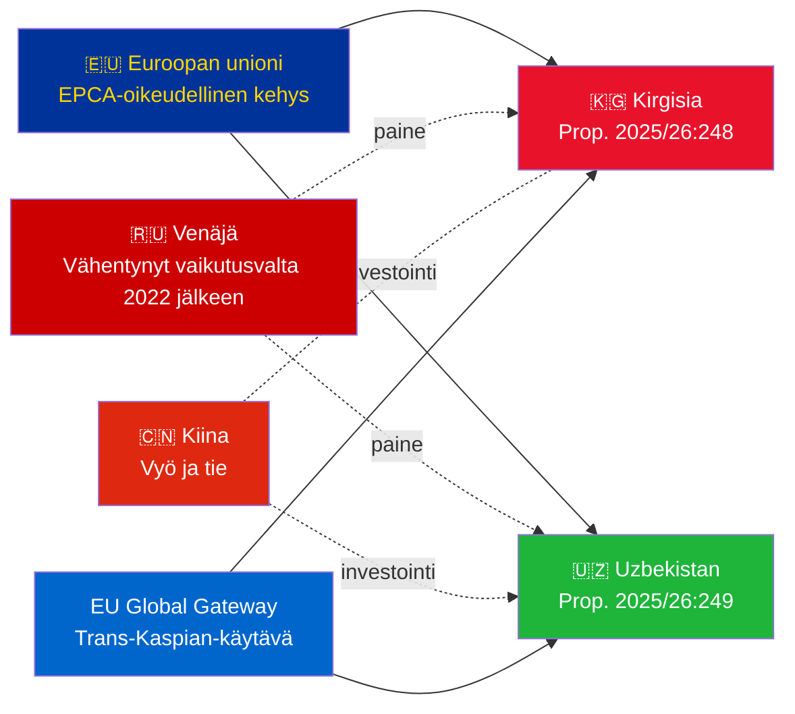

# Tiivistelmä — Hallituksen esitykset 2026-05-06

**Luokittelu**: Admiralty [B2] | **Horisontti**: T+72h / T+90d
**WEP-luottamuksellisuus**: Lähes varma (ratifiointitulos) | Todennäköinen (geopoliittinen suunta)
**DIW**: L2 Strateginen | **Päivämäärä**: 2026-05-06

---

## 🔴 Tärkein tiedusteluhuomio

**Ruotsi esittää ratifioitiäänestykset kahdelle EU–Keski-Aasia-EPCA:lle 2026-05-06.** Molemmat sopimukset (EU–Kirgisia: HD03248; EU–Uzbekistan: HD03249) ovat sopimuksellisia ratifiointiesityksiä Utrikesdepartementilta, lähetettynä Utrikesutskottille. Parlamentaarinen hyväksyntä on **lähes varma** (luottamudellisuus: 95%+) — nämä ovat ei-puoluepoliittisia EU:n sopimusvelvoitteita. Strateginen tiedusteluarvo on geopoliittisessa kontekstissa, ei itse äänestyksessä.

---

## 📋 Mitä Riksdagissa käsitellään

| Esitys | Maa | Allekirjoitettu | Keskeisiä määräyksiä |
|--------|-----|----------------|---------------------|
| 2025/26:248 (HD03248) | Kirgisia | 2023 | Poliittinen vuoropuhelu, kauppa, oikeusvaltioperiaate, konnektiviteetti |
| 2025/26:249 (HD03249) | Uzbekistan | 2023 | Kauppa, kriittiset raaka-aineet, digitaalinen talous, ilmasto |

Molemmat ovat **EPCA:ita (Enhanced Partnership and Cooperation Agreements)** — kattavin kahdenvälinen oikeudellinen kehys, jota EU käyttää assosiaatiosopimusten lisäksi. Ne korvaavat Neuvostoliiton aikakauden kumppanuus- ja yhteistyösopimukset vuodelta 1999.

---

## 🌍 Geopoliittinen konteksti

**Keski-Aasian geopoliittinen uudelleensuuntautuminen vuoden 2022 jälkeen**: Sekä Kirgisia että Uzbekistan ovat kiihdyttäneet EU-sitoutumistaan Venäjän täysimittaisen Ukraina-invasion jälkeen. Venäjän taloudelliset vaikeudet, sekundaarisanktioiden riski ja CSTO:n heikentynyt uskottavuus loivat mahdollisuuden syventää EU-kumppanuutta. EPCA-sarja (Kazakstan, Kirgisia, Uzbekistan, Tadžikistan ratifioinnit käynnissä) edustaa merkittävintä EU:n oikeudellisen kehyksen laajentumista Keski-Aasiassa itsenäistymisen jälkeen.

---

## 🎯 Strateginen tiedusteluarvio

**Uzbekistanin EPCA (HD03249) on korkeamman strategisen arvon** vuoksi:
1. Väestö 38 miljoonaa — Keski-Aasian väkirikkain valtio
2. Kriittiset raaka-aineet: uraani (maailman 7:s), kulta, kupari, litiumtutkimus
3. EU:n kriittisten raaka-aineiden laki (2024) nimeää Keski-Aasian strategiseksi toimitusketjukorridoriksi
4. Uudistusten vauhti Mirziyojevin johdolla — länsimielisin KA-johtaja vuodesta 2016

**Kirgisian EPCA (HD03248)** on matalampi mutta ei merkityksetön:
1. Maantieteellinen yhteyspiste laajempaan KA-konnektiviteettiin
2. Kiina/Venäjä kaksoisvaikutushaaste
3. Vuoden 2021 perustuslaillinen vallan keskittäminen luo ihmisoikeuksien seurantavelvoitteita

---

## ⏱️ Välitön toiminnan aikataulu

| Päivä | Toiminto |
|-------|---------|
| **2026-05-06** | Esitykset HD03248 + HD03249 toimitettu Riksdagille |
| **2026-06** | UU-valiokunnan kuulemiset (todennäköisesti yhteissessiossa) |
| **2026-09** | UU betänkande (suositus) |
| **2026-10** | Täysistuntoäänestys — lähes varma hyväksyntä |
| **2026-11** | Ruotsin ratifiointi talletettu; EPCA:t tulevat väliaikaisesti voimaan |

---

*Tiivistelmä | Riksdagsmonitor | 2026-05-06*

<!-- source-sha: 83ab95c995e928d2f484c02aef7ab0bee0f03535 -->
