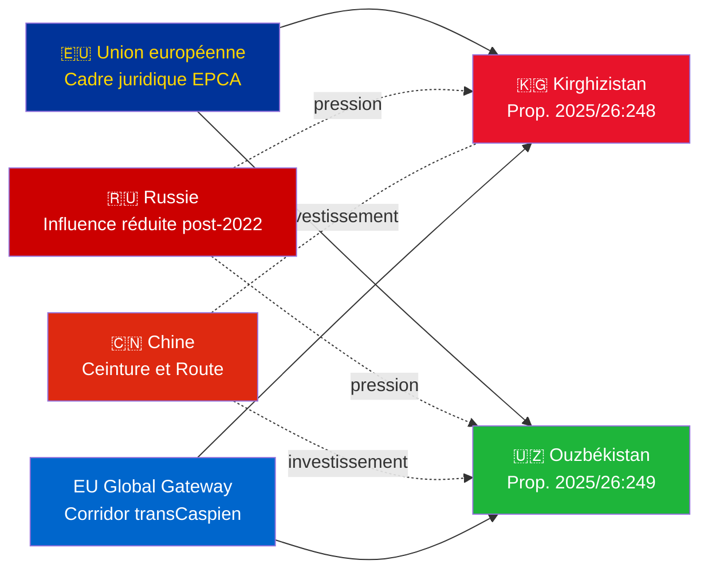

# Synthèse exécutive — Propositions gouvernementales 2026-05-06

**Classification** : Admiralty [B2] | **Horizon** : T+72h / T+90d
**Confiance WEP** : Quasi-certaine (résultat de ratification) | Probable (trajectoire géopolitique)
**DIW** : L2 Stratégique | **Date** : 2026-05-06

---

## 🔴 Principale découverte de renseignement

**La Suède soumet des votes de ratification pour deux EPCA UE–Asie centrale le 2026-05-06.** Les deux accords (UE–Kirghizistan : HD03248 ; UE–Ouzbékistan : HD03249) sont des propositions de ratification de traité de l'Utrikesdepartementet, renvoyées à l'Utrikesutskottet. L'approbation parlementaire est **quasi-certaine** (confiance : 95%+) — il s'agit d'obligations conventionnelles de l'UE non partisanes. La valeur stratégique du renseignement réside dans le contexte géopolitique, et non dans les votes eux-mêmes.

---

## 📋 Ce qui est soumis au Riksdag

| Proposition | Pays | Signée | Dispositions clés |
|------------|------|--------|------------------|
| 2025/26:248 (HD03248) | Kirghizistan | 2023 | Dialogue politique, commerce, état de droit, connectivité |
| 2025/26:249 (HD03249) | Ouzbékistan | 2023 | Commerce, matières premières critiques, économie numérique, climat |

Les deux sont des **EPCA (Enhanced Partnership and Cooperation Agreements)** — le cadre juridique bilatéral le plus complet que l'UE utilise en dehors des accords d'association. Ils remplacent les accords de partenariat et de coopération de l'ère soviétique de 1999.

---

## 🌍 Contexte géopolitique

**Réalignement géopolitique de l'Asie centrale post-2022** : Le Kirghizistan et l'Ouzbékistan ont tous deux accéléré leur engagement envers l'UE depuis l'invasion à grande échelle de l'Ukraine par la Russie. Les difficultés économiques de la Russie, le risque de sanctions secondaires et la crédibilité réduite de l'OTSC ont créé une fenêtre pour un approfondissement du partenariat UE. La série d'EPCA (ratifications en cours pour le Kazakhstan, le Kirghizistan, l'Ouzbékistan, le Tadjikistan) représente l'expansion la plus significative du cadre juridique de l'UE en Asie centrale depuis l'indépendance.

---

## 🎯 Évaluation stratégique du renseignement

**L'EPCA Ouzbékistan (HD03249) a une valeur stratégique plus élevée** en raison de :
1. Population 38M — État le plus peuplé d'Asie centrale
2. Matières premières critiques : uranium (7e mondial), or, cuivre, exploration du lithium
3. La loi de l'UE sur les matières premières critiques (2024) identifie l'Asie centrale comme corridor stratégique d'approvisionnement
4. Rythme des réformes sous Mirzioïev — le dirigeant d'AC le plus pro-occidental depuis 2016

**L'EPCA Kirghizistan (HD03248)** est moins élevé mais non négligeable :
1. Porte d'entrée géographique vers une plus large connectivité en AC
2. Double défi d'influence sino-russe
3. Concentration constitutionnelle du pouvoir en 2021 crée des obligations de surveillance des droits de l'homme

---

## ⏱️ Calendrier d'action immédiat

| Jour | Action |
|------|--------|
| **2026-05-06** | Propositions HD03248 + HD03249 soumises au Riksdag |
| **2026-06** | Auditions du comité UU (probablement session conjointe) |
| **2026-09** | UU betänkande (recommandation) |
| **2026-10** | Vote plénier — approbation quasi-certaine |
| **2026-11** | Ratification suédoise déposée ; EPCAs entrent en vigueur à titre provisoire |

---

*Synthèse exécutive | Riksdagsmonitor | 2026-05-06*

<!-- source-sha: 83ab95c995e928d2f484c02aef7ab0bee0f03535 -->
