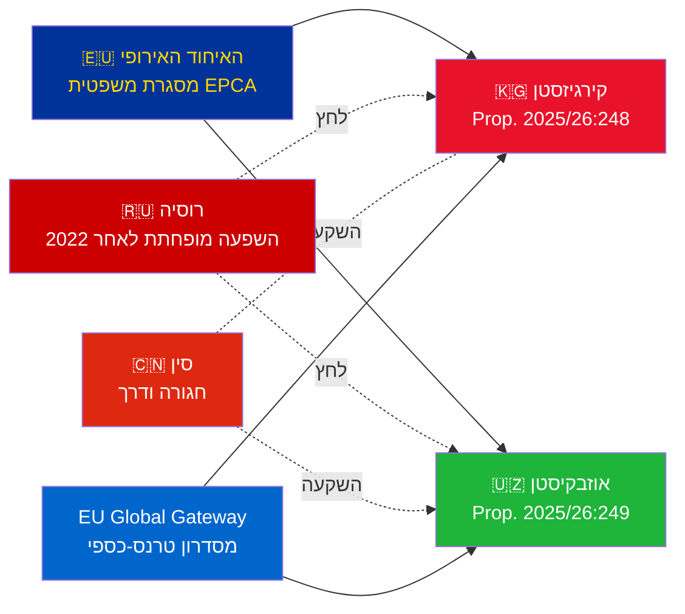

# סיכום מנהלים — הצעות ממשלתיות 2026-05-06

**סיווג**: Admiralty [B2] | **אופק**: T+72h / T+90d
**אמינות WEP**: כמעט ודאי (תוצאת אשרור) | סביר (מסלול גיאופוליטי)
**DIW**: L2 אסטרטגי | **תאריך**: 2026-05-06

---

## 🔴 ממצא מודיעיני עיקרי

**שוודיה מגישה הצבעות אשרור על שתי EPCA בין האיחוד האירופי לאסיה המרכזית ב-2026-05-06.** שתי ההסכמות (האיחוד האירופי–קירגיזסטן: HD03248؛ האיחוד האירופי–אוזבקיסטן: HD03249) הן הצעות אשרור אמנות מ-Utrikesdepartementet, שהועברו ל-Utrikesutskottet. אישור פרלמנטרי הוא **כמעט ודאי** (אמינות: 95%+) — אלו התחייבויות אמנה אירופיות שאינן פוליטיות. הערך המודיעיני האסטרטגי טמון בהקשר הגיאופוליטי, לא בהצבעות עצמן.

---

## 📋 מה נדון ב-Riksdag

| הצעה | מדינה | נחתמה | הוראות מרכזיות |
|------|-------|-------|---------------|
| 2025/26:248 (HD03248) | קירגיזסטן | 2023 | דיאלוג פוליטי, מסחר, שלטון חוק, קישוריות |
| 2025/26:249 (HD03249) | אוזבקיסטן | 2023 | מסחר, חומרי גלם קריטיים, כלכלה דיגיטלית, אקלים |

שתיהן **EPCA (הסכמי שותפות ושיתוף פעולה מוגברים)** — המסגרת המשפטית הדו-צדדית המקיפה ביותר בה האיחוד האירופי משתמש מלבד הסכמי שיתוף פעולה. הן מחליפות את הסכמי השותפות והשיתוף פעולה מעידן סובייטי משנת 1999.

---

## 🌍 הקשר גיאופוליטי

**ארגון מחדש גיאופוליטי של אסיה המרכזית לאחר 2022**: קירגיזסטן ואוזבקיסטן כאחת האיצו את מעורבותן עם האיחוד האירופי מאז הפלישה הרוסית הכוללת לאוקראינה. הקשיים הכלכליים של רוסיה, סיכון הסנקציות המשניות, ואמינות ה-CSTO המופחתת יצרו חלון להעמקת השותפות עם האיחוד האירופי. סדרת ה-EPCA (אשרורים בתהליך עבור קזחסטן, קירגיזסטן, אוזבקיסטן, טג'יקיסטן) מייצגת את ההתרחבות המשמעותית ביותר של המסגרת המשפטית של האיחוד האירופי באסיה המרכזית מאז העצמאות.

---

## 🎯 הערכה מודיעינית אסטרטגית

**EPCA אוזבקיסטן (HD03249) בעל ערך אסטרטגי גבוה יותר** בשל:
1. אוכלוסייה 38 מיליון — המדינה המאוכלסת ביותר באסיה המרכזית
2. חומרי גלם קריטיים: אורניום (מקום 7 בעולם), זהב, נחושת, חיפושי ליתיום
3. חוק חומרי הגלם הקריטיים של האיחוד האירופי (2024) מזהה את אסיה המרכזית כמסדרון אספקה אסטרטגי
4. קצב הרפורמות תחת מירזייוב — המנהיג הפרו-מערבי ביותר של CA מאז 2016

**EPCA קירגיזסטן (HD03248)** קטן יותר אך לא טריוויאלי:
1. שער גיאוגרפי לקישוריות רחבה יותר ב-CA
2. אתגר ההשפעה הסיני-רוסי הכפול
3. ריכוז כוח חוקתי ב-2021 יוצר התחייבויות מעקב זכויות אדם

---

## ⏱️ ציר זמן פעולה מיידי

| יום | פעולה |
|-----|-------|
| **2026-05-06** | Propositioner HD03248 + HD03249 הוגשו ל-Riksdag |
| **2026-06** | שימועי ועדת UU (כנראה ישיבה משותפת) |
| **2026-09** | UU betänkande (המלצה) |
| **2026-10** | הצבעה במליאה — אישור כמעט ודאי |
| **2026-11** | הפקדת אשרור שוודי; EPCA נכנסות לתוקף באופן זמני |

---

*סיכום מנהלים | Riksdagsmonitor | 2026-05-06*

<!-- source-sha: 83ab95c995e928d2f484c02aef7ab0bee0f03535 -->
