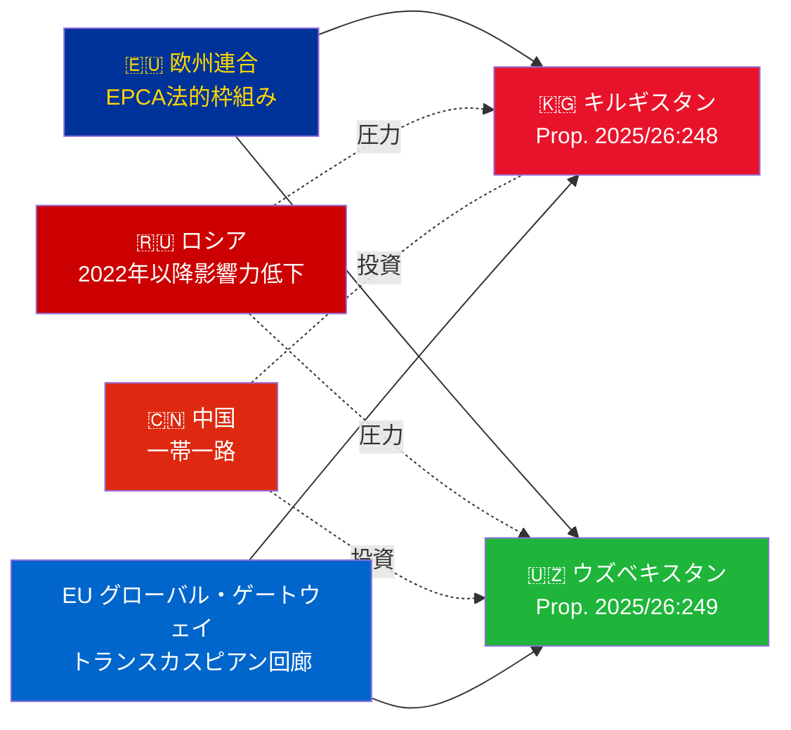

# エグゼクティブ・ブリーフ — 政府法案 2026-05-06

**分類**: Admiralty [B2] | **時間軸**: T+72h / T+90d
**WEP信頼度**: ほぼ確実（批准結果） | 可能性高（地政学的軌道）
**DIW**: L2 戦略 | **日付**: 2026-05-06

---

## 🔴 主要インテリジェンス評価

**スウェーデンは2026-05-06にEU・中央アジア間のEPCA2件の批准投票を提出する。** 両協定（EU・キルギスタン：HD03248；EU・ウズベキスタン：HD03249）はUtrikesdepartementetによる条約批准propositionerで、Utrikesutskottetに付託された。議会承認は**ほぼ確実**（信頼度：95%以上）——これらは超党派のEU条約義務である。戦略的インテリジェンス価値は地政学的文脈にあり、投票そのものではない。

---

## 📋 Riksdagで審議される内容

| 法案 | 国 | 署名年 | 主要規定 |
|-----|---|-------|---------|
| 2025/26:248 (HD03248) | キルギスタン | 2023 | 政治対話、貿易、法の支配、連結性 |
| 2025/26:249 (HD03249) | ウズベキスタン | 2023 | 貿易、重要原材料、デジタル経済、気候 |

両者とも**EPCA（強化パートナーシップ・協力協定）**——EUが連合協定以外で使用する最も包括的な二国間法的枠組み。1999年のソビエト時代のパートナーシップ・協力協定に取って代わる。

---

## 🌍 地政学的文脈

**2022年以降の中央アジア地政学的再編**: キルギスタンとウズベキスタンはともにロシアのウクライナ全面侵攻以来、EU関与を加速させた。ロシアの経済的困難、二次的制裁リスク、CSTOの信頼性低下により、EU深化のための窓が開いた。EPCA一連の批准（カザフスタン、キルギスタン、ウズベキスタン、タジキスタンで進行中）は独立以来最大のEU法的枠組みの中央アジア拡大を意味する。

---

## 🎯 戦略的インテリジェンス評価

**ウズベキスタンEPCA（HD03249）が高い戦略的価値を持つ**理由：
1. 人口3,800万——中央アジア最多人口国
2. 重要原材料：ウラン（世界第7位）、金、銅、リチウム探査
3. EU重要原材料法（2024年）が中央アジアを戦略的供給回廊として特定
4. ミルジヨエフ政権下の改革ペース——2016年以来最も親西洋的なCA指導者

**キルギスタンEPCA（HD03248）**は小規模だが軽視できない：
1. 中央アジア広域連結への地理的玄関口
2. 中露二重の影響力の挑戦
3. 2021年の憲法的権力集中が人権監視義務を生む

---

## ⏱️ 直近のアクションスケジュール

| 日 | アクション |
|----|----------|
| **2026-05-06** | Propositioner HD03248 + HD03249をRiksdagに提出 |
| **2026-06** | UU委員会公聴会（合同開催の可能性大） |
| **2026-09** | UU betänkande（勧告） |
| **2026-10** | 本会議投票——承認はほぼ確実 |
| **2026-11** | スウェーデン批准書寄託；EPCAが暫定的に発効 |

---

*エグゼクティブ・ブリーフ | Riksdagsmonitor | 2026-05-06*

<!-- source-sha: 83ab95c995e928d2f484c02aef7ab0bee0f03535 -->
