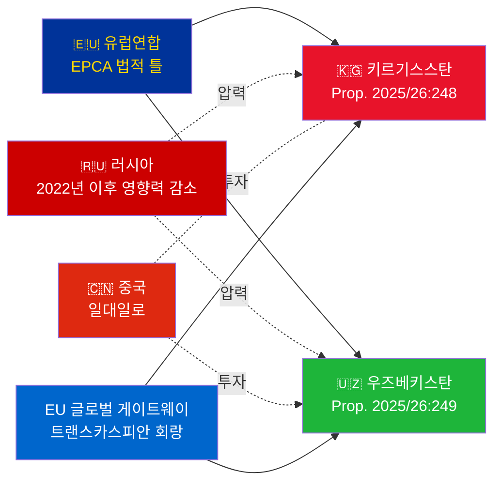

# 행정 브리핑 — 정부 법안 2026-05-06

**분류**: Admiralty [B2] | **시간 지평**: T+72h / T+90d
**WEP 신뢰도**: 거의 확실(비준 결과) | 개연성 높음(지정학적 궤도)
**DIW**: L2 전략 | **날짜**: 2026-05-06

---

## 🔴 주요 정보 평가

**스웨덴은 2026-05-06에 EU-중앙아시아 EPCA 2건의 비준 투표를 제출한다.** 두 협정(EU-키르기스스탄: HD03248; EU-우즈베키스탄: HD03249)은 Utrikesdepartementet의 조약 비준 propositioner로, Utrikesutskottet에 회부됐다. 의회 승인은 **거의 확실**하다(신뢰도: 95%+)——이는 초당파적 EU 조약 의무다. 전략적 정보 가치는 투표 자체가 아닌 지정학적 맥락에 있다.

---

## 📋 Riksdag 심의 내용

| 법안 | 국가 | 서명 | 주요 조항 |
|-----|------|-----|---------|
| 2025/26:248 (HD03248) | 키르기스스탄 | 2023 | 정치 대화, 무역, 법치, 연결성 |
| 2025/26:249 (HD03249) | 우즈베키스탄 | 2023 | 무역, 핵심 원자재, 디지털 경제, 기후 |

모두 **EPCA(강화 파트너십 협력 협정)**——EU가 연합 협정 외에 사용하는 가장 포괄적인 양자 법적 틀. 1999년 소비에트 시대 파트너십 협력 협정을 대체한다.

---

## 🌍 지정학적 맥락

**2022년 이후 중앙아시아 지정학적 재편**: 키르기스스탄과 우즈베키스탄 모두 러시아의 우크라이나 전면 침공 이후 EU 관여를 가속화했다. 러시아의 경제적 어려움, 2차 제재 위험, CSTO 신뢰성 저하로 EU 심화를 위한 창이 열렸다. EPCA 연속 비준(카자흐스탄, 키르기스스탄, 우즈베키스탄, 타지키스탄 진행 중)은 독립 이후 중앙아시아에서 EU 법적 틀의 가장 큰 확장을 의미한다.

---

## 🎯 전략 정보 평가

**우즈베키스탄 EPCA(HD03249)의 전략적 가치가 더 높은** 이유:
1. 인구 3,800만——중앙아시아 최다 인구 국가
2. 핵심 원자재: 우라늄(세계 7위), 금, 구리, 리튬 탐사
3. EU 핵심 원자재법(2024)이 중앙아시아를 전략적 공급 회랑으로 지정
4. 미르지요예프 체제의 개혁 속도——2016년 이후 가장 친서방적인 CA 지도자

**키르기스스탄 EPCA(HD03248)**는 소규모지만 중요하다:
1. 광역 CA 연결성의 지리적 관문
2. 중·러 이중 영향력 도전
3. 2021년 헌법적 권력 집중으로 인권 모니터링 의무 발생

---

## ⏱️ 즉각적인 행동 일정

| 날 | 행동 |
|----|------|
| **2026-05-06** | Propositioner HD03248 + HD03249 Riksdag 제출 |
| **2026-06** | UU 위원회 청문회(합동 회의 개연성 높음) |
| **2026-09** | UU betänkande(권고) |
| **2026-10** | 본회의 투표——승인 거의 확실 |
| **2026-11** | 스웨덴 비준서 기탁; EPCA 잠정 발효 |

---

*행정 브리핑 | Riksdagsmonitor | 2026-05-06*

<!-- source-sha: 83ab95c995e928d2f484c02aef7ab0bee0f03535 -->
